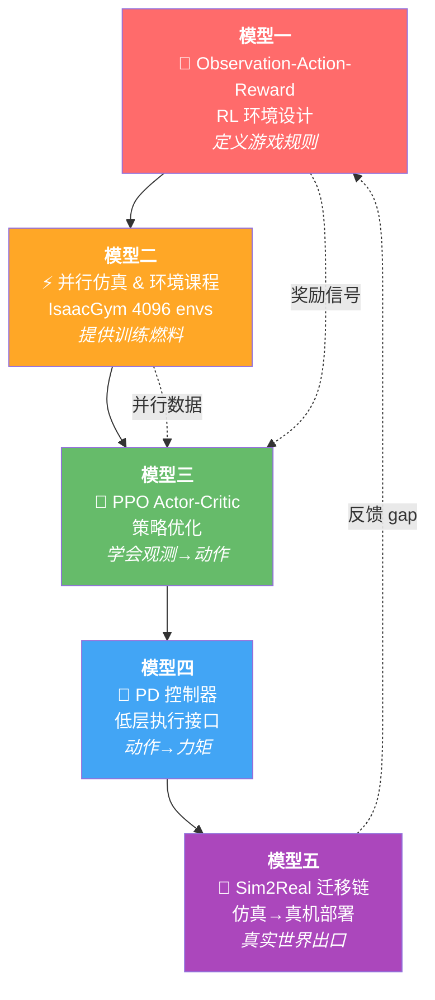
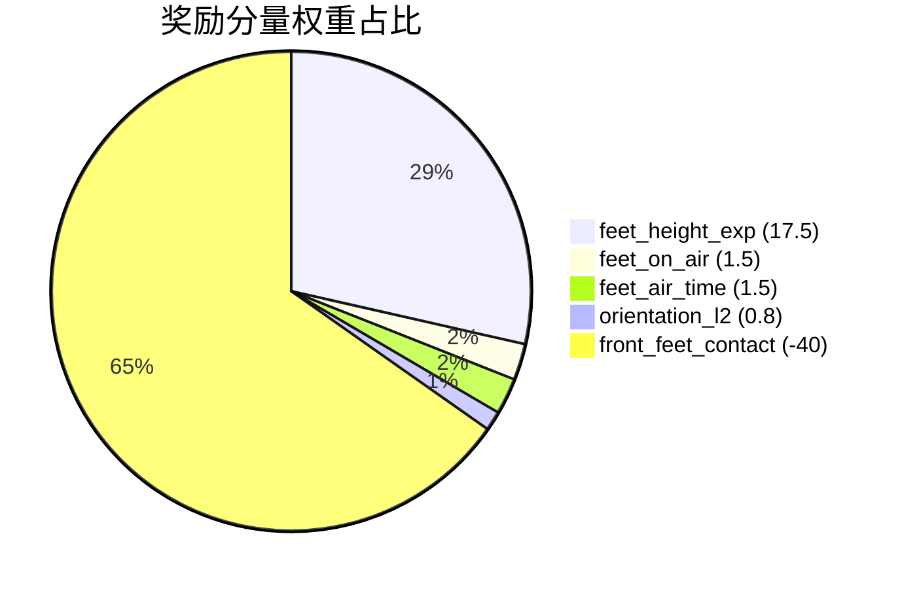
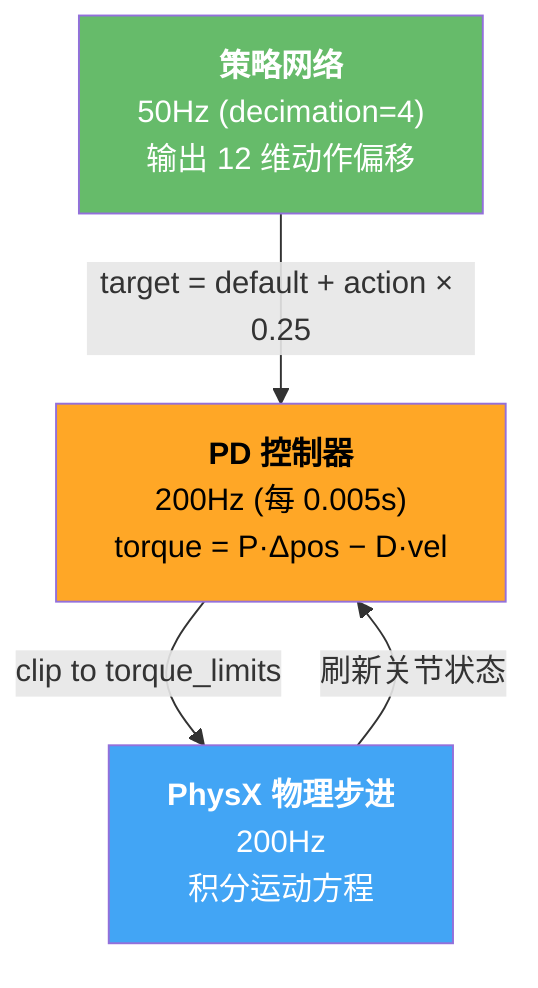
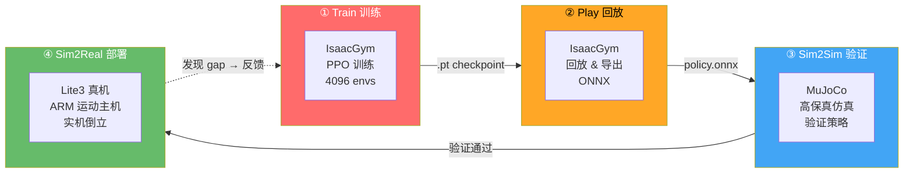
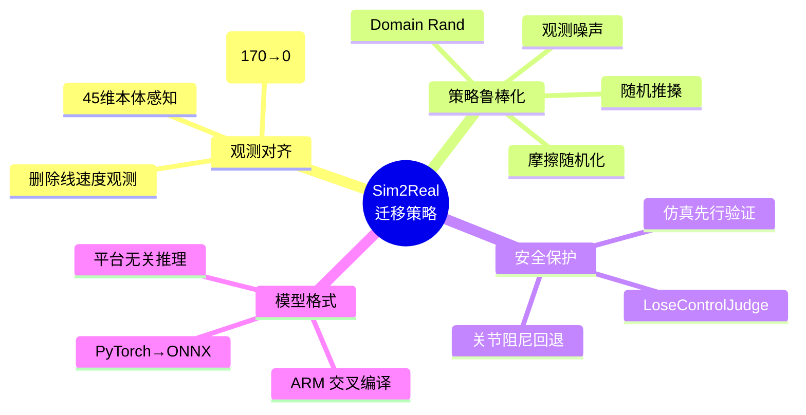
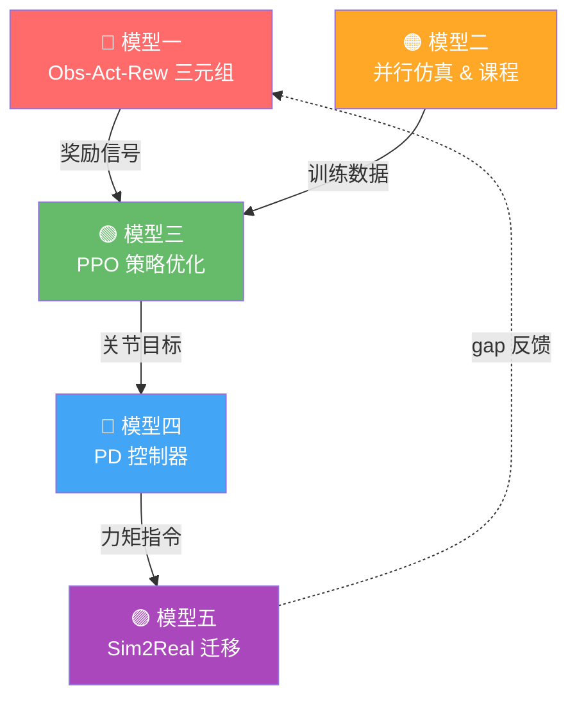

# 🏛️ Socratic Learn — 四足机器人手倒立强化学习控制与 Sim2Real 部署

<p align="center">
  
  
  
  
</p>

---

## 📌 第一步：抓骨架（Build the Skeleton）

> 🔑 **核心问题：** 在「四足机器人手倒立强化学习控制与 Sim2Real 部署」这个领域里，所有专家都认同的五个核心思维模型是什么？

### 🗺️ 五模型全景图



---

## 🔴 模型一：Observation-Action-Reward 三元组（RL 环境设计）

> 💡 **它回答的核心问题：** 要让强化学习学到"手倒立"，需要告诉它什么（观测）、它能做什么（动作）、什么是好的（奖励）？

### 📊 观测-动作-奖励规格

| 要素 | 规格 | 说明 |
|:-----|:----:|:-----|
| 🔍 观测 (Observation) | **45 维** | 基座角速度(3) + 重力投影(3) + 速度指令(3) + 关节位置偏差(12) + 关节速度(12) + 上一帧动作(12) |
| 🕹️ 动作 (Action) | **12 维** | 12 个关节的目标位置偏移量，经 `action_scale=0.25` 缩放后叠加到默认角度 |
| 🎁 奖励 (Reward) | 多分量加权 | 手倒立核心奖励见下方 |

### 🎁 奖励函数权重谱系



| 奖励分量 | 权重 | 类型 | 作用 |
|:---------|:----:|:----:|:-----|
| `handstand_feet_height_exp` | **+17.5** | 🟢 正奖励 | 鼓励前脚抬升到目标高度 0.6m，基于 0.025m 抬腿阈值的多级奖励系统 |
| `handstand_feet_on_air` | **+1.5** | 🟢 正奖励 | 同时检测脚部和膝盖——所有脚+膝盖离地才给奖励 |
| `handstand_feet_air_time` | **+1.5** | 🟢 正奖励 | 累积空中停留时间，膝盖触地则清零 |
| `handstand_orientation_l2` | **+0.8** | 🟢 正奖励 | 基座重力投影与目标 `[1,0,0]`（竖直倒立）的 L2 对齐 |
| `front_feet_contact` | **−40.0** | 🔴 强惩罚 | 前脚一旦接触地面就重罚，强制后腿支撑、前腿悬空 |
| `joint_smoothness` | +2.5e-9 | 🟡 平滑 | 惩罚动作变化率 + 加速度 + Jerk |
| `torque_smoothness` | +0.06 | 🟡 平滑 | 惩罚相邻帧扭矩突变 |
| `action_rate` | −0.03 | 🔴 惩罚 | 惩罚相邻时间步动作差异过大 |
| `torques` | −1e-5 | 🔴 惩罚 | 最小化关节力矩，鼓励节能 |
| `dof_pos_limits` | −10.0 | 🔴 强惩罚 | 关节位置接近限位时严厉惩罚 |

> ⚠️ **关键设计决策：**
> - 故意**删除**了原版的基座线速度(3维)和地形高度测量(170维) → 观测空间从 235 降至 45，与实机传感器覆盖精确对齐，降低 Sim2Real gap
> - `front_feet_contact = -40.0` 是奖赏谱系中最强的信号——前脚触地立刻重罚，迫使网络寻找"后腿支撑+前腿抬起"的倒立解

> 🔗 **与相邻模型的关系：** 定义"游戏规则" → 模型二决定用什么数据学 → 模型三决定怎么学

---

## 🟠 模型二：大规模并行仿真与环境课程（Parallel Simulation & Curriculum）

> 💡 **它回答的核心问题：** 单个机器人需要试错几百万步才能学会倒立——如何让这个过程在可接受的时间内完成？

### ⚡ IsaacGym 并行仿真

```
┌─────────────────────────────────────────────────────┐
│              4096 个并行环境同时运行                    │
│  ┌──────┐ ┌──────┐ ┌──────┐       ┌──────┐          │
│  │ Env₀ │ │ Env₁ │ │ Env₂ │  ...  │Env₄₀₉₅│         │
│  └──┬───┘ └──┬───┘ └──┬───┘       └──┬───┘          │
│     └────────┴────────┴──────────────┴──────────────┘  │
│                         │                              │
│              每步 ≈ 98,000 条经验                       │
│            (4096 envs × 24 steps)                      │
└─────────────────────────────────────────────────────┘
```

### 🎲 Domain Randomization（领域随机化）

| 随机化项 | 范围 | 目的 |
|:---------|:-----|:-----|
| 🔄 摩擦系数 | `[0.5, 1.25]` | 适应不同地面材质（冰面↔橡胶） |
| 💥 随机推搡 | 每 15s，`max_vel_xy=1.0 m/s` | 应对外力扰动，保持倒立不倒下 |
| 📡 观测噪声 | 关节位置 `0.01 rad`, 角速度 `0.4 rad/s`, 重力 `0.05` | 模拟传感器噪声，弥合 Sim2Real 感知差距 |
| 🔧 关节初始位 | 默认角度 `× [0.5, 1.5]` | 避免对精确初始位姿的过拟合 |

### 📈 全量课程学习机制（5 个）

本项目代码中实际存在 **5 个课程学习机制**，状态各不相同：

| # | 名称 | 状态 | 函数 | 机制 |
|:--|:-----|:----:|:-----|:-----|
| 1 | **命令课程** | ✅ 活跃 | `update_command_curriculum()` [:519](legged_gym/envs/base/legged_robot.py#L519) | 追踪奖励 > 80% → 速度范围扩大 ±0.5，上限 `max_curriculum=1.0` |
| 2 | **渐进姿态课程** | ✅ 活跃 | `_update_progressive_targets()` [:213](legged_gym/envs/base/legged_robot.py#L213) | 目标重力向量从站立过渡到倒立 |
| 3 | **姿态容忍度衰减** | ✅ 活跃 | `_reward_progressive_orientation()` [:1503](legged_gym/envs/base/legged_robot.py#L1503) | progress 增加 → 容许角度误差从 30° 收紧到 10° |
| 4 | **地形课程** | ⚠️ 本体关闭 | `_update_terrain_curriculum()` [:497](legged_gym/envs/base/legged_robot.py#L497) | `mesh_type='plane'` 导致自动 `curriculum=False`，狗都在平地上训 |
| 5 | **渐进姿态奖励** | 🔇 权重=0 | 同上 #3 | 配置 `progressive_orientation=0`，作者注"投影重力有问题" |

---

### 1️⃣ 命令课程

```
训练开始                    追踪达标后                    最终上限
   │                          │                          │
   ▼                          ▼                          ▼
[-0.2, -0.2]           [-0.5, 0.5]              [-1.0, 1.0]
 "慢慢走就行"           "走快一点"               "全速跑"

判断条件：平均追踪奖励 > 满分的 80%
扩大幅度：每次 ±0.5，受 max_curriculum=1.0 约束
```

### 2️⃣ 渐进姿态课程（核心创新）

**注意：只有一条 S 曲线，不是两条。** `3t²−2t³` 作用在 progress 的数值增长上，然后 progress 驱动两段**线性**插值。

```
一条 S 曲线控制 progress 的增长速度 (开头慢、中间快、结尾慢)：

  progress
  1.0 ┤                    ╭────
      │                  ╱
  0.5 ┤               ╱          ← t=0.5 时斜率最大，增长最快
      │            ╱
  0.0 ┤────────────              ← t=0 和 t=1 处导数为 0，缓起缓停
      └────────────────────────
         0        0.5       1.0  时间

这个 progress 被用来驱动两段线性插值（两段内部都是等速变化）：

  阶段一 (progress 0→0.5)            阶段二 (progress 0.5→1.0)

  [0,0,1] ────线性插值───▶ [0.7,0,0.7] ────线性插值───▶ [1,0,0]
   站立                     45° 倾斜                    竖直倒立

  stage1_progress = progress × 2          stage2_progress = (progress-0.5) × 2
  target = 站立 + stage1 × (45°-站立)      target = 45° + stage2 × (竖直-45°)
```

> 分两段 = 用两段线段近似单位球面上的大圆弧。一段直线中点 `[0.5,0,0.5]` 模长 0.707，不在球面上；两段中点 `[0.7,0,0.7]` 模长 0.99，在球面上。

### 3️⃣ 姿态容忍度衰减

```
progress=0.0 (还站着)  →  容许角度误差 30°   "歪一点没关系"
progress=0.5 (45°倾斜) →  容许角度误差 20°   "开始认真了"
progress=1.0 (竖直倒立) →  容许角度误差 10°   "必须精准对齐"
```

随着训练进度收紧标准，逼狗越来越精准。

> 🔗 **与相邻模型的关系：** 提供"训练数据"和"训练难度曲线" → 是模型三的燃料来源

---

## 🟢 模型三：PPO 策略优化与 Actor-Critic 架构

> 💡 **它回答的核心问题：** 有了环境和奖励信号，具体用什么算法让神经网络学会"观测 → 动作"的映射？

### 🧠 网络架构

```
                    ┌── Actor (策略网络) ──────────────────────┐
                    │                                            │
    45 维观测 ──────┤                                            ├── 12 维动作均值
                    │   FC(512)+ELU → FC(256)+ELU → FC(128)+ELU  │
                    │                                            │
                    └────────────────────────────────────────────┘

                    ┌── Critic (价值网络) ───────────────────────┐
                    │                                            │
    45 维观测 ──────┤                                            ├── 1 维 V(s)
                    │   FC(512)+ELU → FC(256)+ELU → FC(128)+ELU  │
                    │                                            │
                    └────────────────────────────────────────────┘

    两个网络共享同一个 45 维输入，结构完全对称，只是输出维度不同。
    Actor 输出动作（12 个关节的偏移），Critic 输出该状态"有多好"的一个标量。
```

### ⚙️ PPO 超参数表

| 超参数 | 值 | 含义 |
|:-------|:--:|:-----|
| `clip_param` | **0.2** | 策略更新的信任域半径——新旧策略概率比被限制在 [0.8, 1.2] |
| `γ` (discount) | **0.99** | 未来奖励的折扣因子——99% 的远期奖励被保留 |
| `λ` (GAE) | **0.95** | 广义优势估计的偏差-方差权衡——偏低的方差 |
| `num_learning_epochs` | **5** | 每批数据重复学习 5 轮——在过拟合和充分利用之间平衡 |
| `num_mini_batches` | **4** | 每 epoch 分成 4 个小批次 → batch_size ≈ 25,000 |
| `learning_rate` | **1e-3** | 自适应调度——KL 超过 0.01 时自动降低 |
| `desired_kl` | **0.01** | KL 散度目标——触发学习率调整的阈值 |
| `entropy_coef` | **0.01** | 熵正则化——鼓励探索，避免早熟收敛 |
| `max_grad_norm` | **1.0** | 梯度裁剪——防止单步更新过大 |
| `num_steps_per_env` | **24** | 每轮每环境收集 24 步 → 总 batch = 98,304 步 |

> 💡 **为什么是 PPO？** PPO 是四足机器人 RL 的事实标准——它在样本效率、训练稳定性和实现复杂度之间取得了最佳平衡。4096 个并行环境使得 on-policy 算法对 sample efficiency 的要求被大幅缓解。

> 🔗 **与相邻模型的关系：** 接收模型一的奖励信号和模型二的并行数据 → 输出模型四的关节目标

---

## 🔵 模型四：PD 控制器与执行层（Low-Level Control Interface）

> 💡 **它回答的核心问题：** 神经网络输出"目标关节角度"——如何把它变成电机能执行的力矩信号？

### 🔧 控制栈



### 📐 关键参数

| 参数 | 值 | 说明 |
|:-----|:--:|:-----|
| `control_type` | **P** | 位置控制——对 Sim2Real gap 最鲁棒 |
| `stiffness` (P gain) | **20 N·m/rad** | 位置误差 → 力矩的比例系数 |
| `damping` (D gain) | **0.7 N·m·s/rad** | 速度 → 力矩的阻尼系数 |
| `action_scale` | **0.25** | 动作缩放——网络输出 ±1 → 实际偏移 ±0.25 rad |
| `decimation` | **4** | 策略频率:PD 频率 = 1:4 (50Hz : 200Hz) |

> ⚠️ **为什么用 P 控制而不是 V（速度）或 T（力矩）控制？**
> - P 控制对建模误差容忍度更高，位置误差直观可控
> - 速度控制和力矩控制对 URDF 质量/惯量参数精度要求极高，迁移到实机时容易因参数失配而发散
> - 这是 Sim2Real 社区的经验共识：低层用简单控制器，让 RL 策略在高层做决策

> 🔗 **与相邻模型的关系：** 桥接模型三（策略网络）↔ 模型五（真实物理世界）

---

## 🟣 模型五：Sim2Real 迁移链（Simulation-to-Reality Transfer Pipeline）

> 💡 **它回答的核心问题：** 在仿真中学会的倒立策略，怎么跑到真实的 JueYing Lite3 机器狗上？

### 🚀 四阶段迁移链路



### 📋 各阶段操作

| 阶段 | 命令/操作 | 产出 |
|:-----|:----------|:-----|
| ① Train | `python train.py --task=lite3 --headless --max_iterations=500` | `.pt` 模型权重 |
| ② Play | `python play.py --task=lite3` | `logs/onnx/legged.onnx` |
| ③ Sim2Sim | `cp legged.onnx → Lite3_rl_deploy/policy/ppo/policy.onnx`<br>`python3 mujoco_simulation.py` + `./rl_deploy` | MuJoCo 验证报告 |
| ④ Sim2Real | 相同 ONNX → 机器狗运动主机<br>`cmake .. -DBUILD_PLATFORM=arm -DBUILD_SIM=OFF` | 实机倒立动作 |

### 🛡️ Sim2Real 关键工程决策



> 🔴 **郑重警告：** 实机部署前必须在 MuJoCo 仿真中充分验证！如果机器狗执行关键动作时误判为危险动作而进入关节阻尼状态，可临时在仿真中注释掉 `LoseControlJudge()` 的判断（`state_machine.hpp:190`），但**实机上绝不可跳过此保护**，否则可能导致设备损坏甚至人身伤害。

> 🔗 **与相邻模型的关系：** 是前面四个模型的"真实世界出口"——仿真中再好的倒立，过了 Sim2Real 才算真正成功

---

## 🧩 骨架总结（Skeleton Summary）

> 🗣️ 用你自己的话可以这样说：
>
> **"用 4096 只仿真 Lite3 机器狗并行试错，每只狗只靠本体感知（角速度、重力方向、关节状态——不要线速度和地形），神经网络输出 12 个关节的目标偏移，PD 控制器转为力矩。奖励函数引导前脚抬升、姿态对齐，渐进课程从站立过渡到倒立。领域随机化让策略鲁棒。最终导出 ONNX，经 MuJoCo 验证后部署真机。"**

### 🔗 五模型依赖关系



---

## ❓ 反问

这五个模型里，**你最熟悉哪个？最陌生的是哪个？**
