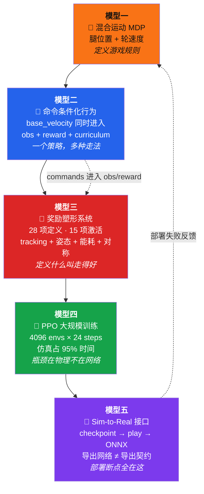
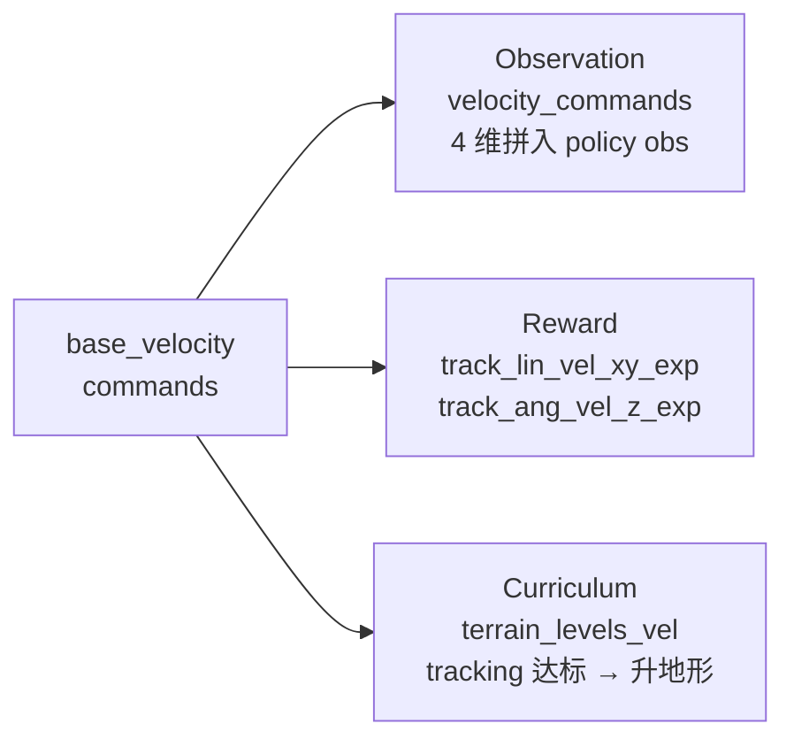

# 🏛️ Socratic Learn — Go2W 轮足混合运动

<p align="center">
  
  
  
  
</p>

---

## 📌 第一步：抓骨架

> 🔑 **核心问题：** 在 Go2W 轮足混合运动强化学习里，所有专家都认同的五个核心思维模型是什么？

---

## 🗺️ 五模型全景图



---

## 🟠 模型一：混合运动 MDP — 腿位置 + 轮速度

> 💡 **它回答的核心问题：** Go2W 在每个控制周期看见什么、能做什么、什么算好？

### 观测-动作-奖励规格

| 要素 | 规格 | 说明 |
|:---|:---|:---|
| 🔍 Policy 观测 | base_vel(3) + ang_vel(3) + gravity(3) + commands(4) + **joint_pos_rel_without_wheel**(16) + joint_vel(16) + last_action(14) | 轮子角度用相对编码，防止无界增长 |
| 🔍 Critic 观测 | 同 policy，但 **不含 noise** | critic 只训练用，不需要鲁棒 |
| 🕹️ 动作 | **14 维混合**：12 腿位置 + 4 轮速度（实际输出 14 维，4 轮子 joint 中有 2 维被合并或独立） | hip scale=0.125, 其他腿 scale=0.25, 轮 scale=5.0 |
| 🎁 奖励 | 28 项定义，15 项激活非零权重 | 见模型三 |
| ⏱️ 控制频率 | PhysX 200Hz, 策略 50Hz (decimation=4) | 每 0.02s 一个策略决策 |
| 📐 Episode | 20s = 最多 1000 步 | time_out 终止 |

### 混合 Action 的设计逻辑

```text
腿关节 (12个) → JointPositionActionCfg → 目标角度 → PD → 力矩
  为什么是位置？ → 腿有姿态意义，目标角度有明确物理含义

轮关节 (4个) → JointVelocityActionCfg → 目标速度 → 速度控制 → 力矩
  为什么是速度？ → 轮子持续滚动，角度无界增长，位置控制会漂移
```

### ⚠️ 关键设计决策

- `joint_pos_rel_without_wheel` 而非普通 `joint_pos_rel`——轮角可累积几百弧度，直接进网络炸数值
- hip 的 action scale 只有其他腿关节的一半（0.125 vs 0.25）——hip 的微小角度变化就产生大幅身体位移
- `illegal_contact` termination 被关闭——轮足结构在粗糙地形上偶尔擦地是正常的

> 🔗 **与相邻模型的关系：** 模型一定义接口 → 模型二把 commands 塞进接口 → 模型三用 reward 评价接口输出

---

## 🔵 模型二：命令条件化行为

> 💡 **它回答的核心问题：** 一个策略如何学会不同速度、不同转向，且训练和部署共享同一套命令接口？

### 命令谱系

| 维度 | 含义 | 训练范围 | 重采样 |
|:---|:---|:---|:---|
| `lin_vel_x` | 前向速度 | [-1.0, 1.0] m/s | 每 10s |
| `lin_vel_y` | 侧向速度 | [-1.0, 1.0] m/s | 每 10s |
| `ang_vel_z` | 偏航角速度 | [-1.0, 1.0] rad/s | 每 10s |
| `heading` | 目标朝向 | [-π, π] rad | 每 10s |

### Commands 的三条路径



Go2W 子类显式关闭了 `command_levels_lin_vel` 和 `command_levels_ang_vel`——命令范围始终 [-1,1]，不随训练扩大。只有 terrain_levels 自动升级。

### ⚠️ 关键设计决策

为什么关闭 command curriculum？两个 curriculum 叠加（地形变难 + 命令范围扩大）会让难度增长过快。先用地形课程单维度推进，可诊断性更好。

> 🔗 **与相邻模型的关系：** 模型二定义"想怎么走"→ 模型三定义"走得好不好"→ 模型四学习映射

---

## 🔴 模型三：奖励塑形系统

> 💡 **它回答的核心问题：** Go2W 怎样才算"走得好"？28 项奖励中真正起作用的是哪几项？

### 启用的奖励权重表（rough_env_cfg.py:134-218）

| 奖励项 | 权重 | 类型 | 作用 |
|:---|:---:|:---:|:---|
| `track_lin_vel_xy_exp` | **+3.0** | 🟢 核心任务 | 线速度跟踪，std=√0.25 |
| `track_ang_vel_z_exp` | **+1.5** | 🟢 核心任务 | 角速度跟踪 |
| `upward` | **+1.0** | 🟢 姿态 | 机身 Z 对齐世界 Z，防翻车 |
| `feet_contact_without_cmd` | **+0.1** | 🟢 接触 | 无命令时奖励足端接触 |
| `lin_vel_z_l2` | **−2.0** | 🔴 稳定 | 惩罚 Z 轴蹦跳 |
| `ang_vel_xy_l2` | **−0.05** | 🔴 稳定 | 惩罚 roll/pitch 摇晃 |
| `joint_torques_l2` | **−2.5e-5** | 🔴 节能 | 惩罚腿关节力矩 |
| `joint_acc_l2` | **−2.5e-7** | 🟡 平滑 | 惩罚腿关节加速度 |
| `joint_acc_wheel_l2` | **−2.5e-9** | 🟡 平滑 | 惩罚轮关节加速度（腿的 1/100） |
| `joint_pos_limits` | **−5.0** | 🔴 安全 | 关节逼近限位时强惩罚 |
| `joint_power` | **−2e-5** | 🔴 节能 | 惩罚腿关节功率 |
| `stand_still` | **−2.0** | 🔴 静止 | 零命令时惩罚不必要的腿运动 |
| `joint_pos_penalty` | **−1.0** | 🔴 姿态 | 惩罚关节偏离默认位置 |
| `joint_mirror` | **−0.05** | 🔴 对称 | FR↔RL、FL↔RR 腿位置不对称惩罚 |
| `action_rate_l2` | **−0.01** | 🟡 平滑 | 惩罚连续两步动作变化 |
| `undesired_contacts` | **−1.0** | 🔴 接触 | 惩罚非足端身体接触地面 |
| `contact_forces` | **−1.5e-4** | 🔴 接触 | 惩罚过大接触力 |

### 被关闭的奖励（权重=0，但值得知道它们存在）

`feet_air_time`(0), `feet_gait`(0), `feet_slide`(0), `flat_orientation_l2`(0), `base_height_l2`(0), `body_lin_acc_l2`(0), `wheel_vel_penalty`(0), `feet_stumble`(0)

### 你的实测数据 (~1775 轮)

```
track_lin_vel_xy_exp = 1.62 (上限 3.0，达成 54%)
track_ang_vel_z_exp  = 0.77 (上限 1.5，达成 51%)
upward               = 3.88 (接近天花板)
action_rate_l2       = -0.68 (偏高，动作变化频繁)
joint_mirror         = -0.012 (可忽略)
```

> 🔗 **与相邻模型的关系：** 模型三把模型二的 commands 变成优化目标 → 模型四通过 PPO 最大化这些目标

---

## 🟢 模型四：PPO 大规模训练

> 💡 **它回答的核心问题：** 4096 个 Go2W 同时训练，每 2 秒迭代一次，GPU 上到底在发生什么？

### 网络架构

```text
Actor [512, 256, 128] elu → 14 维 action (均值) + std
Critic [512, 256, 128] elu → 1 维 V(s)

两个网络结构对称，输入维度相同（policy obs 拼接后 ~70 维）
init_noise_std = 1.0（初始探索方差大）
actor/critic 都没有 obs normalization
```

### PPO 超参数

| 参数 | 值 | 参数 | 值 |
|:---|:---:|:---|:---:|
| clip_param | 0.2 | entropy_coef | 0.01 |
| learning_rate | 1e-3 (adaptive) | desired_kl | 0.01 |
| γ / λ | 0.99 / 0.95 | max_grad_norm | 1.0 |
| num_epochs | 5 | num_mini_batches | 4 |

### 每轮迭代时间分解

| 阶段 | 耗时 | 占比 | 数据量 |
|:---|:---:|:---:|:---|
| Collection | 2.05s | **95%** | 4096×24=98,304 transitions |
| Learning | 0.10s | 5% | 5 epochs × 4 mini-batches |
| **总计** | **2.15s** | | ~45,000 steps/s |

**瓶颈在 PhysX 仿真，不在 GPU matmul。** 优化方向是减少物理计算量或增加并行度，不是压缩网络。

### 你的训练状态

- 20000 轮总计划，1775 轮 ≈ 8.9%，~64 分钟
- time_out=1.0 → 全部存活，episode 跑满 1000 步
- terrain_levels=5.18 停滞 → 速度跟踪在 5 级地形已达 curriculum 升级阈值边缘
- entropy=25.57 → 探索还很活跃，策略远未收敛

> 🔗 **与相邻模型的关系：** 模型四从模型一/二/三采集的数据中学习 → 模型五只导出推理路径

---

## 🟣 模型五：Sim-to-Real 接口

> 💡 **它回答的核心问题：** 训练出的 checkpoint 怎么变成可部署的策略？中间丢失了什么信息？

### 链路

```text
训练 → model_2600.pt (actor+critic+optimizer+normalizer, ~20MB)
  ↓
play.py → 加载 checkpoint, 关闭部分随机化, 运行策略
  ↓
导出 → policy.pt (JIT) + policy.onnx (ONNX)
  ↓  ⚠️ 危险断点
部署 → 另一个控制栈
```

### ONNX 导出 ≠ 接口契约导出

| 导出物 | 包含 | 不包含 |
|:---|:---|:---|
| `policy.onnx` | 网络计算图（矩阵乘法 + 激活函数） | — |
| ❌ 缺失 | — | obs 维度顺序和语义 |
| ❌ 缺失 | — | obs normalize (mean/std) |
| ❌ 缺失 | — | action scale (hip 0.125, leg 0.25, wheel 5.0) |
| ❌ 缺失 | — | joint order (哪维对应哪个关节) |
| ❌ 缺失 | — | 控制类型 (哪些是位置控制，哪些是速度控制) |
| ❌ 缺失 | — | 控制频率 (50Hz, decimation=4) |
| ❌ 缺失 | — | default_dof_pos (默认关节角偏移) |

**最危险的不是维度错，而是维度对但语义错。** 12 个 float 按顺序给 12 个关节——顺序一对，一切正常。顺序错一位，所有关节收到错误指令。

### 10 个部署断点检查项

| # | 断点 | 如果错 |
|:---:|:---|:---|
| 1 | obs 维度顺序 | 策略看到乱序状态，输出乱序动作 |
| 2 | obs normalize mean/std | 输入 scale 不对，网络输出偏移 |
| 3 | action scale (腿/轮不同) | 动作幅度整体放大/缩小 |
| 4 | joint order (16 joints) | 动作发给错误关节 |
| 5 | 腿位置 vs 轮速度区分 | 轮子收到位置指令 → 角度漂移 |
| 6 | 控制频率 (50Hz) | 历史信息的时间尺度错 |
| 7 | default_dof_pos 偏移 | 持续 PD 误差 |
| 8 | 传感器噪声特征 | 策略在干净信号上训练，噪声上部署 |
| 9 | 随机化被 play 关闭 | 仿真内表现 ≠ 真实世界表现 |
| 10 | 地形假设 | play 用 5×5 平地，部署是真实世界 |

> 🔗 **与相邻模型的关系：** 模型五暴露模型一到四的所有隐藏假设——obs 怎么拼、action 怎么映射、reward 真正在优化什么

---

## 🧩 Skeleton Summary

> Go2W 的运动学习骨架是：
> **在混合 action MDP 中定义轮足控制接口（腿位置+轮速度），用 base_velocity 命令条件化行为，用 15 项启用的奖励塑形系统定义"走得好"，通过 4096 并行 PPO 从仿真数据中学习策略，最后将 checkpoint 导出为 ONNX——但接口契约（obs 顺序、action scale、joint order、控制类型）不会自动跟随网络文件。**

---

## ❓ 反问

这五个模型里，你最熟悉哪个？最陌生的是哪个？

别说名字——说一个你能在源码里定位到的**具体参数值**。
