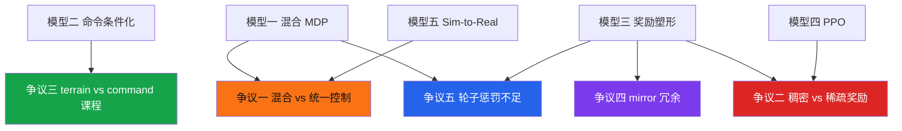

# ⚔️ Socratic Learn — Go2W Step 2 找争议

<p align="center">
  
  
  
</p>

---

## 📌 第二步：找争议

> 🔑 **核心问题：** Go2W 训练中，专家真正会吵的是什么？底层分歧在哪？

---

## 争议一：执行层 — 混合控制 vs 统一控制

<p align="center">
  
</p>

|  | 阵营 A：混合控制 (腿位置 + 轮速度) | 阵营 B：统一位置控制 |
|:--|:--|:--|
| 🏷️ **立场** | 不同执行器用最自然的控制模式 | 统一 action space，降低系统复杂度 |
| 📍 **本项目** | 站 A：`MixedActionCfg` | 不采用 |
| ✅ **核心论据** | 轮子持续滚动 → 速度控制天然匹配物理本质；腿有姿态目标 → 位置控制有明确物理含义 | 14 维统一位置控制 → 代码简单，obs 不需要区分腿/轮，部署端只需一种接口 |
| 🗣️ **反驳对方** | 轮子位置控制下，策略需要每步输出递增的 delta 才能滚动——PPO 输出的是单步值，很难学到"持续递增" | 混合控制在部署端需要维护两套控制逻辑，增加出错可能 |

```text
本项目路线 (A)：
  策略 → [12 位位置目标 + 2 维速度目标]
    → 腿: PD(target_pos)
    → 轮: velocity_control(target_vel)

统一路线 (B)：
  策略 → [14 位位置目标]
    → 轮子角度漂移 → 位置误差误导 critic → 策略退化
```

> 🔗 **关联骨架：** 模型一（混合 MDP）。本项目的选择不是架构偏好，是物理约束。

**拷问：** 如果给 Go2W 加一个可升降腰部关节（prismatic，行程 0-20cm），该用位置还是速度控制？

<details>
<summary>参考答案</summary>

位置控制。腰部有明确行程范围，目标是到达并保持某高度——和腿关节逻辑一致。速度控制会导致腰部持续漂移，需要额外界限逻辑。
</details>

---

## 争议二：塑形 — 稠密奖励 vs 稀疏引导

<p align="center">
  
</p>

|  | 阵营 A：Dense Reward Engineering | 阵营 B：更少奖励 + 更强课程 |
|:--|:--|:--|
| 🏷️ **立场** | 显式奖励速度、姿态、能耗、对称、平滑——15 项同时作用 | 只保留 tracking + 防摔倒，其他靠策略自己发现 |
| 📍 **本项目** | 站 A：28 项定义，15 项启用 | 不采用 |
| ✅ **核心论据** | 轮足搜索空间太大（腿+轮组合），没有密集信号训练极慢 | 奖励项越多越容易 reward hacking，迁移任务全废 |
| 🗣️ **反驳对方** | 稀疏奖励可能永远探索不到稳定 gait | 稠密奖励的权重是一次次试出来的，换到 Go2 又要重调 |

### 你的训练数据揭示的 tension

```
track_lin_vel_xy_exp = 1.62 (上限 3.0，达成 54%)
upward               = 3.88 (接近天花板)
action_rate_l2       = -0.68 (单步惩罚 ~0.68，在总 reward ~80 中占比 <1%)
joint_pos_penalty    = -0.69 (和 action_rate 相当)
```

`upward` 占正奖励的 ~62%。它接近天花板意味着——继续训练时，upward 已经无法提供有区分度的学习信号。策略提升只能靠 tracking 项，但 tracking 的提升空间被 action_rate/pos_penalty 两项惩罚压在下面。

**这不是"哪项权重该调"的问题，而是"奖励结构本身是否存在冲突"。** 策略被要求同时：追踪速度（要大动作）+ 动作平滑（要小变化）+ 关节不偏默认（要小偏移）——三者互斥。

> 🔗 **关联骨架：** 模型三（奖励塑形系统）。

**拷问：** 如果你的训练中 `action_rate_l2` 继续上升（绝对值增大），而 `track_lin_vel_xy` 停滞，你认为是奖励冲突还是策略在正常探索？

<details>
<summary>参考答案</summary>

区分方法：看 `mean action std`。当前 std=1.28，还比较高。如果 std 下降的同时 action_rate 上升 → 奖励冲突（策略想做大幅动作但被惩罚拉住）。如果 std 和 action_rate 正相关 → 正常探索。

另一个线索：如果 `joint_pos_penalty` 和 `action_rate_l2` 同涨 → 策略在被惩罚项驱赶，在惩罚项之间找平衡，而不是在优化主任务。
</details>

---

## 争议三：课程 — terrain 单推进 vs terrain+command 双推进

<p align="center">
  
</p>

|  | 阵营 A：只用 terrain curriculum | 阵营 B：terrain + command 双 curriculum |
|:--|:--|:--|
| 🏷️ **立场** | 命令范围 [-1,1] 固定，只让地形升级 | 地形和命令同步扩大，更自然 |
| 📍 **本项目** | 站 A：子类关闭了 command curriculum | 父类默认启用 |
| ✅ **核心论据** | 双 curriculum 叠加会导致难度暴涨，难以诊断 | 先学会简单命令再扩展，符合课程学习原则 |
| 🗣️ **反驳对方** | 命令范围固定，terrain 是唯一难度维度 → 可诊断性好 | terrain 到 5 级后 tracking 已到瓶颈，command 扩展被浪费 |

### 你的训练状态

```
terrain_levels = 5.18 (overall mean)
terrain_levels 分布未知 ← 需要看 histogram
tracking error_vel_xy = 0.9 m/s (命令范围 ±1.0)
```

Terrain 停在 5.x 说不一定是坏事——它意味着 curriculum 在工作（"你还没准备好升级"）。但如果长时间停滞，可能是因为：

1. 升级阈值对 Go2W 太高（轮足 tracking 天然比四足差）
2. 某些环境在低级别拉低均值
3. terrain_levels_vel 函数内部的 upgrade/downgrade 逻辑需要调参

> 🔗 **关联骨架：** 模型二（Commands 的 curriculum 路径） + 模型四（PPO 训练）。

**拷问：** 如果你的 terrain_levels 在 5.x 停了 3000 轮不动，你先调 upgrade threshold 还是先开 command curriculum？

<details>
<summary>参考答案</summary>

先调 upgrade threshold。因为它改变的唯一变量是"达到什么 tracking 水平才升级"——可控、可逆、可量化。

开 command curriculum 会同时改变两个难度维度，如果出事你分不清是哪个导致的。正确的控制变量顺序是：先调单变量 → 确认稳定 → 再开另一个。

但调 threshold 前，先看 terrain_levels 的分布（不是均值）。如果分布是双峰的（大部分在 level 3，少部分在 level 8），问题不是 threshold 而是采样或 reset 逻辑。
</details>

---

## 争议四：对称 — joint_mirror 是保险还是噪音？

<p align="center">
  
</p>

|  | 阵营 A：保留 mirror 作为弱约束 | 阵营 B：mirror 是冗余的 |
|:--|:--|:--|
| 🏷️ **立场** | 弱 mirror（-0.05）防止策略漂移出不对称 | 其他 reward 隐含鼓励对称，mirror 只加调参负担 |
| ✅ **核心论据** | 训练早期搜索空间大，mirror 缩小搜索 | torque + tracking 自然鼓励对称，mirror 数值可忽略 |
| 🗣️ **反驳对方** | 非对称地形需要不对称动作，mirror 限制了应对能力 | 权重 0.05 × 实际值 0.012 = 在总 reward 中完全不可见 |

**你的数据：** `joint_mirror = -0.012/step`。在 ~80 的 total reward 中占比 0.015%。两种可能：策略天然对称（mirror 冗余），或者权重太小策略无视了它（mirror 无效）。

区分实验：翻 10 倍权重 → 0.5。如果动作方差和 tracking 都不变 → mirror 是冗余的。如果 tracking 下降 → 对称和速度存在 tradeoff。

> 🔗 **关联骨架：** 模型三（mirror 配对联 FR↔RL, FL↔RR）。

---

## 争议五：轮子惩罚 — 几乎为零的约束够吗？

<p align="center">
  
</p>

### 腿 vs 轮惩罚权重对比

| 惩罚项 | 腿权重 | 轮权重 | 比例 |
|:---|:---:|:---:|:---:|
| torque_l2 | -2.5e-5 | **关闭** | ∞ |
| acc_l2 | -2.5e-7 | **-2.5e-9** | 100:1 |
| vel_l2 | 关闭 | **关闭** | — |
| power | -2e-5 | **无此项** | ∞ |
| pos_limits | -5.0 | **无此项** | ∞ |

轮子只有一项 `joint_acc_wheel_l2`，且权重是腿的 1/100。设计者赌的是"轮子速度控制 + action_rate_l2 已经足够约束轮子"。

但 `action_rate_l2=-0.68` 由 14 维动作共同贡献，12 条腿占了主导。轮子的 2 维动作变化可能被埋没。如果轮子速度在相邻步间剧烈震荡，action_rate 感知不到。

> 🔗 **关联骨架：** 模型三（reward 配置）+ 模型一（混合 action）。

**拷问：** 如果分别统计腿和轮的 action change/step，发现轮子是腿的 5 倍——但都被埋没在 action_rate 的 total 里。你会加轮子专属惩罚还是统一调 action_rate？

<details>
<summary>参考答案</summary>

加轮子专属惩罚。因为统一调 action_rate 会同时抑制腿的动作变化——腿可能本来就需要那些变化来完成速度跟踪。针对性调 `joint_acc_wheel_l2` 从 -2.5e-9 升到 -2.5e-7（和腿持平），只影响轮子。

调完后看两个指标：`action_rate_l2` 是否下降（轮子贡献被抑制），`track_lin_vel_xy` 是否不变（腿的动作自由度没被影响）。
</details>

---

## 🗺️ 争议 vs 骨架 对照



---

## 立场记录表

| 争议 | 你的立场 | 对方最强反驳 | 你会做的实验 |
|------|----------|-------------|-------------|
| 混合 vs 统一控制 | | | |
| 稠密 vs 稀疏奖励 | | | |
| terrain vs command 课程 | | | |
| mirror 保险 vs 冗余 | | | |
| 轮子惩罚不足 | | | |

---

## ❓ 反问

这五个争议里，你最站哪边？为什么？

别说"都重要"。选一边，然后说：**如果你错了，最先会在哪个实验现象里暴露？**
