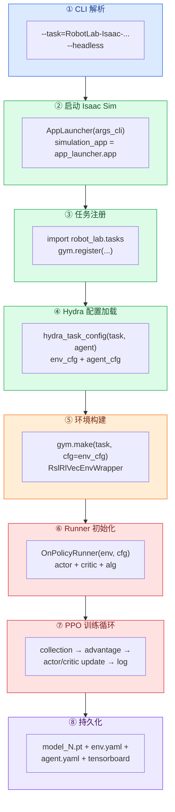
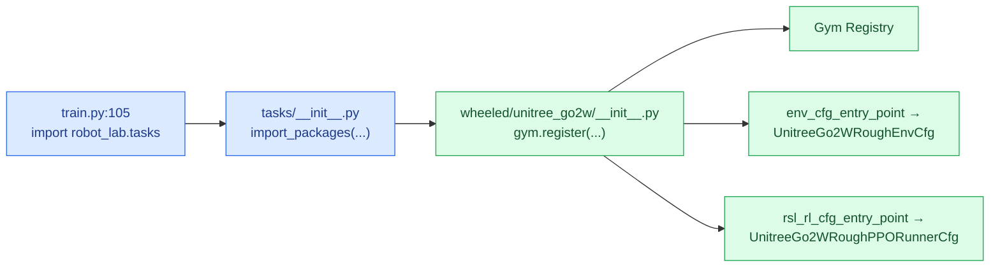
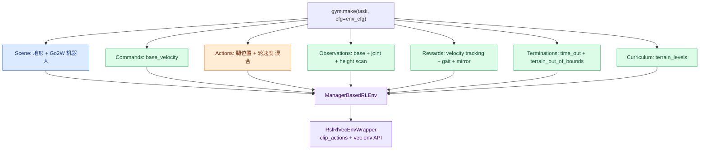
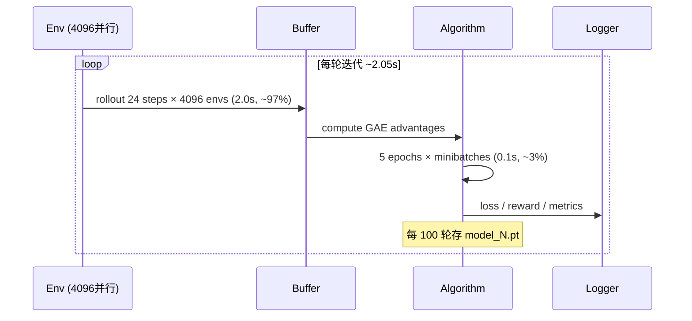
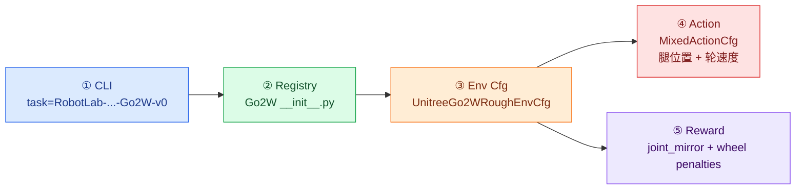

# Socratic 04: 训练管线骨架 — Go2W 从命令到梯度

主题: `python scripts/reinforcement_learning/rsl_rl/train.py --task=RobotLab-Isaac-Velocity-Rough-Unitree-Go2W-v0 --headless`

<div style="border-left: 6px solid #2563eb; background: #eff6ff; padding: 12px 16px; margin: 12px 0;">
<strong>学习目标</strong><br>
不只说出"train.py 启动训练"。你要能解释：一行 CLI 命令如何一步步变成 GPU 上的 PPO 梯度更新，以及 Go2W 的轮足混合控制在整个链路中哪里被特殊处理。
</div>

## 颜色图例

| 颜色 | 含义 | Go2W 训练中的对应 |
| --- | --- | --- |
| <span style="color:#2563eb"><strong>蓝色</strong></span> | CLI/启动层 | argparse → AppLauncher → SimulationApp |
| <span style="color:#16a34a"><strong>绿色</strong></span> | 配置解析层 | Hydra → env_cfg + agent_cfg |
| <span style="color:#f97316"><strong>橙色</strong></span> | Go2W 特化层 | 混合 action、轮子观测、joint_mirror |
| <span style="color:#dc2626"><strong>红色</strong></span> | 训练核心循环 | PPO collection → learning → logging |
| <span style="color:#7c3aed"><strong>紫色</strong></span> | 训练外围 | checkpoint、tensorboard、export |

---

## 总览：8 阶段链路



---

## 阶段 ①: CLI 解析 — argparse 与 hydra 的分工

```python
# train.py:22-51
parser = argparse.ArgumentParser(...)
parser.add_argument("--task", type=str, default=None, ...)
parser.add_argument("--agent", type=str, default="rsl_rl_cfg_entry_point", ...)
AppLauncher.add_app_launcher_args(parser)  # --headless 在这里
args_cli, hydra_args = parser.parse_known_args()
sys.argv = [sys.argv[0]] + hydra_args  # Hydra 接管剩余参数
```

| 参数 | 谁处理 | 值 |
|------|--------|-----|
| `--task=RobotLab-Isaac-...` | argparse | `args_cli.task` |
| `--headless` | argparse | 传给 AppLauncher，不渲染窗口 |

**关键点：** `parse_known_args()` 把 argparse 不认识的东西留给 Hydra，实现两套参数系统共存。

**自测题:** 如果命令写成 `-- task=... -- headless`（`--` 后面有空格），会发生什么？

<details>
<summary>参考答案</summary>

独立的 `--` 是 POSIX "选项结束"标记。argparse 会停止解析，`task=...` 和 `headless` 都变成位置参数落入 `hydra_args`。`args_cli.task` 保持 `None`，后续 `task_name.split(":")` 触发 `AttributeError`。
</details>

---

## 阶段 ②: 启动 Isaac Sim App

```
[INFO][AppLauncher]: Using device: cuda:0
[INFO][AppLauncher]: Loading experience file: .../isaaclab.python.kit
... (约 200 个扩展加载, ~16 秒)
Simulation App Startup Complete
```

| 关键扩展 | 作用 | 训练必需? |
|----------|------|-----------|
| `omni.physx` | 物理引擎 | ✅ |
| `omni.warp` | GPU 加速 tensor 运算 | ✅ |
| `isaaclab` | Isaac Lab 框架 | ✅ |
| `isaaclab_tasks` | 任务配置注册 | ✅ |
| `isaaclab_rl` | RSL-RL wrapper | ✅ |
| `isaaclab_assets` | 机器人资产库 | ✅ |
| `omni.kit.window.*` | UI 窗口 | ❌ headless 时不需要 |

---

## 阶段 ③: 任务注册 — `import robot_lab.tasks` 做了什么



**注册代码位置:** `robot_lab/source/robot_lab/robot_lab/tasks/manager_based/locomotion/velocity/config/wheeled/unitree_go2w/__init__.py`

**自测题:** 如果 `list_envs.py` 能看到 task 但训练找不到 agent cfg，查哪个入口字符串？

<details>
<summary>参考答案</summary>

查 `gym.register` 的 `kwargs["rsl_rl_cfg_entry_point"]`——它指向 agent/runner 配置类。`list_envs.py` 只用 `id` 和 `entry_point`，不碰 agent cfg。agent cfg 出错只有训练/play 时才会暴露。
</details>

---

## 阶段 ④: Hydra 配置加载 — 两个 cfg 如何合并

```
[INFO]: Parsing configuration from: ...unitree_go2w.rough_env_cfg:UnitreeGo2WRoughEnvCfg
[INFO]: Parsing configuration from: ...unitree_go2w.agents.rsl_rl_ppo_cfg:UnitreeGo2WRoughPPORunnerCfg
```

```python
# hydra.py:80
env_cfg, agent_cfg = register_task_to_hydra(task_name.split(":")[-1], agent_cfg_entry_point)
```

| 步骤 | 操作 | 结果 |
|------|------|------|
| 1 | `load_cfg_from_registry(task_name, "env_cfg_entry_point")` | `UnitreeGo2WRoughEnvCfg` 实例 |
| 2 | `load_cfg_from_registry(task_name, agent_cfg_entry_point)` | `UnitreeGo2WRoughPPORunnerCfg` 实例 |
| 3 | 替换 gym spaces → string | OmegaConf 兼容 |
| 4 | `.to_dict()` 转字典 | `{"env": {...}, "agent": {...}}` |
| 5 | `ConfigStore.instance().store(name=task_name, node=cfg_dict)` | 注册到 Hydra |

Hydra 通过 `@hydra.main` 装饰器在运行时用命令行覆盖配置。

---

## 阶段 ⑤: 环境构建 — Go2W 的 MDP 实例化



### Go2W 混合 action 的特殊处理

```python
# rough_env_cfg.py (Go2W)
actions = MixedActionCfg(
    leg_action=JointPositionActionCfg(...),   # 腿: 位置控制
    wheel_action=JointVelocityActionCfg(...),  # 轮: 速度控制
)
```

| 部件 | 控制类型 | 原因 |
|------|----------|------|
| 腿关节 (12个) | 位置控制 | 姿态有明确目标角度 |
| 轮关节 (2个) | 速度控制 | 轮子需要持续滚动 |

**自测题:** 如果把轮子也改成位置控制，训练会出什么问题？

<details>
<summary>参考答案</summary>

轮子持续滚动时轮角不断累积。位置控制的策略会试图把轮子转到某个"固定角度"而不是维持速度，导致轮角误差误导 actor 和 critic。实际表现可能是轮子来回转，机器人走不起来。
</details>

---

## 阶段 ⑥: Runner 初始化 — PPO 的 actor/critic 构建

```python
# train.py:206
runner = OnPolicyRunner(env, agent_cfg.to_dict(), log_dir=log_dir, device=agent_cfg.device)
```

Runner 内部构建:

| 组件 | 输入维度 | 输出维度 | 隐藏层 |
|------|----------|----------|--------|
| Actor | obs_dim + cmd_dim | act_dim (14: 12腿位置 + 2轮速度) | MLP [512, 256, 128] |
| Critic | obs_dim + cmd_dim (+ privileged) | 1 (value) | MLP [512, 256, 128] |
| Algorithm | — | — | PPO (clip, advantage, entropy) |

**存储缓冲区:** `num_steps_per_env=24 × num_envs=4096 = 98304 transitions/iteration`

---

## 阶段 ⑦: PPO 训练循环 — 每 2 秒发生了什么

```
################################################################################
                     Learning iteration 1772/20000

                      Total steps: 174292992
                 Steps per second: 45069        ← GPU 吞吐
                  Collection time: 2.087s        ← 环境推演
                    Learning time: 0.094s        ← 网络更新
                  Mean value loss: 0.1123
              Mean surrogate loss: -0.0119
                Mean entropy loss: 25.5693
                      Mean reward: 80.93
              Mean episode length: 1000.00       ← 全部存活 ✅
...
                       Iteration time: 2.18s
```



**时间占比:**
- 环境推演: 2.05s / 2.15s = **95%**（Physics + Rendering）
- 网络更新: 0.10s / 2.15s = **5%**（GPU matmul）
- **瓶颈在仿真，不在学习。**

**自测题:** 如果 `Learning time` 突然从 0.09s 涨到 2s，`Collection time` 不变，可能原因是什么？

<details>
<summary>参考答案</summary>

Collection time 不变说明仿真正常。Learning time 暴涨可能原因:
1. GPU 被其他进程抢占（nvitop 确认）
2. minibatch size 或 epoch 数被改大
3. 网络结构被改深（更多参数）
4. 混合精度训练被关闭，回退到 FP32

优先查 GPU 占用和 agent cfg 中的 learning 参数。
</details>

---

## 阶段 ⑧: 持久化 — 日志和 checkpoint

```
logs/rsl_rl/unitree_go2w_rough/
└── 2026-06-13_14-19-17/
    ├── model_0.pt              ← 初始权重
    ├── model_100.pt            ← 每 100 轮存一次
    ├── model_2400.pt
    ├── ...
    ├── params/
    │   ├── env.yaml            ← 完整环境配置
    │   └── agent.yaml          ← 完整 agent 配置
    ├── git/                    ← 训练时的 git commit hash
    └── events.out.tfevents...  ← TensorBoard 事件
```

| 文件 | 用途 | 谁读 |
|------|------|------|
| `model_N.pt` | PPO checkpoint (actor+critic+optimizer+normalizer) | `play.py`, `train.py --resume` |
| `env.yaml` | 环境可复现性 | 调试、对比实验 |
| `agent.yaml` | 算法可复现性 | 调试、对比实验 |
| `events.out.*` | TensorBoard 曲线 | 监控训练 |

---

## Go2W 在整条链路中的 5 个特殊插入点



| 插入点 | 文件 | 如果不特殊处理 |
|--------|------|---------------|
| ① Task ID | `__init__.py` | 找不到 task |
| ② Env cfg | `rough_env_cfg.py` | 用错 base class |
| ③ Scene robot | env cfg 中的 `robot` 字段 | 加载错误机器人模型 |
| ④ Mixed action | env cfg 中的 `actions` 字段 | 轮子控制语义错 |
| ⑤ Wheel reward | env cfg 中 `joint_acc_wheel_l2` 等 | 轮子动作不受约束 |

---

## 一句话骨架

<div style="border-left: 6px solid #2563eb; background: #eff6ff; padding: 12px 16px; margin: 12px 0;">
<strong>用自己的话说一遍</strong><br>
一行 <code>--task=RobotLab-Isaac-Velocity-Rough-Unitree-Go2W-v0</code> 触发了: Isaac Sim 启动 → task registry 中找到 Go2W 的环境和 agent 配置 → Hydra 合并 CLI 覆盖 → gym.make 创建 4096 个并行 Go2W 环境（腿位置+轮速度混合控制）→ RSL-RL PPO runner 每 2 秒做一次 collection+learning → 每 100 轮存 checkpoint。
</div>

**问题:** 这 8 个阶段里，你最熟悉哪个？最陌生的是哪个？
