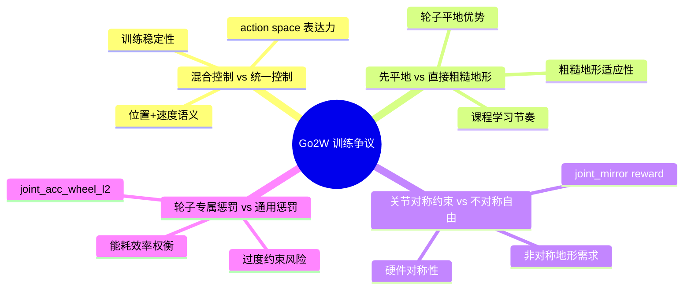
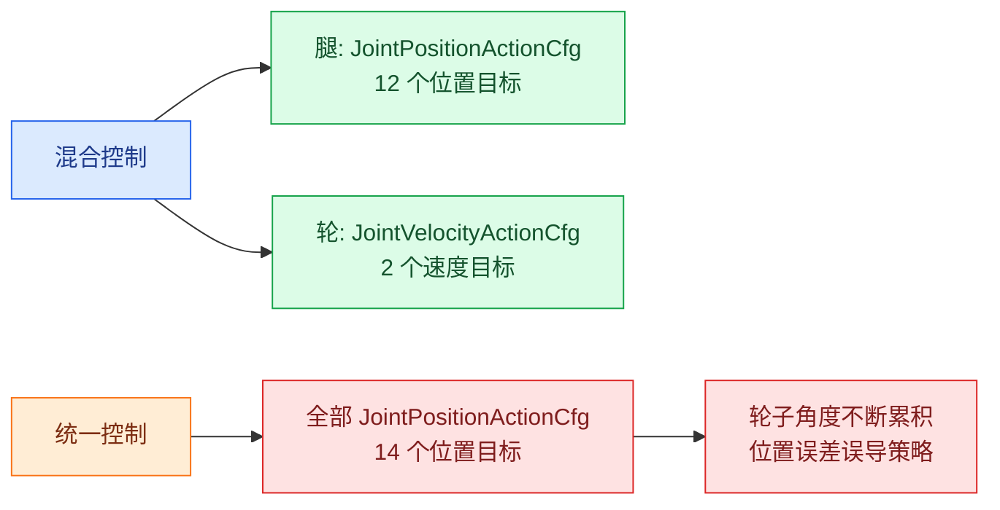
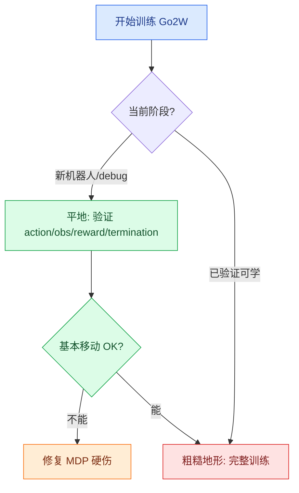
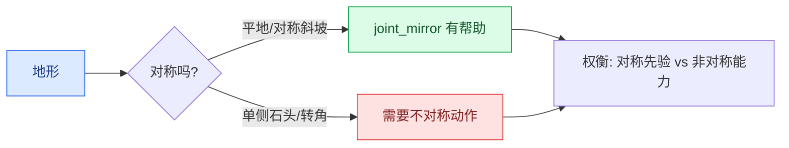
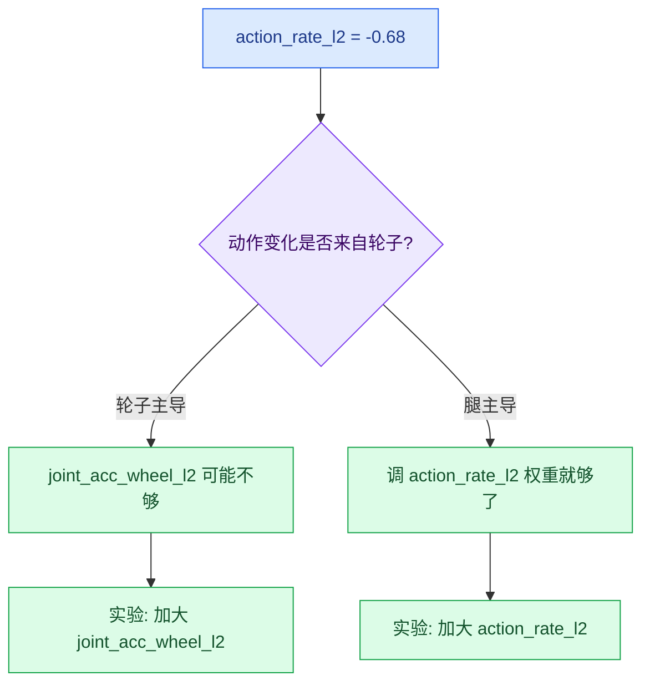

# Socratic 05: 轮足争议 — Go2W 训练中的设计取舍

主题: Go2W 轮足混合机器人 RL 训练

<div style="border-left: 6px solid #f97316; background: #fff7ed; padding: 12px 16px; margin: 12px 0;">
<strong>学习目标</strong><br>
Go2W 不是"四条腿加两个轮子"那么简单。它的每个设计选择都踩在一个争议上——理解这些争议，你才知道当前方案为什么长这样，以及什么时候该打破它。
</div>

## 争议地图



## 快速总表

| 争议 | 阵营 A | 阵营 B | 真正分歧 | 代码锚点 |
|------|--------|--------|----------|----------|
| 混合控制 vs 统一控制 | 腿用位置+轮用速度，各取最优 | 全部统一位置或统一速度，简化架构 | 控制语义 vs 架构整洁 | `rough_env_cfg.py` actions |
| 先平地 vs 直接粗糙地形 | 先平地学基本移动，再迁移 | 一开始就粗糙地形，避免过拟合平地 | 训练效率 vs 泛化能力 | `flat_env_cfg.py` vs `rough_env_cfg.py` |
| 关节对称 vs 不对称自由 | 加 joint_mirror 减少非对称动作 | 不加，让策略自己决定 | 结构先验 vs 端到端学习 | `rewards.py` joint_mirror |
| 轮子专属惩罚 vs 通用惩罚 | 轮子加速度单独约束，防止抖动 | 统一 action_rate_l2 就够了 | 精细控制 vs 调参负担 | `joint_acc_wheel_l2` |

---

## 争议 1: <span style="color:#2563eb">混合控制</span> 还是 <span style="color:#f97316">统一控制</span>？

**问题:** Go2W 的腿和轮应该用不同的 action type，还是统一成一种？

### 对照表

| 维度 | 混合控制 (位置 + 速度) | 统一控制 (全部位置或全部速度) |
|------|------------------------|-------------------------------|
| 核心信念 | 不同执行器应该用最自然的控制模式 | 统一 action space 降低学习和维护成本 |
| 优点 | 语义清晰，策略更容易学到合理行为 | action space 维度简单，不需要混合处理 |
| 风险 | 代码和配置复杂，obs 中需区分处理 | 轮子位置控制 → 角度漂移；腿速度控制 → 姿态不稳定 |
| 代码证据 | `MixedActionCfg` + `joint_pos_rel_without_wheel` | Go2 (纯四足) 的 `JointPositionActionCfg` |
| 部署影响 | 部署端必须区分腿/轮控制模式 | 部署端只需一种控制接口 |



**代码锚点:**
- `velocity_env_cfg.py`: `MixedActionCfg` 定义
- `rough_env_cfg.py`: Go2W 的 `actions` 字段，`joint_pos_rel_without_wheel`

<div style="border-left: 6px solid #dc2626; background: #fef2f2; padding: 12px 16px; margin: 12px 0;">
<strong>拷问</strong><br>
如果你想给 Go2W 再加一个可升降的腰部关节（prismatic），应该用位置控制还是速度控制？为什么？
</div>

<details>
<summary>参考答案</summary>

腰部升降有明确的行程范围（上限/下限），目标是达到某个高度并保持。这和腿关节类似——有姿态意义，有位置限制。

→ 用**位置控制**。速度控制会让腰部不断漂移，需要额外逻辑限制行程。

但观测中需要加入腰部位置/速度，reward 中可能需要加入腰部高度惩罚。
</details>

---

## 争议 2: <span style="color:#16a34a">先平地后粗糙</span> 还是 <span style="color:#dc2626">一开始就粗糙地形</span>？

**问题:** Go2W 训练应该先在平地上学会基本移动，再迁移到粗糙地形；还是直接在整个粗糙地形上训练？

### 对照表

| 维度 | 先平地 → 后粗糙 | 直接粗糙地形 |
|------|-----------------|-------------|
| 核心目标 | 快速验证基本 MDP 是否 work | 避免学到平地特化策略 |
| 优点 | 迭代快、易诊断、减少变量 | 最终策略更鲁棒 |
| 风险 | 平地策略可能无法迁移到粗糙 | 早期学习被复杂地形淹没 |
| 轮足特殊性 | 轮子在平地上优势太大，可能学到"纯轮驱动"而非"腿轮协调" | 粗糙地形强迫使用腿 |
| 代码证据 | `flat_env_cfg.py` 关闭 terrain curriculum | `rough_env_cfg.py` 启用 `ROUGH_TERRAINS_CFG` |



<div style="border-left: 6px solid #dc2626; background: #fef2f2; padding: 12px 16px; margin: 12px 0;">
<strong>拷问</strong><br>
Go2W 在平地上学会的策略，迁移到粗糙地形时什么能力最容易退化？
</div>

<details>
<summary>参考答案</summary>

**腿的使用频率。** 平地策略可能学到"尽量用轮子滚动，腿保持锁定或小幅调整"——因为轮子驱动在平地上能量效率最高。

迁移到粗糙地形后，轮子可能被石头卡住或打滑，策略被迫重新学习用腿来越障。但训练数据中不平整地形的比例一开始太低，可能导致 return 骤降甚至摔倒率飙升。

验证方法: 对比平地/粗糙地形的 joint_pos 方差。如果方差差异很大，说明腿的使用模式完全不同。
</details>

---

## 争议 3: <span style="color:#7c3aed">关节对称</span> 还是 <span style="color:#f97316">不对称自由</span>？

**问题:** Go2W 的左右腿是对称的，训练应该加 `joint_mirror` 惩罚来鼓励对称步态，还是让策略自己探索？

### 对照表

| 维度 | 加 joint_mirror | 不加，自由探索 |
|------|----------------|---------------|
| 核心信念 | 硬件对称 → 动作也该对称 | 非对称地形需要非对称动作 |
| 优点 | 更自然的步态，减少非对称陋习 | 不限制策略，可能发现新步态 |
| 风险 | 限制非对称地形的应对能力 | 可能学到左右不平衡的奇怪步态 |
| 当前状态 | Go2W 启用了 `joint_mirror` | `weight` 较小（约 -0.004 ~ -0.013/step） |



<div style="border-left: 6px solid #dc2626; background: #fef2f2; padding: 12px 16px; margin: 12px 0;">
<strong>拷问</strong><br>
你的 Go2W 训练输出中 <code>joint_mirror ≈ -0.012</code>，绝对值很小。这是说明 reward 无效，还是说明策略天然对称？
</div>

<details>
<summary>参考答案</summary>

两种情况都可能:

**如果 reward 无效:** 权重太小，策略忽略了它。可以临时加大权重到 1.0，看 episode return 是否显著下降，动作是否变化。

**如果策略天然对称:** 其他 reward (velocity tracking + gait + torque) 已经隐含鼓励对称——因为不对称步态通常更费能量、速度跟踪更差。

区分方法: 把 `joint_mirror` 临时权重翻 10 倍，比较:
- 动作方差是否变小
- 速度跟踪是否下降
- 地形适应性是否变差

如果三个指标都没变化，说明策略本来就对称，reward 是冗余的。
</details>

---

## 争议 4: <span style="color:#dc2626">轮子加速度单独惩罚</span> 还是 <span style="color:#16a34a">统一 action rate 惩罚</span>？

**问题:** Go2W 的轮子需要单独的 `joint_acc_wheel_l2` 惩罚，还是统一的 `action_rate_l2` 就够了？

### 对照表

| 维度 | 单独轮子加速度惩罚 | 统一 action_rate_l2 |
|------|-------------------|-------------------|
| 原因 | 轮子速度变化比腿位置变化更频繁、更大 | 减少调参负担 |
| 当前状态 | `joint_acc_wheel_l2 ≈ -0.008` | `action_rate_l2 ≈ -0.68` |
| 问题 | action_rate_l2 已经很高，加额外 wheel 惩罚可能过约束 | 轮子速度方向的 action rate 和腿位置的 action rate 语义不同 |

**当前训练数据:**

```
action_rate_l2: -0.68     ← 已经很高，说明策略动作变化频繁
joint_acc_wheel_l2: -0.008 ← 数值很小，被 action_rate_l2 主宰
```



<div style="border-left: 6px solid #dc2626; background: #fef2f2; padding: 12px 16px; margin: 12px 0;">
<strong>拷问</strong><br>
<code>action_rate_l2=-0.68</code> 但 <code>joint_acc_wheel_l2=-0.008</code>，100 倍差距。轮子的加速度惩罚在总分中几乎看不见。这是设计缺陷还是合理的？
</div>

<details>
<summary>参考答案</summary>

取决于轮子动作的实际贡献:

1. 腿有 12 个关节，轮只有 2 个。12:2 的比例意味着 action_rate_l2 天然腿主导。
2. 如果轮子速度变化确实比腿小，那小权重合理。
3. 但如果轮子速度抖动但被埋没在腿的 action_rate 中，可能需要单独加大 wheel penaly。

诊断实验:
- 分别统计腿和轮的 action change per step（分开算 L2）。
- 如果轮子 action change 的方差远超腿，说明当前惩罚不够。
- 如果轮子 action change 和腿差不多，那当前设计合理。
</details>

---

## 立场记录表

| 争议 | 你的立场 | 对方最强反驳 | 你会做的实验 |
|------|----------|-------------|-------------|
| 混合控制 vs 统一控制 | | | |
| 先平地 vs 直接粗糙 | | | |
| 关节对称 vs 不对称自由 | | | |
| 轮子专属惩罚 vs 通用惩罚 | | | |

<details>
<summary>参考填写示例</summary>

| 争议 | 我的立场 | 对方最强反驳 | 实验 |
|------|----------|-------------|------|
| 混合控制 vs 统一控制 | 保持混合控制 | 统一控制简化部署 | 对比统一位置控制的训练曲线和视频 |
| 先平地 vs 直接粗糙 | debug 阶段先平地 | 平地策略迁移退化 | 平地策略 + 1 个粗糙 episode 看退化程度 |
| 关节对称 vs 不对称自由 | 保留弱 mirror | 非对称地形需要不对称 | 加大 mirror 权重看非对称地形表现 |
| 轮子专属惩罚 vs 通用惩罚 | 先分析轮/腿 action change 比例 | 多一项调参负担 | 分别统计腿和轮的 action change/step |
</details>
