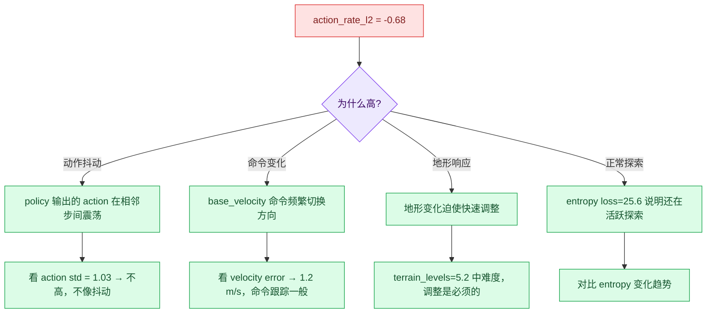

# Socratic 06: 训练诊断 — Go2W 被拷问

主题: Go2W 训练中的故障诊断与反事实推理

<div style="border-left: 6px solid #dc2626; background: #fef2f2; padding: 12px 16px; margin: 12px 0;">
<strong>学习目标</strong><br>
训练跑起来了不等于你懂了。每道题都要落到具体文件、类名、配置字段、诊断实验——不能只给方向性回答。
</div>

## 题型图例

| 标记 | 类型 | 你要做什么 |
|------|------|-----------|
| <span style="color:#2563eb"><strong>Cross-connect</strong></span> | 跨概念连接 | 把 CLI、cfg、MDP、训练循环串起来 |
| <span style="color:#f97316"><strong>Counterfactual</strong></span> | 反事实推理 | 假设改一处，推断系统怎么变 |
| <span style="color:#dc2626"><strong>Diagnosis</strong></span> | 现象诊断 | 给现象，定位断点和验证实验 |

## 题目总览

| 题号 | 类型 | 主题 | 核心考点 |
|------|------|------|----------|
| Q1 | Diagnosis | action_rate_l2 过高 | 动作平滑 vs 速度跟踪的 tradeoff |
| Q2 | Cross-connect | Go2W action 语义 | MixedActionCfg, 观测中轮子特殊处理 |
| Q3 | Counterfactual | 关闭 joint_mirror | 对称先验的作用 |
| Q4 | Diagnosis | terrain_levels 停滞 | curriculum 调参 |
| Q5 | Diagnosis | mean reward 剧烈波动 | episode return 的构成分析 |
| Q6 | Counterfactual | num_envs 减半 | batch size vs diversity tradeoff |
| Q7 | Cross-connect | env_cfg × agent_cfg 交互 | Hydra 覆盖、seed、device |
| Q8 | Diagnosis | 训练初期频繁摔倒 | action/init_pose/termination 诊断顺序 |
| Q9 | Counterfactual | wheel velocity action → position | 控制模式修改的影响 |
| Q10 | Diagnosis | play 好但实际部署漂移 | export ≠ interface contract |

---

## Q1: <span style="color:#dc2626">action_rate_l2 居高不下</span>

**类型:** Diagnosis

**现象:** 你的 Go2W 训练中 `action_rate_l2 ≈ -0.68`（绝对值偏高），说明策略每一步都在大幅改变动作。但 `track_lin_vel_xy_exp ≈ 1.6` 还不错。



**问题:** 设计实验区分"策略在抖动"和"策略在必要地调整"。  
**追问:** 如果你的实验确认是抖动，你会先调 `action_rate_l2` 的权重，还是先改 action scale？为什么？

<details>
<summary>参考答案</summary>

**区分实验:**
1. 固定地形（`terrain.curriculum=False`），固定命令（小恒定速度），看 `action_rate_l2` 是否下降。
2. 如果下降 → 之前高是因为地形+命令变化，策略在合理调整。
3. 如果不降 → 策略自主抖动，需要干预。

如果确认是抖动，**先改 action scale 再改 reward 权重**。原因:
- action scale 太小 → 策略需要大幅输出才能产生小动作，但连续的 overshoot 导致震荡。增大 action scale 可能直接消除抖动。
- action scale 已经合理 → 再调 `action_rate_l2` 权重。

调 reward 权重是间接手段，改 control 参数是直接手段。先直接后间接。
</details>

---

## Q2: <span style="color:#2563eb">Go2W 的 action 和 observation 中有哪些"轮子特供"？</span>

**类型:** Cross-connect

**问题:** Go2W 的 action 和 observation 配置中，哪些字段是专门为轮子存在的？逐个列出并解释为什么四足 Go2 不需要它们。

**必须覆盖:** `MixedActionCfg`, `JointVelocityActionCfg`, `joint_pos_rel_without_wheel`, `joint_acc_wheel_l2`

<details>
<summary>参考答案</summary>

| 字段 | 位置 | Go2W 需要 | Go2 不需要 |
|------|------|-----------|-----------|
| `MixedActionCfg` | `actions` | 腿位置+轮速度混合 | 只有位置控制 |
| `JointVelocityActionCfg` | `actions.wheel_action` | 轮子用速度控制 | 无轮子 |
| `joint_pos_rel_without_wheel` | `observations.policy` | 观测中去掉轮子绝对位置 | 不需要区分 |
| `joint_acc_wheel_l2` | `rewards` | 单独惩罚轮子加速度 | 无轮子 |

**`joint_pos_rel_without_wheel` 的核心逻辑:**
轮子连续滚动时，轮角不断增大（可以转几百圈）。如果观测中包含轮子的绝对角度，这个值会无界增长，破坏神经网络的数值稳定性。所以只保留腿关节的绝对位置，轮子用相对位置（变化量）或速度替代。
</details>

---

## Q3: <span style="color:#f97316">如果关闭 joint_mirror</span>

**类型:** Counterfactual

**问题:** 假设把 Go2W 的 `joint_mirror` reward weight 设为 0。给出:
1. 三个可能改善的场景
2. 三个可能恶化的场景
3. 一个能验证你判断的最小实验

<details>
<summary>参考答案</summary>

**可能改善:**
1. 非对称地形（单侧斜坡、单侧石头）——允许左右腿采取不同策略
2. 转弯时内外侧腿自然差异不再被惩罚
3. 单腿被卡住时，另一侧腿可以补偿

**可能恶化:**
1. 平地行走出现左右不对称步态（美观和能耗问题）
2. 策略可能长期偏重某一侧，磨损不对称
3. 训练早期探索空间更大，可能收敛更慢

**最小实验:**
- 固定对称地形，比较 `joint_mirror=0` 和 `joint_mirror=0.5`（加大）的 episode return 和视频
- 固定非对称地形（单侧障碍物），比较同样的两个配置
- 预期: 对称地形下 mirror=0.5 更好看；非对称地形下 mirror=0 速度更快
</details>

---

## Q4: <span style="color:#dc2626">terrain_levels 为什么停滞在 5.x？</span>

**类型:** Diagnosis

**现象:** 你的 Go2W 训练跑了 1700+ 轮，`terrain_levels ≈ 5.18`，没有再上升。

```
Curriculum/terrain_levels: 5.1800 → 5.1828 → 5.1814 → 5.1819
```

**问题:** 列举 4 个可能导致地形难度不再上升的原因，并给出每个的诊断方法。

<details>
<summary>参考答案</summary>

| 原因 | 诊断方法 |
|------|----------|
| 1. 速度跟踪在 5 级地形已达阈值上限，策略升级后又掉下来 | 看 `terrain_levels_vel` 函数中的 upgrade/downgrade 阈值逻辑；查 episode sum 在 level 5 vs 6 的差异 |
| 2. 地形 curriculum 的 threshold 对 Go2W 偏高（轮足机器人速度跟踪可能不如纯四足） | 降低 upgrade 阈值，观察 level 是否上升 |
| 3. `max_init_terrain_level=5` 限制了初始分布，升到 6 需要更长时间积累 | 检查 `terrain_importer.py` 中的升级逻辑；看是否在 5 级到达稳态 |
| 4. 4096 个环境中部分在低级的拉低了平均 | 看 terrain_levels 分布（不是均值），检查是否有大量环境在低级别 |

**代码锚点:**
- `curriculums.py` 中的 `terrain_levels_vel` 函数
- `terrain_importer.py:320-327` 的 `update_env_origins`
</details>

---

## Q5: <span style="color:#dc2626">mean reward 从 4.3 跳到 80.9</span>

**类型:** Diagnosis

**现象:** 你的训练从 iteration 34 到 1772，`mean reward` 从 4.36 涨到了 80.93。

但 episode return 的构成中:
```
Episode_Reward/upward:             3.88   ← 最大正贡献
Episode_Reward/track_lin_vel_xy:   1.62   ← 第二
Episode_Reward/track_ang_vel_z:    0.77
Episode_Reward/action_rate_l2:    -0.68   ← 最大负贡献
Episode_Reward/joint_pos_penalty: -0.69   ← 和 action_rate 相当
```

**问题:** 计算剔除 `upward` 奖励后的有效任务 reward。`upward` 占这么大比例说明什么？

<details>
<summary>参考答案</summary>

**有效任务 reward ≈ 80.93 - 3.88 = 77.05**（剔除朝向奖励后）

但实际上还要看所有惩罚项的总和:
- 惩罚总和 ≈ -(0.11+0.36+0.03+0.20+0.02+0.01+0.02+0.69+0.01+0.68+0.04+0.02) ≈ -2.19
- 正面 reward ≈ 3.88 + 1.62 + 0.77 = 6.27

**`upward` 占比大说明:**
1. 策略已经学会保持机身直立——这是生存的基础，是好事
2. 但它区分度下降——`time_out=1.0`, `upward≈3.9` 说明所有 episode 都活得很好，`upward` 接近天花板
3. 后续提升应该看 `track_lin_vel_xy` 和 `track_ang_vel_z`——它们是区分"能走"和"走得好"的关键
</details>

---

## Q6: <span style="color:#f97316">如果把 num_envs 从 4096 减到 512</span>

**类型:** Counterfactual

**问题:** 当前训练用 4096 个并行环境。如果改成 512（GPU 显存压力小很多），给出:
1. 训练速度会怎么变
2. 学习质量会怎么变（batch diversity）
3. PPO 哪些超参数可能需要同步调整

<details>
<summary>参考答案</summary>

**训练速度:**
- 每轮迭代时间 ≈ (512/4096) × 2.05s？不一定。GPU 利用率可能下降（batch 太小填不满），实际加速可能只有 2-3x 而非 8x。
- 总步数到收敛可能不变或增加（每轮数据少，需要更多轮）。

**学习质量:**
- Batch diversity 下降：512×24 = 12288 transitions/iteration vs 98304。PPO 的 advantage 估计方差更大。
- 可能学得更慢，需要更多 iteration。

**需要同步调整的超参数:**
| 参数 | 建议调整 |
|------|----------|
| `num_steps_per_env` | 从 24 增大到 48 或更多，补偿 env 减少 |
| `num_mini_batches` | 可能需要减少 |
| `learning_rate` | 可能需要降低（梯度噪声更大） |
| entropy coef | 可能需要增大（探索不够） |

**结论:** 不推荐在生产中降到 512。debug 时可以暂时减少来加速迭代，但最终训练应该恢复 4096。
</details>

---

## Q7: <span style="color:#2563eb">env_cfg 和 agent_cfg 在哪一步被合并？</span>

**类型:** Cross-connect

**问题:** `env_cfg`（环境配置）和 `agent_cfg`（PPO 配置）在整个训练链路中分开加载，但有些字段两个 cfg 都需要。请找出:
1. 哪一步它们第一次被放在一起
2. `env_cfg.seed` 和 `agent_cfg.seed` 是什么关系
3. `env_cfg.sim.device` 和 `agent_cfg.device` 是什么关系

<details>
<summary>参考答案</summary>

**1. 第一次合并在 Hydra:**
```python
# hydra.py:54
cfg_dict = {"env": env_cfg_dict, "agent": agent_cfg_dict}
ConfigStore.instance().store(name=task_name, node=cfg_dict)
```
它们被合并成一个 Hydra config node，由 `@hydra.main` 装饰器在运行时统一管理。

**2. seed 关系 (train.py:133):**
```python
env_cfg.seed = agent_cfg.seed  # env seed 被 agent seed 覆盖
```
如果 `--seed` CLI 参数存在，它会先更新 agent_cfg，再传播到 env_cfg。分布式训练时再加 local_rank。

**3. device 关系 (train.py:134):**
```python
env_cfg.sim.device = args_cli.device if args_cli.device else env_cfg.sim.device
# agent_cfg.device 在第 145 行分布式场景中才被显式设置
```
正常单卡训练: env 在 `cuda:0` 上仿真，agent 在 `cuda:0` 上学习。
分布式训练: env 分到各 GPU，agent 也分到各 GPU。
</details>

---

## Q8: <span style="color:#dc2626">新 Go2W 训练，前 100 轮 episode length 不到 100</span>

**类型:** Diagnosis

**现象:** 你启动了一个新的 Go2W 训练（比如改了 reward 或 action），前 100 轮 `mean episode length < 100`，机器人频繁摔倒终止。

**问题:** 给出诊断顺序（优先级从高到低），每个检查项要说清楚"如果这里对/错，下一步去哪"。

<details>
<summary>参考答案</summary>

| 优先级 | 检查项 | 如果对 | 如果错 |
|--------|--------|--------|--------|
| 1 | `zero_agent` 能否 step 1000 步 | 查学习问题 → 2 | 查环境硬伤 → 1a |
| 1a | `scene.robot` 资产是否正确 | → 1b | 修复资产路径 |
| 1b | 初始关节角是否让机器人站立 | → 1c | 修复 default_joint_pos |
| 1c | action scale 是否合理 | → 1d | 调大/调小 action scale |
| 1d | `illegal_contact` 是否误触发 | → 2 | 修复 contact sensor |
| 2 | `random_agent` 的 episode length 分布 | 如果 > 200 → 3 | 如果 < 100 → 回 1 |
| 3 | 关闭所有 domain randomization | 如果能学 → 4 | 查 reward/termination → 5 |
| 4 | 逐项加回随机化 | 找具体断点 | — |
| 5 | 固定平地+小命令+关终止 | 如果能学 → reward 可用 | 如果不能 → reward/obs/action 有硬伤 |

**Go2W 特别注意:**
- 轮子初始速度应为 0，不要给 speed command 随机初始值
- 混合 action 中轮子 velocity action 的 scale 不能太大（否则轮子暴冲导致翻倒）
- `init_pose` 中 body 高度是否足够（轮子半径计入高度）
</details>

---

## Q9: <span style="color:#f97316">如果把轮子 velocity action 改成 position action</span>

**类型:** Counterfactual

**问题:** 修改 `rough_env_cfg.py`，把 `JointVelocityActionCfg` 替换为 `JointPositionActionCfg`。推断:
1. 训练初期的 episode length
2. 收敛后的 velocity tracking
3. 轮子在视频中的表现

<details>
<summary>参考答案</summary>

**1. 训练初期:**
策略需要输出 14 个位置目标（包括 2 个轮子）。轮子的初始位置是当前角度。如果策略输出轮子目标=当前角度，轮子不动。如果策略输出目标=当前角度+delta，轮子转 delta 后停下。策略必须持续输出递增的 delta 才能让轮子滚动。

→ 早期 episode length 可能和原来差不多（只要能站稳），但 velocity tracking 会差很多——轮子不会持续滚动。

**2. 收敛后:**
策略可能学到"高频振荡"——快速交替输出正负 delta，平均效果 = 轮子缓慢前进。但 tracking error 会比 velocity action 大得多，因为位置控制不适合持续运动。

**3. 视频表现:**
轮子会一顿一顿地转，像齿轮卡住。整体移动速度变慢，转弯笨拙。机器人可能更多依赖腿走路而非轮子滚动，退化成一个"差一点的四足"。

**结论:** 轮子用速度控制不是偏好，是物理必然。
</details>

---

## Q10: <span style="color:#dc2626">play 表现好，ONNX 部署到另一个控制栈后飘移</span>

**类型:** Diagnosis

**问题:** `play.py` 中 Go2W 策略走得很好，你导出 `policy.onnx`，部署到另一台机器的控制栈上。机器人表现为:
- 前几步正常
- 几秒后开始偏航
- 30 秒后完全失控

**问题:** 沿 RobotLab 的链条列出所有可能的断点，每个断点给出检查方法和修复手段。

<details>
<summary>参考答案</summary>

| 断点 | 检查方法 | 修复 |
|------|----------|------|
| **1. Observation 顺序** | 对比 `env.observation_manager.group_obs_dim` 的 key 顺序和部署端输入顺序 | 导出 obs order JSON 作为接口文档 |
| **2. Observation normalize** | 对比 runner 中的 `actor_obs_normalizer.mean/std` 和部署端的 normalize 参数 | 导出 normalizer 参数到部署端 |
| **3. Action scale/clip** | 对比 `env_cfg.actions.*.scale` 和部署端的 action 缩放 | 导出 action scale 和 clip 值 |
| **4. Joint order** | 对比 `env_cfg.scene.robot.joint_names` 和部署端 joint 顺序 | Go2W 有 14 个动作输出，顺序必须严格一致 |
| **5. 腿/轮 action 区分** | 部署端是否把位置控制用于腿、速度控制用于轮 | 导出 action type map |
| **6. 控制频率** | `env.step_dt` vs 部署端控制周期 | 匹配 decimation 或插值 |
| **7. Default joint offset** | 部署端是否有 joint 的默认偏移（Go2W 的 default_joint_pos） | 导出 default_joint_pos |
| **8. 观测噪声** | play.py 关闭了 `enable_corruption`（line 134），但部署端传感器有真实噪声 | 训练时 retain noise；或部署端加低通滤波 |
| **9. 轮子位置观测** | 部署端是否使用了 `joint_pos_rel_without_wheel` 同义的轮子观测 | 确保轮子位置是相对值而非绝对值 |
| **10. 地形假设** | play 时固定平地（5×5 grid, no curriculum），部署环境完全不同 | 部署时首跑平地验证，再逐步上复杂地形 |

**核心教训:** ONNX 只导出网络计算图。接口契约——观测顺序/归一化/动作缩放/关节顺序/控制类型/控制频率——全部在代码和配置中，必须手动导出。
</details>

---

## 复盘报告

| 模块 | 你的结论 |
|------|----------|
| 我真正懂的诊断场景 | |
| 我还会漏查的断点 | |
| 我能立刻定位的代码文件 | |
| 我会设计的第一个对照实验 | |
| 下一步要在 Go2W 上跑的验证 | |

<details>
<summary>参考填写示例</summary>

| 模块 | 示例 |
|------|------|
| 我真正懂的诊断场景 | 训练不上升 → 固定地形+小命令，逐项加回 |
| 我还会漏查的断点 | 部署端 Obs normalize 参数——经常忘导出 mean/std |
| 我能立刻定位的代码文件 | `velocity_env_cfg.py`, `rough_env_cfg.py`, `mdp/rewards.py` |
| 我会设计的第一个对照实验 | 固定平地+小命令，对比 action_rate_l2=0.68 和大一倍的效果 |
| 下一步要在 Go2W 上跑的验证 | 把 `joint_mirror` 权重翻倍，看动作方差和速度跟踪变化 |
</details>
