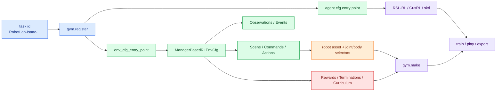
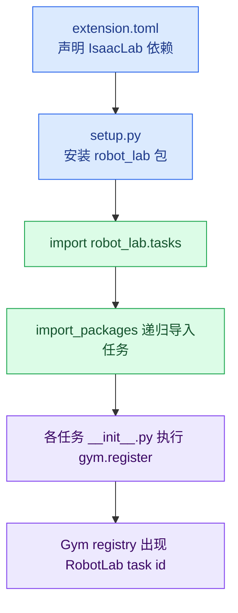
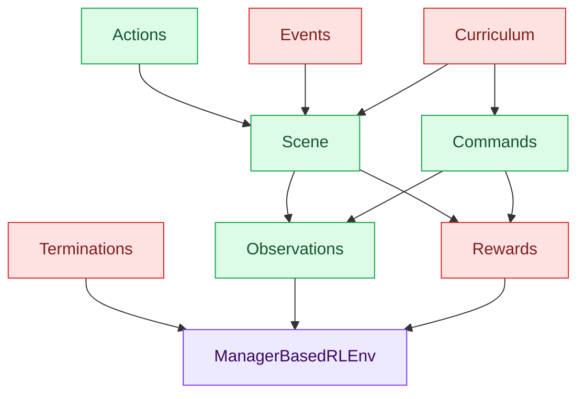
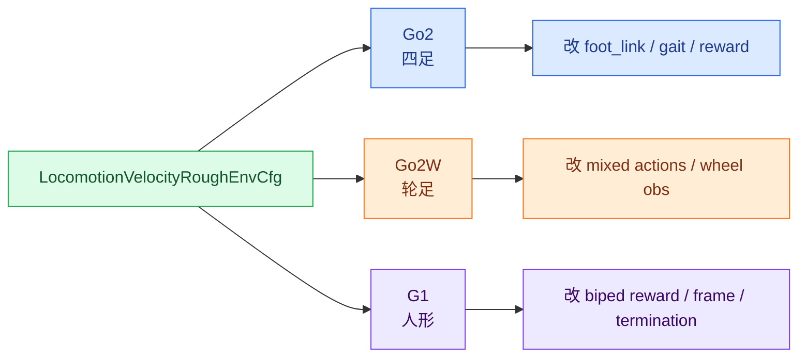
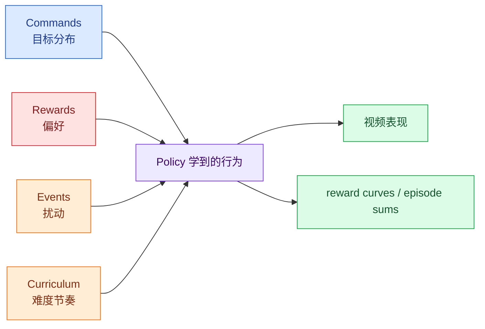
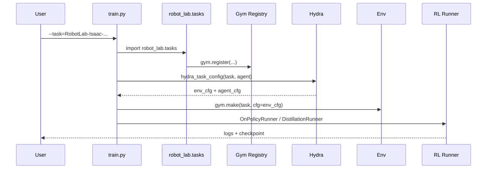
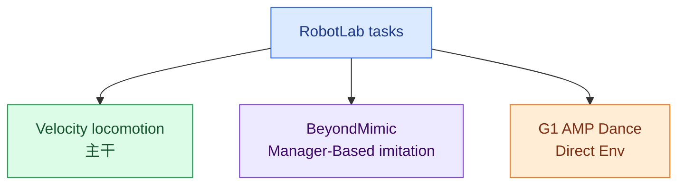

# Socratic 01: 抓骨架

主题: 学习 `robot_lab`

<div style="border-left: 6px solid #2563eb; background: #eff6ff; padding: 12px 16px; margin: 12px 0;">
<strong>学习目标</strong><br>
你不是来背目录的。你要能解释: 一个 <code>--task</code> 名字，为什么最后能变成一批并行训练的机器人。
</div>

## 颜色图例

| 颜色 | 含义 | 你该怎么读 |
| --- | --- | --- |
| <span style="color:#2563eb"><strong>蓝色</strong></span> | 架构入口 | 先看它怎么把系统接起来 |
| <span style="color:#16a34a"><strong>绿色</strong></span> | 可复用模板 | 看哪些东西被多个机器人共享 |
| <span style="color:#f97316"><strong>橙色</strong></span> | 机器人差异 | 看哪里必须按硬件改 |
| <span style="color:#dc2626"><strong>红色</strong></span> | 训练风险点 | 看哪里最容易让训练跑歪 |
| <span style="color:#7c3aed"><strong>紫色</strong></span> | 扩展边界 | 看主干之外还有什么任务范式 |

## 总览流程图



<div style="border-left: 6px solid #16a34a; background: #f0fdf4; padding: 12px 16px; margin: 12px 0;">
<strong>一句话骨架</strong><br>
RobotLab 是 IsaacLab 上的机器人 RL 扩展库: 用 task registry 找到配置，用 Manager-Based MDP 组织环境，用机器人 cfg 适配身体，用训练脚本接上算法。
</div>

---

## 五个核心模型

| 模型 | 一句话 | 关键文件 | 最容易误解的点 |
| --- | --- | --- | --- |
| 1. 扩展库 | RobotLab 挂在 IsaacLab 上，而不是重写 IsaacLab | `extension.toml`, `setup.py`, `tasks/__init__.py` | 以为训练脚本硬编码了机器人 |
| 2. Manager-Based MDP | 环境被拆成多个 manager 配置 | `velocity_env_cfg.py` | 只盯 reward，不看 action/obs/event |
| 3. 机器人适配层 | 父类给任务结构，子类给身体差异 | `config/*/*/rough_env_cfg.py` | 以为换 URDF 就算接入 |
| 4. 塑形系统 | reward、randomization、curriculum 一起塑造策略 | `mdp/rewards.py`, `events.py`, `curriculums.py` | 把训练失败都归因于 PPO |
| 5. 训练闭环 | task id 连接 env cfg、agent cfg、runner、checkpoint | `train.py`, `play.py`, task `__init__.py` | 以为导出 policy 就等于部署完成 |

---

## 模型 1: <span style="color:#2563eb">扩展库而不是主框架</span>

| 项 | 内容 |
| --- | --- |
| 核心问题 | 为什么 RobotLab 代码量不算巨大，却能支持很多机器人和训练任务？ |
| 代码锚点 | `robot_lab/source/robot_lab/config/extension.toml`<br>`robot_lab/source/robot_lab/setup.py`<br>`robot_lab/source/robot_lab/robot_lab/tasks/__init__.py`<br>`robot_lab/scripts/reinforcement_learning/rsl_rl/train.py` |
| 核心判断 | RobotLab 借 IsaacLab 的仿真、配置、环境、RL wrapper，只补“机器人任务扩展层”。 |



**自测题:** 如果删掉 `train.py` 里的 `import robot_lab.tasks`，`--task=RobotLab-Isaac-...` 还能被找到吗？

<details>
<summary>参考答案</summary>

大概率找不到。`RobotLab-Isaac-...` 这些 task id 是在任务子包的 `__init__.py` 里通过 `gym.register(...)` 注册的。

`import robot_lab.tasks` 会触发 `tasks/__init__.py` 中的 `import_packages(...)`，递归导入任务模块。没有导入，注册不会发生，Gym registry 里通常就没有 RobotLab task id。
</details>

---

## 模型 2: <span style="color:#16a34a">Manager-Based MDP 分解</span>

| Manager | 负责什么 | 典型例子 |
| --- | --- | --- |
| Scene | 世界里有什么 | 地形、机器人、height scanner、contact sensor |
| Commands | 策略要完成什么目标 | `base_velocity` |
| Actions | 策略怎么控制机器人 | `JointPositionActionCfg`, `JointVelocityActionCfg` |
| Observations | actor / critic 能看见什么 | base vel、gravity、joint pos/vel、height scan |
| Events | 训练时世界怎么随机变 | friction、mass、COM、push |
| Rewards | 什么行为被鼓励或惩罚 | velocity tracking、feet slide、joint power |
| Terminations | 什么算失败或结束 | timeout、illegal contact、terrain out of bounds |
| Curriculum | 难度怎么变 | terrain level、command range |



<div style="border-left: 6px solid #dc2626; background: #fef2f2; padding: 12px 16px; margin: 12px 0;">
<strong>危险误区</strong><br>
训练坏了就只改 reward。实际上 action scale、joint order、observation scale、termination、randomization 都可能让 reward 再漂亮也学不出来。
</div>

**自测题:** 如果策略速度跟踪失败，你应该只看 reward 吗？还要检查哪些模块？

<details>
<summary>参考答案</summary>

不能只看 reward。速度跟踪失败至少可能来自:

| 模块 | 可能问题 |
| --- | --- |
| Commands | 速度范围太大，小命令处理不合理 |
| Actions | action scale 错、joint order 错、控制类型错 |
| Observations | 关键状态缺失，scale 或噪声不合理 |
| Events | 随机化太强，早期学习被扰动淹没 |
| Rewards | tracking 太弱，或惩罚项过强 |
| Terminations | 过早终止，策略拿不到长时学习信号 |
| Curriculum | 难度增长太快，或一开始目标太难 |

较稳的顺序是: 先确认资产和 action 能跑，再看 observation/action 语义，再查 reward 和 randomization。
</details>

---

## 模型 3: <span style="color:#f97316">机器人适配层</span>

| 机器人类型 | 示例 cfg | 适配重点 |
| --- | --- | --- |
| 四足 | `quadruped/unitree_go2/rough_env_cfg.py` | foot link、四足 gait、腿部位置控制 |
| 轮足 | `wheeled/unitree_go2w/rough_env_cfg.py` | 腿位置控制 + 轮速度控制 |
| 人形 | `humanoid/unitree_g1/rough_env_cfg.py` | biped air-time、人形 foot link、左右关节对称 |



**接入新机器人检查表:**

| 必查项 | 为什么 |
| --- | --- |
| `scene.robot` | 是否换成正确资产 |
| `base_link_name` | scanner、mass、COM、push 都可能用它 |
| `foot_link_name` | contact reward / termination 依赖它 |
| `joint_names` | actor 输出顺序依赖它 |
| action type / scale | 决定策略能否产生合理控制 |
| init pose / joint pos | 决定开局是否摔倒 |
| reward body/joint selectors | 决定奖励是否作用在正确部件 |

**自测题:** 如果要接入一台新机器人，最先复制哪个现有 cfg？判断依据是什么？

<details>
<summary>参考答案</summary>

复制“控制接口和身体拓扑最接近”的 cfg，而不是只看外形或厂商。

| 新机器人 | 更适合参考 |
| --- | --- |
| 普通四足 | `unitree_go2` / `unitree_a1` |
| 轮足 | `unitree_go2w` |
| 人形 | `unitree_g1` |

判断依据依次是: 控制类型、关节拓扑、接触点定义、训练目标、资产格式。外形像但 action 语义不同，复制错 cfg 会很难诊断。
</details>

---

## 模型 4: <span style="color:#dc2626">奖励、随机化、课程是同一个塑形系统</span>

| 子系统 | 它改变什么 | 典型失败模式 |
| --- | --- | --- |
| Rewards | 优化方向 | 学会 reward hacking，例如脚滑但速度高 |
| Events | 训练分布 | 随机化太强，策略还没学会就被扰动淹没 |
| Curriculum | 难度节奏 | 过早升难，return 掉下去 |
| Commands | 目标分布 | 命令范围太宽，早期学习稀疏 |



**自测题:** 训练不稳定时，你会先降低随机化、缩小 command，还是改 reward？

<details>
<summary>参考答案</summary>

推荐诊断顺序:

| 步骤 | 操作 | 目的 |
| --- | --- | --- |
| 1 | 确认 zero/random agent 能 step | 排除环境崩溃和资产错误 |
| 2 | 缩小 command range | 降低目标难度 |
| 3 | 关闭或减弱强随机化 | 判断是不是扰动过强 |
| 4 | 固定地形 | 排除地形难度 |
| 5 | 看 reward episode sums | 判断 reward 冲突或主项太弱 |
| 6 | 逐项加回随机化和课程 | 找到真正断点 |

如果一开始就调 reward，很容易把 action/joint/termination/randomization 错误误判成 reward 问题。
</details>

---

## 模型 5: <span style="color:#2563eb">任务注册到训练闭环</span>



| 阶段 | 文件 | 关键点 |
| --- | --- | --- |
| 注册 | task `__init__.py` | `id`, `entry_point`, `env_cfg_entry_point`, `rsl_rl_cfg_entry_point` |
| 训练 | `rsl_rl/train.py` | 创建 env、wrapper、runner、写日志 |
| 播放 | `rsl_rl/play.py` | 加载 checkpoint，关闭部分随机化，导出 JIT/ONNX |
| 查看 | `scripts/tools/list_envs.py` | 验证 task 是否注册成功 |

**自测题:** 新增任务能被 `list_envs.py` 看到，但 `train.py` 加载 agent cfg 失败，你查哪两个入口字符串？

<details>
<summary>参考答案</summary>

优先查任务 `__init__.py` 的 kwargs:

| 入口 | 作用 |
| --- | --- |
| `env_cfg_entry_point` | 指向环境配置类 |
| `rsl_rl_cfg_entry_point` | 指向 RSL-RL agent/runner 配置类 |

`list_envs.py` 能看到 task，说明 `gym.register` 成功。训练找不到 agent cfg，多半是 `rsl_rl_cfg_entry_point` 模块路径、类名、agents 包导入、或 `--agent` 参数不匹配。
</details>

---

## <span style="color:#7c3aed">边界模型: BeyondMimic 与 Direct AMP</span>

| 分支 | 类型 | 核心命令 | 核心奖励 | 代码 |
| --- | --- | --- | --- | --- |
| Velocity locomotion | Manager-Based | `base_velocity` | 速度跟踪、步态、姿态、能耗 | `velocity_env_cfg.py` |
| BeyondMimic | Manager-Based | `motion` | anchor/body pose tracking | `beyondmimic/tracking_env_cfg.py` |
| G1 AMP dance | Direct Env | motion file / AMP data | imitation / AMP reward | `direct/g1_amp/g1_amp_env_cfg.py` |



**自测题:** 为什么 BeyondMimic 可以继续用 Manager-Based，而 G1 AMP 选择 Direct Env 也说得通？

<details>
<summary>参考答案</summary>

BeyondMimic 能自然拆成 command、observation、reward、termination:

| Manager | BeyondMimic 中的含义 |
| --- | --- |
| Command | reference motion |
| Observation | motion anchor/body 信息 |
| Reward | tracking error |
| Termination | 偏离参考运动太远 |

G1 AMP 的 motion loader、AMP observation、历史数据和判别器式训练信号更耦合，用 Direct Env 表达更直接。
</details>

---

## 最后复述卡

<div style="border-left: 6px solid #7c3aed; background: #f5f3ff; padding: 12px 16px; margin: 12px 0;">
<strong>用自己的话说一遍</strong><br>
RobotLab 的主干不是“机器人列表”，而是: <code>任务注册 -> Manager-Based MDP -> 机器人适配 -> 塑形系统 -> RL 训练闭环</code>。
</div>

**问题:** 这五个模型里，你最熟悉哪个？最陌生的是哪个？

<details>
<summary>参考答案示例</summary>

```text
我最熟悉的是: 任务注册到训练闭环。
因为我能解释 task id 如何通过 gym.register、hydra_task_config、gym.make 变成训练环境。

我最陌生的是: 奖励、随机化、课程的共同塑形。
我卡住的具体文件是 rewards.py 和 curriculums.py。

我下一步要追问的问题是:
为什么很多机器人 cfg 关闭 command curriculum，但保留 event randomization？
```
</details>
