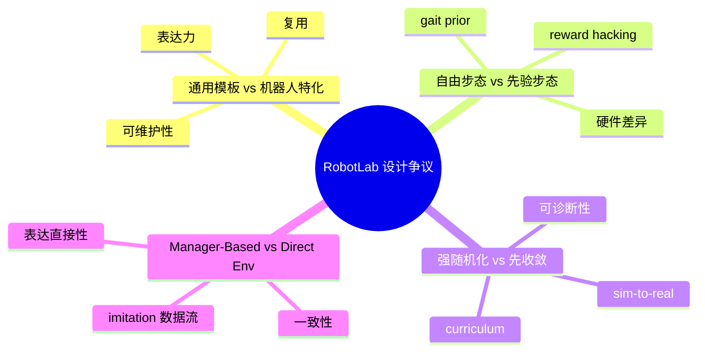
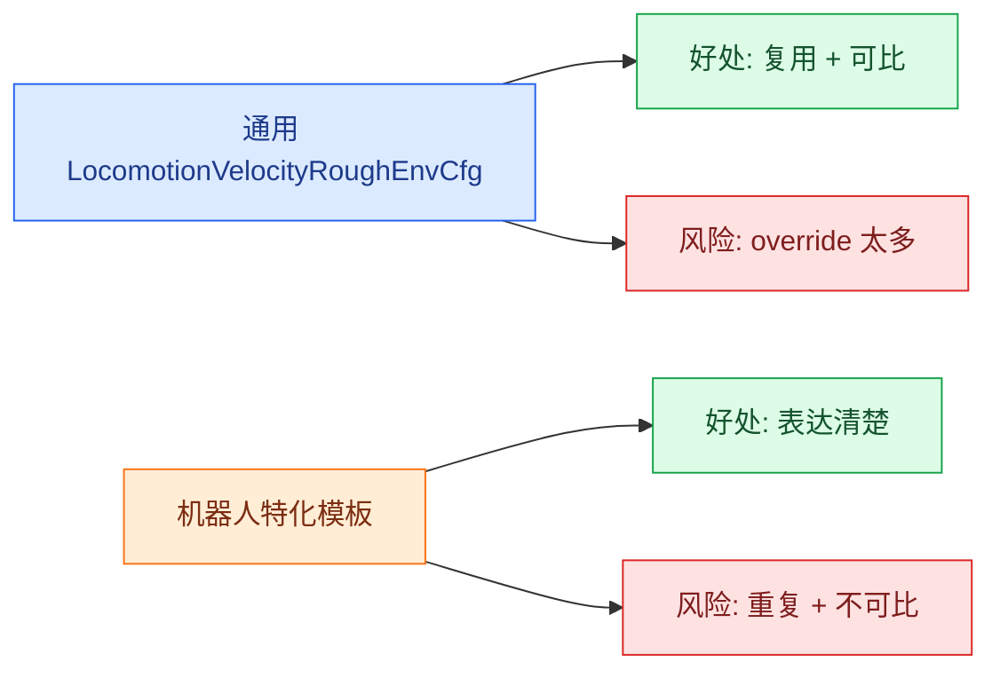
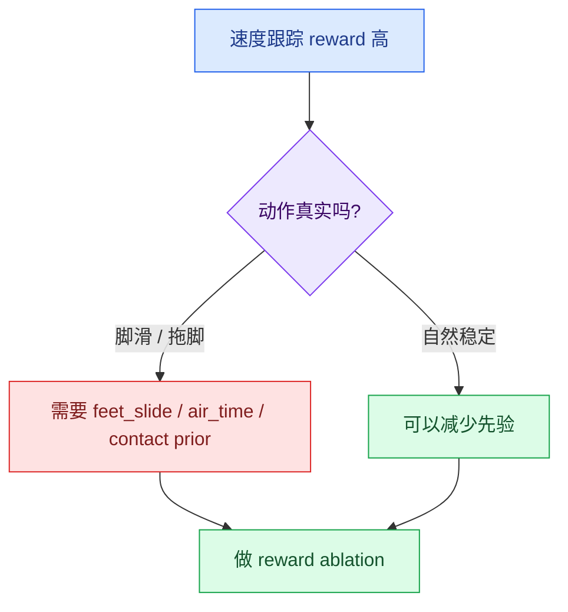
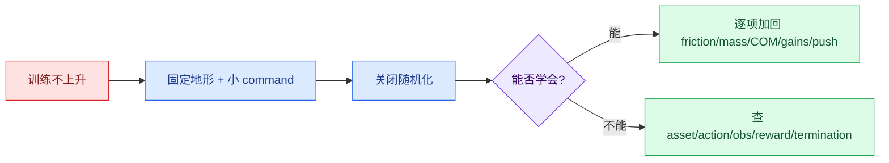
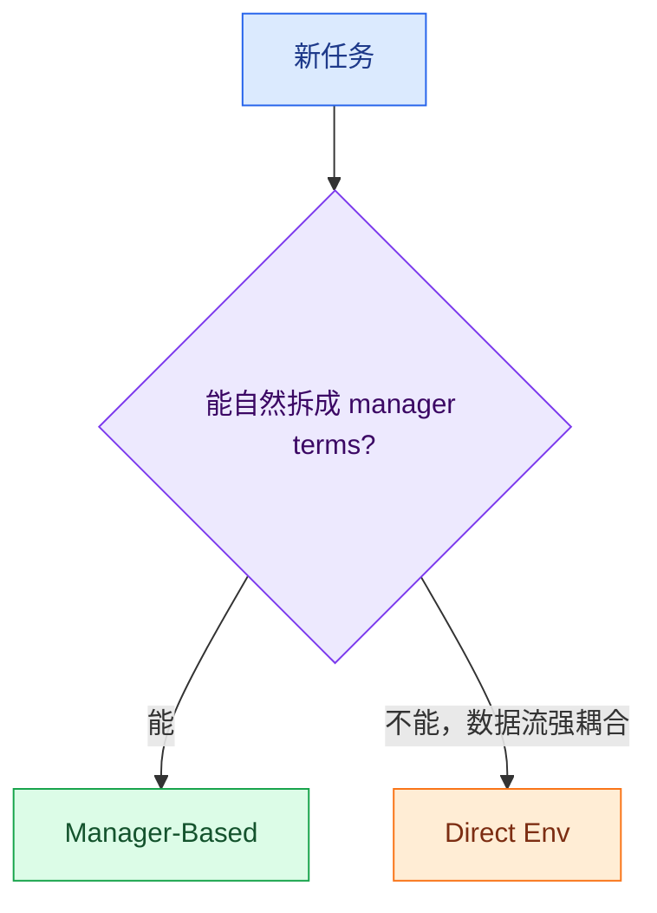

# Socratic 02: 找争议

主题: 学习 `robot_lab`

<strong>学习目标</strong> 
不再只问“代码是什么”，而要问“为什么这样设计”。争议不是噪声，争议是你理解项目边界的入口。

## 争议地图

## 快速总表

| 争议 | 阵营 A | 阵营 B | 真正分歧 | 代码锚点 |
| --- | --- | --- | --- | --- |
| 通用模板 vs 特化模板 | 统一 `LocomotionVelocityRoughEnvCfg` | 四足/轮足/人形分模板 | 复用 vs 表达力 | `velocity_env_cfg.py`, 各机器人 cfg |
| 自由步态 vs 先验步态 | 少 reward prior，让策略自己学 | gait/mirror/air-time 塑形 | 端到端学习 vs 结构化先验 | `mdp/rewards.py` |
| 强随机化 vs 先收敛 | 一开始就 domain randomization | 先干净仿真学会 | 泛化 vs 可诊断性 | `events.py`, `curriculums.py` |
| Manager-Based vs Direct Env | 框架一致、模块复用 | 强定制任务直接写 env | 一致性 vs 表达直接性 | `beyondmimic`, `direct/g1_amp` |

---

## 争议 1: 通用模板优先 还是 机器人特化优先？

**问题:** RobotLab 应该尽量用一个 `LocomotionVelocityRoughEnvCfg` 覆盖所有机器人，还是为四足、轮足、人形分别写更独立的任务模板？

### 对照表

| 维度 | 通用模板优先 | 机器人特化优先 |
| --- | --- | --- |
| 目标 | 减少重复，快速接入新机器人 | 清晰表达不同身体和控制语义 |
| 优点 | 实验可比、维护集中、训练脚本统一 | 不容易隐藏特殊逻辑，读者更容易理解 |
| 风险 | 子类 override 过多，父类变成“万金油” | 重复代码多，不同模板难比较 |
| 支持证据 | `velocity_env_cfg.py` 拆分足够细 | Go2W 混合 action，G1 biped reward |
| 典型问题 | “为什么这个 reward 在父类里但 weight=0？” | “为什么两个模板里同样逻辑写两遍？” |

**代码锚点:**

- `robot_lab/source/robot_lab/robot_lab/tasks/manager_based/locomotion/velocity/velocity_env_cfg.py`
- `robot_lab/source/robot_lab/robot_lab/tasks/manager_based/locomotion/velocity/config/quadruped/unitree_go2/rough_env_cfg.py`
- `robot_lab/source/robot_lab/robot_lab/tasks/manager_based/locomotion/velocity/config/wheeled/unitree_go2w/rough_env_cfg.py`
- `robot_lab/source/robot_lab/robot_lab/tasks/manager_based/locomotion/velocity/config/humanoid/unitree_g1/rough_env_cfg.py`

<strong>拷问</strong> 
如果你要给 RobotLab 加一个“带机械臂的轮足机器人”，你会继承 wheeled locomotion，还是新建 locomanipulation 模板？

参考答案

先判断任务语义是否改变。

| 情况 | 选择 |
| --- | --- |
| 机械臂固定，不参与任务，只做轮足速度跟踪 | 继承 wheeled locomotion |
| 机械臂参与抓取、平衡、负载变化、移动操作 | 新建 locomanipulation 模板 |

原因:

- action space 可能从腿/轮扩展到 arm。
- observation 可能需要末端、目标物、抓取状态。
- reward 不再只是 base velocity tracking。
- termination 不再只是摔倒或非法接触。
- command 可能从 base velocity 变成 base + end-effector / object target。

所以判断标准不是“能不能硬塞进父类”，而是 MDP 核心语义有没有变。

---

## 争议 2: 自由步态 还是 先验步态？

**问题:** locomotion 策略应该靠速度跟踪和能耗惩罚自己发现步态，还是通过 gait、mirror、air time、feet slide 等 reward 明确塑造步态？

### 对照表

| 维度 | 少先验，让策略自己学 | 加先验，训练更稳定 |
| --- | --- | --- |
| 核心信念 | 策略可能发现人没想到的有效动作 | 搜索空间太大，需要人为引导 |
| 优点 | 少偏见，少调参 | 更稳定，更少 reward hacking |
| 风险 | 脚滑、拖行、晃动也可能骗过 reward | 可能限制新步态 |
| RobotLab 证据 | 可关闭 gait/mirror 等 reward | `feet_air_time`, `feet_gait`, `feet_slide` |
| 适合阶段 | 探索新硬件潜力 | 追求稳定训练和可部署动作 |

**代码锚点:**

- `robot_lab/source/robot_lab/robot_lab/tasks/manager_based/locomotion/velocity/mdp/rewards.py`
- `robot_lab/source/robot_lab/robot_lab/tasks/manager_based/locomotion/velocity/config/quadruped/unitree_go2/rough_env_cfg.py`
- `robot_lab/source/robot_lab/robot_lab/tasks/manager_based/locomotion/velocity/config/humanoid/unitree_g1/rough_env_cfg.py`

<strong>拷问</strong> 
Go2 的 <code>feet_gait.weight = 0.5</code>，G1 没用四足 gait 而改了 biped air-time。这个差异是硬件差异，还是作者训练经验？

参考答案

两者都有，但首先是硬件差异。

| 机器人 | 接触结构 | 合理先验 |
| --- | --- | --- |
| Go2 | 四足，存在对角脚同步/异步关系 | `feet_gait`, `feet_air_time`, `feet_slide` |
| G1 | 双足，没有四足脚对 | `feet_air_time_positive_biped`, 人形姿态/对称约束 |

具体权重和是否启用某些项，则很可能包含作者训练经验。

验证方法:

1. Go2 关闭 `feet_gait`，比较速度、脚滑、接触节律、摔倒率。
2. G1 关闭 biped air-time，观察是否拖脚或双脚同时离地。
3. 不只看 total return，要看视频和 contact sensor 统计。

---

## 争议 3: 强 domain randomization 还是 先追求仿真内收敛？

**问题:** 一开始就加摩擦、质量、COM、actuator gains、reset 姿态、push 等随机化，还是先在干净仿真里学会基本动作？

### 对照表

| 维度 | 强随机化优先 | 先收敛再加随机化 |
| --- | --- | --- |
| 核心目标 | sim-to-real 稳健性 | 可诊断、先学会基本动作 |
| 优点 | 不容易过拟合默认仿真 | 更容易定位问题 |
| 风险 | 早期学习被扰动淹没 | 干净仿真策略泛化差 |
| RobotLab 证据 | `EventCfg` 默认很多随机化 | `CurriculumCfg` 存在，play 会关闭部分扰动 |
| 适合阶段 | 任务已成熟，准备泛化 | 新机器人接入、debug 阶段 |

**代码锚点:**

- `robot_lab/source/robot_lab/robot_lab/tasks/manager_based/locomotion/velocity/mdp/events.py`
- `robot_lab/source/robot_lab/robot_lab/tasks/manager_based/locomotion/velocity/mdp/curriculums.py`
- `robot_lab/source/robot_lab/robot_lab/tasks/manager_based/locomotion/velocity/velocity_env_cfg.py`
- `robot_lab/scripts/reinforcement_learning/rsl_rl/play.py`

<strong>拷问</strong> 
如果 Go2W 训练不稳定，你会先关 <code>randomize_actuator_gains</code>，还是先缩小 <code>base_velocity</code> command range？

参考答案

我会先缩小 command range，再分组关随机化。

| 实验 | 改动 | 判断 |
| --- | --- | --- |
| 1 | 固定平地，小前进速度，关横向/yaw | 看是否能学基本移动 |
| 2 | 保持小 command，关闭强随机化 | 看是不是扰动太强 |
| 3 | 逐项加回 friction/mass/COM/actuator/push | 找具体断点 |
| 4 | 恢复 command range | 看能力边界 |

Go2W 有腿和轮的混合 action，目标过宽会让早期学习很乱。若缩小 command 后仍学不会，要回查 action/joint order、wheel velocity action、observation。

---

## 加餐争议: Manager-Based 还是 Direct Env？

### 对照表

| 维度 | Manager-Based | Direct Env |
| --- | --- | --- |
| 适合任务 | 能拆成 command / obs / reward / termination | 数据流强耦合 |
| 优点 | 配置一致、模块复用 | 表达直接、少绕路 |
| 风险 | 强行拆分会变复杂 | 和主干模式不一致 |
| RobotLab 例子 | BeyondMimic | G1 AMP dance |

**拷问:** “框架一致”本身是不是充分理由？什么时候一致性反而会伤害表达力？

参考答案

不是充分理由。

当任务能自然拆成 command、observation、reward、termination 时，Manager-Based 的一致性很有价值。BeyondMimic 就是例子。

当任务的数据流高度耦合，例如 AMP 的 motion loader、历史 observation、判别器相关输入和特殊 reset 逻辑，Direct Env 可能更清楚。

一致性伤害表达力的情况是: 为了套框架，把简单直接的数据流拆成很多间接 term，导致调试更困难。

---

## 立场记录表

| 争议 | 你的立场 | 对方最强反驳 | 你会做的实验 |
| --- | --- | --- | --- |
| 通用 vs 特化 |  |  |  |
| 自由步态 vs 先验 |  |  |  |
| 强随机化 vs 先收敛 |  |  |  |
| Manager-Based vs Direct |  |  |  |

参考填写示例

| 争议 | 我的立场 | 对方最强反驳 | 实验 |
| --- | --- | --- | --- |
| 通用 vs 特化 | 通用模板 + 必要时特化 | 过早特化导致重复和不可比 | 比较通用/特化模板的训练稳定性和配置复杂度 |
| 自由步态 vs 先验 | 适度先验 | 先验可能限制新步态 | 逐项关闭 gait/air-time/slide，看视频和 contact 统计 |
| 强随机化 vs 先收敛 | debug 阶段先收敛 | 干净仿真泛化差 | 固定 command 后逐项加回随机化 |
| Manager-Based vs Direct | 能自然拆就 Manager-Based | 一致性可能让表达变绕 | 比较 BeyondMimic 和 AMP 数据流复杂度 |

