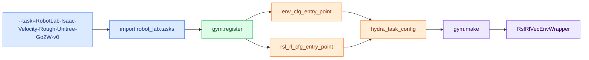
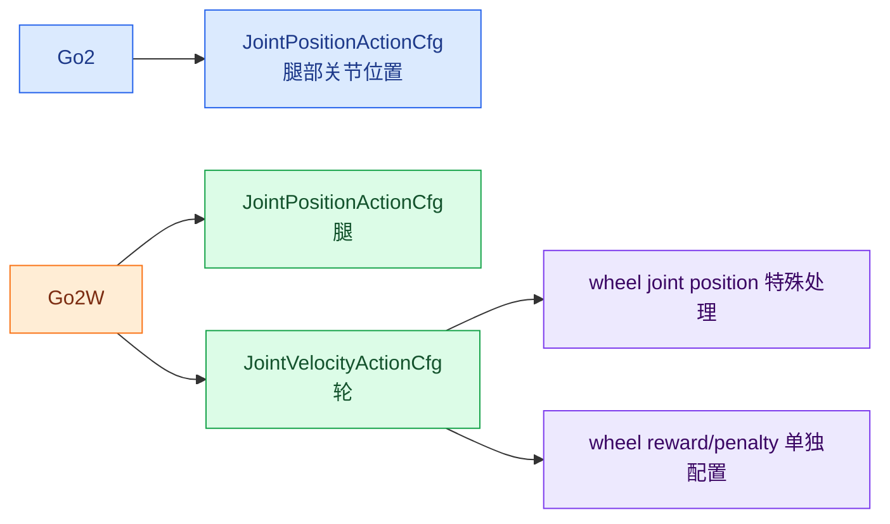
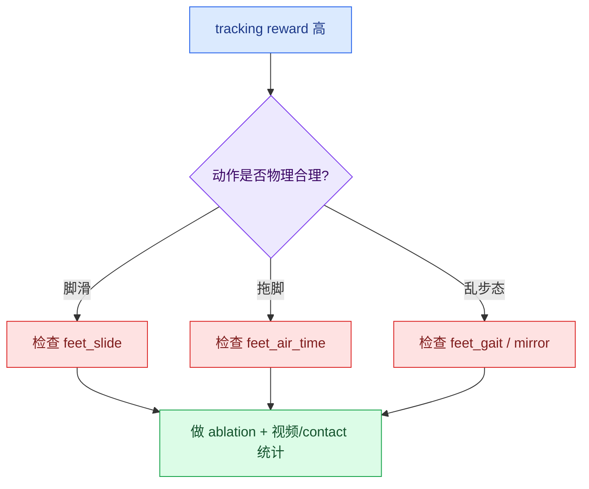
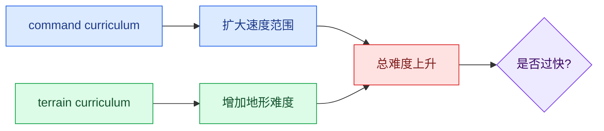
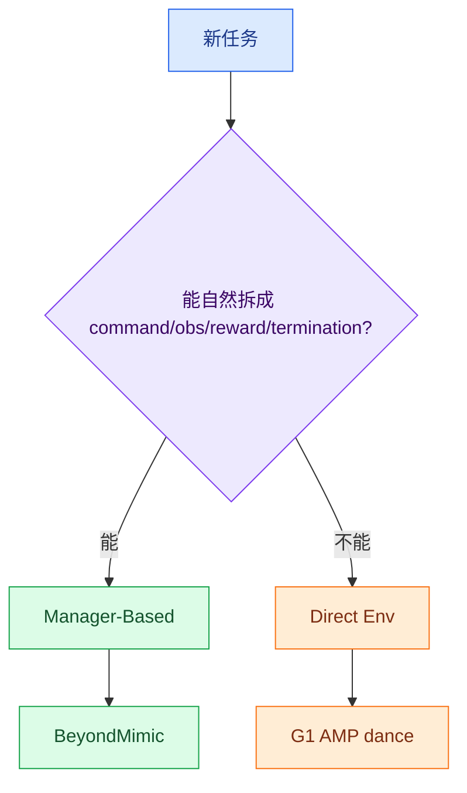

# Socratic 03: 被拷问

主题: 学习 `robot_lab`

<strong>学习目标</strong> 
区分“看过代码”和“真的懂”。每题先自己答，再展开参考答案。每题都要能落到文件、类名、配置项或诊断实验。

## 题型图例

| 标记 | 类型 | 你要做什么 |
| --- | --- | --- |
| <strong>Cross-connect</strong> | 跨概念连接 | 把 task、cfg、MDP、训练脚本串起来 |
| <strong>Counterfactual</strong> | 反事实推理 | 假设改一处，推断系统怎么变 |
| <strong>Diagnosis</strong> | 现象诊断 | 给现象，定位可能断点和验证实验 |

## 题目总览

| 题号 | 类型 | 主题 | 核心考点 |
| --- | --- | --- | --- |
| Q1 | Cross-connect | task id 到环境实例 | 注册、Hydra、gym.make、wrapper |
| Q2 | Diagnosis | 新机器人一落地就终止 | scene/action/contact/termination |
| Q3 | Cross-connect | Go2 vs Go2W | 混合 action、轮子观测 |
| Q4 | Diagnosis | 速度高但脚滑 | reward hacking |
| Q5 | Diagnosis | 训练曲线不上升 | 最小诊断矩阵 |
| Q6 | Counterfactual | actor/critic 观测差异 | privileged obs、部署一致性 |
| Q7 | Counterfactual | 课程学习开关 | command range、terrain curriculum |
| Q8 | Cross-connect | BeyondMimic vs velocity | motion command vs velocity command |
| Q9 | Counterfactual | Manager-Based vs Direct Env | 任务表达边界 |
| Q10 | Diagnosis | play 好但部署差 | export 不是接口契约 |

---

## Q1: task id 到环境实例

**类型:** Cross-connect

**问题:** 请解释这个 task id 如何变成一个 `ManagerBasedRLEnv` 实例。

**必须连接:** `import robot_lab.tasks`、`gym.register(...)`、`env_cfg_entry_point`、`rsl_rl_cfg_entry_point`、`hydra_task_config`、`gym.make(...)`、`RslRlVecEnvWrapper`。

**追问:** 如果 `list_envs.py` 能看到这个 task，但训练时找不到 agent cfg，你漏查了哪一层？

参考答案

| 步骤 | 发生了什么 |
| --- | --- |
| 1 | `train.py` 启动 Isaac Sim App |
| 2 | `import robot_lab.tasks` 触发任务包递归导入 |
| 3 | `wheeled/unitree_go2w/__init__.py` 执行 `gym.register(...)` |
| 4 | task id 绑定 `entry_point="isaaclab.envs:ManagerBasedRLEnv"` |
| 5 | `env_cfg_entry_point` 指向 `UnitreeGo2WRoughEnvCfg` |
| 6 | `rsl_rl_cfg_entry_point` 指向 PPO runner cfg |
| 7 | `hydra_task_config(args_cli.task, args_cli.agent)` 加载 env/agent cfg |
| 8 | `gym.make(args_cli.task, cfg=env_cfg, ...)` 创建环境 |
| 9 | `RslRlVecEnvWrapper` 包装成 RSL-RL 可训练环境 |

追问答案:

`list_envs.py` 能看到 task，说明 `gym.register` 成功。训练找不到 agent cfg，优先查 task `__init__.py` 里的 `rsl_rl_cfg_entry_point` 是否模块路径或类名写错，还要查 `--agent` 是否仍然默认 `rsl_rl_cfg_entry_point`。

---

## Q2: 新机器人一落地就终止

**类型:** Diagnosis

**现象:** 复制 Go2 rough cfg 接入新四足，训练刚开始频繁 reset，机器人一落地就终止。

### 诊断表

| 优先级 | 检查项 | 属于哪类 | 为什么 |
| --- | --- | --- | --- |
| 1 | `scene.robot` 和资产路径 | Scene | 资产没换对，后面全错 |
| 2 | base link 名称 | Scene / Event | scanner、mass、COM、push 都可能依赖 |
| 3 | foot link/body selector | Reward / Termination | 脚匹配错会误判接触 |
| 4 | 初始高度和默认关节角 | Scene | 开局姿态不对会直接摔 |
| 5 | action scale / joint order | Action | 动作错误会马上打翻机器人 |
| 6 | contact sensor prim path | Scene / Sensor | sensor 没覆盖 link，接触判断异常 |
| 7 | `illegal_contact` | Termination | 合法接触可能被判失败 |

**问题:** 你会按什么顺序检查？  
**追问:** 如果把 `illegal_contact` 设为 None 后“能跑了”，证明问题解决了吗？

参考答案

建议先按表格顺序查，不要第一步就关 termination。

`illegal_contact = None` 只能证明“报警器被拆掉了”，不能证明机器人对了。真正问题可能是:

- foot link selector 错，把脚接触当非法接触。
- base link 初始高度太低，身体接触地面。
- 默认关节角导致开局跪地。
- contact sensor 没覆盖正确 body。
- action scale 太大，一步就打翻。

正确做法是打开视频和 contact 统计，确认到底哪些 link 在接触，再修 selector、初始姿态或动作配置。

---

## Q3: Go2 与 Go2W 的 MDP 差异

**类型:** Cross-connect

**问题:** 为什么 Go2W 不能只复用 Go2 的 `ActionsCfg` 和 joint position action？

**追问:** 如果把轮子也当成位置控制关节，会制造什么错误学习信号？

参考答案

Go2W 是轮足机器人，腿和轮的 action 语义不同。

| 部件 | 合理 action | 原因 |
| --- | --- | --- |
| 腿 | `JointPositionActionCfg` | 腿关节目标位置有姿态意义 |
| 轮 | `JointVelocityActionCfg` | 轮子需要持续滚动产生速度 |

Go2W 还使用 `joint_pos_rel_without_wheel` 处理 wheel joint 的位置观测，因为轮子连续转动时，轮角相对默认位置没有普通腿关节那种姿态意义。

如果把轮子当位置控制，策略会试图把轮子转到某个固定角度，而不是持续滚动。轮角不断累积，位置误差会误导 actor 和 critic。

---

## Q4: 速度高但脚滑

**类型:** Diagnosis

**现象:** 四足策略速度跟踪 reward 很高，但视频里脚长时间滑动，身体靠摩擦“蹭”着走。

**问题:** 诊断可能原因。不能只改一个 reward 权重。  
**追问:** 如果 `feet_slide` 权重加大后速度跟踪下降，这是好事还是坏事？

参考答案

| 方向 | 可能原因 |
| --- | --- |
| Reward | `feet_slide` 太弱；`feet_air_time` 太弱；`feet_gait` 未启用；contact force 惩罚不足 |
| Observation | 没有 height scan 或 base velocity，策略难判断真实运动状态 |
| Action | action scale 太大，接触期脚被快速拖动 |
| Events | 摩擦随机化范围偏高，滑动也能过关；或扰动太强导致策略找捷径 |
| Evaluation | 只看 return，没看视频和 contact pattern |

两个对照实验:

1. 固定平地和摩擦，逐项开关 `feet_slide`、`feet_air_time`、`feet_gait`。
2. 保持 reward 不变，缩小 action scale 或提高 action rate penalty。

追问答案:

不一定是坏事。旧策略可能靠脚滑骗 tracking reward。`feet_slide` 加大后 tracking 下降，可能说明策略被迫放弃作弊。要同时看脚滑、能耗、摔倒率、contact pattern 和最终部署可行性。

---

## Q5: 训练曲线长期不上升

**类型:** Diagnosis

### 最小诊断矩阵

| 实验 | 设置 | 如果成功 | 如果失败 |
| --- | --- | --- | --- |
| A | zero/random agent | 环境能 step，可继续查学习问题 | 资产、contact、termination 可能错 |
| B | 平地 + 小 command + 关随机化 | 基本 MDP 可学 | action/obs/reward/termination 有硬伤 |
| C | B + 原 reward 权重 | reward 大体可用 | reward 冲突或符号/权重错 |
| D | B + 逐项加 event | 找随机化断点 | 某类 randomization 太强 |
| E | B + terrain curriculum | 判断地形课程 | 地形或课程太难 |
| F | 原设置 + episode sums | 看谁主导 return | 定位主 reward/penalty 冲突 |

**问题:** 设计一个最小诊断矩阵，区分资产/action 错、reward 错、randomization/curriculum 过强。  
**追问:** 为什么“训练不上升”本身不足以定位问题？

参考答案

直接使用上面的矩阵即可。重点是控制变量。

“训练不上升”只是结果，不是原因。下面这些都会导致曲线不上升:

- URDF 或 USD 资产不合理。
- joint order 错。
- action scale 太大或太小。
- observation 缺关键量。
- reward 符号错或惩罚压过主 reward。
- termination 太严格。
- command range 太宽。
- domain randomization 太强。
- terrain curriculum 太难。

所以必须把问题拆成环境能否正常 step、基本任务能否学、reward 是否冲突、随机化是否过强几个层次。

---

## Q6: Policy 观测与 Critic 观测不一致

**类型:** Counterfactual

| 假设 | 可能结果 |
| --- | --- |
| critic 也加 noise | value estimation 更抖，训练可能不稳 |
| policy noise 全关 | 仿真内更快，但部署鲁棒性下降 |
| privileged obs 给 critic | 可行，因为 critic 不部署 |
| privileged obs 给 actor | 通常不可行，除非部署端也有 |

**问题:** 假设 critic 也 noisy，或者 policy noise 全关，会发生什么？  
**追问:** 只在仿真里能拿到的观测，能不能给 critic？能不能给 actor？

参考答案

critic noisy 会让 value estimation 更难，优势估计更抖，训练稳定性可能下降。它对部署鲁棒性的帮助有限，因为 critic 不部署。

policy noise 全关可能让仿真训练更快，但 actor 会依赖干净观测。部署时如果传感器有噪声、延迟或缺失，性能可能下降。

只在仿真里能拿到的 privileged observation 可以给 critic，因为 critic 只参与训练。通常不能给 actor，因为 actor 会被导出部署，部署端必须提供同样输入。

---

## Q7: 课程学习为什么可能被关闭？

**类型:** Counterfactual

**问题:** 父类定义 terrain 和 command curriculum，为什么很多机器人子类会关闭 command curriculum？重新打开后怎么判断它帮忙还是伤害？

参考答案

可能原因:

| 原因 | 解释 |
| --- | --- |
| command range 已经合适 | 不需要自动扩张 |
| reward threshold 不通用 | 不同机器人 reward scale 不同 |
| episode length 影响判断 | episode sum 与长度相关 |
| terrain curriculum 已经升难 | command 再升难可能叠加过快 |
| 机器人能力不同 | 人形、四足、轮足可达速度范围不同 |

判断方法:

1. 只打开 command curriculum，不动其他变量。
2. 记录 command range 随训练变化。
3. 比较 tracking error、摔倒率、最终速度范围。
4. 看是否出现“range 一扩大，return 掉下去”。

---

## Q8: BeyondMimic 与 velocity tracking 的本质差异

**类型:** Cross-connect

| 维度 | Velocity locomotion | BeyondMimic |
| --- | --- | --- |
| Command | `base_velocity` | `motion` |
| 目标 | 跟踪线速度/角速度 | 跟踪参考动作 |
| Reward | velocity tracking + gait/energy | anchor/body pose/ori/vel tracking |
| Termination | 摔倒、非法接触、越界 | 偏离参考 motion 太远 |
| Observation | 当前状态 + 命令 | 当前状态 + reference motion 信息 |

**问题:** 比较二者命令、奖励、观测、终止的差异。  
**追问:** 如果把 velocity reward 直接搬到 BeyondMimic，会漏掉什么？

参考答案

Velocity task 的目标是按命令走，核心是 base velocity tracking。BeyondMimic 的目标是像参考动作一样运动，核心是 reference motion tracking。

如果直接搬 velocity reward，会漏掉:

- 姿态相位。
- anchor/body 的相对位置。
- body orientation。
- body linear/angular velocity。
- 动作风格和时序。

策略可能走得快，但完全不像参考动作。

---

## Q9: Manager-Based 与 Direct Env 的边界

**类型:** Counterfactual

**问题:** 什么时候接受 Direct Env 分叉？什么时候坚持 Manager-Based？  
**追问:** “框架一致”本身是不是充分理由？

参考答案

能自然拆成 manager terms 时，坚持 Manager-Based。它配置一致、模块可复用，也更符合 RobotLab 主干。

如果任务数据流强耦合，例如 AMP 的 motion loader、历史 observation、判别器输入、特殊 reset strategy，用 Direct Env 更清楚。

“框架一致”不是充分理由。为了套框架把直接的数据流拆成很多间接 term，会伤害表达力和可调试性。

---

## Q10: play 好但部署差

**类型:** Diagnosis

### 部署断点检查表

| 断点 | 要检查什么 |
| --- | --- |
| play 环境 | 哪些 randomization / curriculum 被关闭 |
| observation | 顺序、scale、clip、noise、base lin vel、height scan |
| action | scale、default joint offset、clip |
| joint | 命名和顺序是否一致 |
| timing | `dt`, `decimation`, 控制频率 |
| robot special case | Go2W 腿/轮 action，G1 人形关节 |
| export | ONNX/JIT 只导出网络，不导出接口契约 |

**问题:** 一个策略在 `play.py` 好，但 ONNX/JIT 部署到另一个控制栈表现差。沿 RobotLab 链条找断点。  
**追问:** 为什么“导出了 policy.onnx”不等于“部署接口定义也导出了”？

参考答案

play 好不等于部署好。可能断点:

- `play.py` 关闭了部分随机化和 curriculum。
- actor observation 顺序和部署端不一致。
- scale、clip、normalizer 没复现。
- action scale 和 default joint offset 没复现。
- joint order 不一致。
- 控制频率和训练时不同。
- Go2W 的腿位置 action / 轮速度 action 没分开处理。
- G1 的人形关节和 foot link 假设没对齐。

ONNX/JIT 只导出神经网络计算图，不导出完整接口契约。部署还需要知道输入每一维是什么、如何归一化、动作如何缩放、关节如何排序、控制周期是多少。

---

## 复盘报告

| 模块 | 你的结论 |
| --- | --- |
| 我真正懂的模型 |  |
| 我还会混淆的层 |  |
| 我能定位的文件 |  |
| 我能设计的诊断实验 |  |
| 下一步要跑的最小实验 |  |

参考填写示例

| 模块 | 示例 |
| --- | --- |
| 我真正懂的模型 | task id -> gym.register -> hydra_task_config -> gym.make -> wrapper |
| 我还会混淆的层 | policy obs vs critic obs，command curriculum vs terrain curriculum |
| 我能定位的文件 | `velocity_env_cfg.py`, `rewards.py`, `unitree_go2w/rough_env_cfg.py` |
| 我能设计的诊断实验 | 平地 + 小 command + 关随机化，然后逐项加回 |
| 下一步要跑的最小实验 | 用 Go2W 跑 `zero_agent.py` 或 `random_agent.py` 验证环境 |

