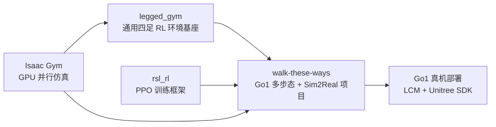
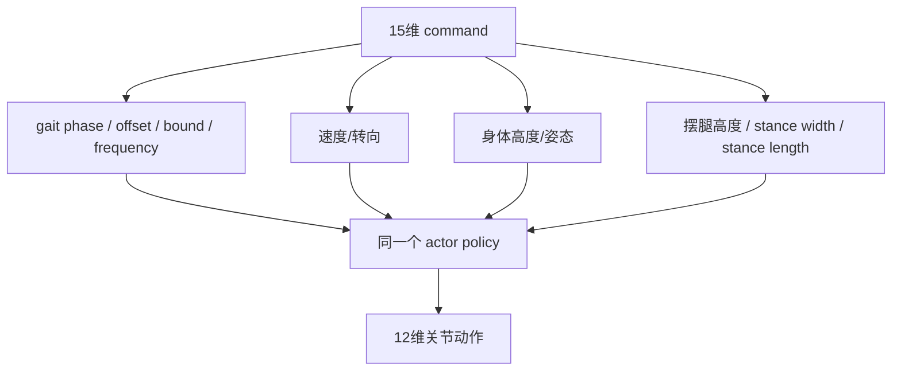
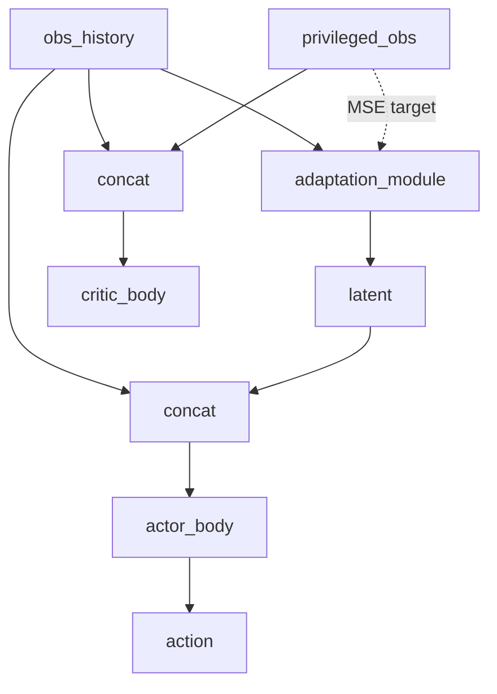

# Walk These Ways 与 legged_gym 对比

> 这里的 `leggym` 按常见语境理解为 `legged_gym`。  
> `walk-these-ways` 不是从零写的四足 RL 框架，而是在 `legged_gym + Isaac Gym + rsl_rl` 这条技术栈上，进一步做了 Go1、多步态命令、RMA 适应和真机部署。

## 一句话结论

`legged_gym` 更像一个通用的四足机器人 Isaac Gym 训练基座；`walk-these-ways` 更像一个面向 Unitree Go1 的完整 sim-to-real 行为学习项目。



## 定位差异

| 维度 | legged_gym | walk-these-ways |
|---|---|---|
| 项目定位 | 通用 legged locomotion RL 环境 | Go1 sim-to-real locomotion starter kit |
| 主要目标 | 快速训练四足机器人行走策略 | 学会多种可命令调节的 gait，并部署到 Go1 |
| 机器人覆盖 | 偏通用，可扩展多机器人 | 重点围绕 Unitree Go1 |
| 训练算法 | 经典 PPO / rsl_rl 风格 | PPO_CSE / RMA 风格，带 adaptation module |
| 部署链 | 主要关注仿真训练 | 自带 Go1 部署代码、LCM、Unitree SDK 接口 |
| 行为复杂度 | 速度跟踪、地形行走为主 | velocity + gait + body command 的多行为控制 |

## 代码结构对比

| 层级 | legged_gym 思路 | walk-these-ways 对应位置 | 变化 |
|---|---|---|---|
| 环境基类 | `LeggedRobot` 定义 step/reset/reward/obs | `go1_gym/envs/base/legged_robot.py` | 保留框架，但扩展 command、gait、privileged obs |
| 配置系统 | robot config + task config | `go1_gym/envs/base/legged_robot_config.py` + `go1_config.py` + `scripts/train.py` | 大量训练配置直接在 `train.py` 覆盖 |
| 训练入口 | task registry + train script | `scripts/train.py` | 更固定地面向 Go1 MoB 训练 |
| PPO | `rsl_rl` PPO | `go1_gym_learn/ppo_cse` | 加入 CSE/RMA adaptation loss |
| 部署 | 通常不作为核心 | `go1_gym_deploy/*` | 新增完整 Go1 真机闭环 |

## 环境和观测差异

`legged_gym` 的核心是把四足行走任务抽象成标准 RL 环境：

```text
observation -> policy -> action -> physics -> reward/reset
```

`walk-these-ways` 保留这个骨架，但把 observation 变成更强的多行为接口：

| 项目 | legged_gym 常见设定 | walk-these-ways 当前设定 |
|---|---|---|
| 单帧 observation | 速度、重力、关节状态、动作、地形高度等 | 约 70 维，包含 gravity、commands、关节状态、动作、clock inputs |
| command | 通常以线速度/角速度为主 | 15 维 command，包含速度、body height、gait phase/offset/bound/frequency、摆腿高度、姿态、站姿尺寸 |
| history | 不一定是核心输入 | `num_observation_history=30`，用于 adaptation |
| privileged obs | 可用于 asymmetric training | 直接成为 adaptation module 的监督目标 |
| clock inputs | 不是基础 legged_gym 的核心概念 | 用于给策略步态相位参考 |

关键差别：`walk-these-ways` 的 command 不是简单速度目标，而是行为参数化接口。

## 命令和步态差异

`legged_gym` 常见任务是“给定速度命令，学会稳定跟踪”。

`walk-these-ways` 的核心是 multiplicity of behavior：同一个策略根据不同 command 生成不同 gait。



这让 `walk-these-ways` 不只是“会走”，而是“按命令调 gait”。

## 奖励设计差异

`legged_gym` 的奖励通常围绕稳定行走、速度跟踪、能耗、姿态和碰撞展开。

`walk-these-ways` 在这个基础上强化了 gait command 的执行：

| 奖励类别 | legged_gym | walk-these-ways |
|---|---|---|
| 速度跟踪 | 核心 | 仍然核心 |
| 姿态稳定 | 核心 | 仍然核心，并加入 command 控制 |
| 能耗/平滑 | 常见 | 明显保留，强调真机可部署 |
| 接触时序 | 可有可无 | 很关键，`tracking_contacts_shaped_force/vel` 权重高 |
| gait 结构 | 通常不是主线 | 核心目标之一 |
| Raibert 足端先验 | 不一定有 | 用于约束落脚点和速度/频率关系 |

一句话：`legged_gym` 的奖励更像“走稳走准”；`walk-these-ways` 的奖励更像“按命令走出指定风格”。

## 算法差异

`legged_gym` 常见是 PPO actor-critic：

```text
obs -> actor -> action
obs -> critic -> value
```

`walk-these-ways` 的 `ppo_cse` 加入了 RMA/CSE 风格的适应模块：



核心差别：

| 维度 | legged_gym / rsl_rl 常规 PPO | walk-these-ways PPO_CSE |
|---|---|---|
| actor 输入 | 当前 obs 或 stacked obs | `obs_history + latent` |
| critic 输入 | obs / privileged obs | `obs_history + privileged_obs` |
| 额外模块 | 无或较少 | `adaptation_module` |
| 额外 loss | PPO loss 为主 | PPO loss + adaptation MSE |
| 部署模型 | actor | `adaptation_module.jit + body.jit` |

这就是为什么 `walk-these-ways` 特别依赖 history wrapper。

## 执行层和动力学差异

`legged_gym` 常见做法是策略输出关节目标，底层 PD 计算力矩。

`walk-these-ways` 的训练脚本明确使用：

```python
Cfg.control.control_type = "actuator_net"
```

也就是说，仿真中不是直接用简单 PD，而是用训练好的 actuator network 根据关节误差和速度历史预测 torque。

```text
action
  -> action_scale
  -> joint_pos_target
  -> joint error / velocity history
  -> actuator_net
  -> torque
```

但部署端仍然会把策略 action 转成 `q_des`，通过 LCM 发给 Unitree 低层控制器：

```text
action
  -> action_scale + default_dof_pos
  -> q_des
  -> pd_tau_targets
  -> Unitree SDK
```

关键点：actuator net 是为了让仿真中的执行器响应更像真实 Go1，而不是部署时真的把神经网络 torque model 发到电机上。

## Sim2Real 差异

| 维度 | legged_gym | walk-these-ways |
|---|---|---|
| Domain randomization | 有，主要服务泛化 | 更强，直接服务 Go1 部署 |
| 电机模型 | 常规 PD/参数随机化 | actuator net + lag randomization |
| 隐变量适应 | 不是主线 | adaptation module 是核心 |
| 真机接口 | 通常不包含完整链 | 包含 `go1_gym_deploy` |
| 策略导出 | 视项目而定 | 固定导出 `body_latest.jit` 和 `adaptation_module_latest.jit` |
| 遥控器命令 | 非核心 | `RCControllerProfile` 是部署链一部分 |

`walk-these-ways` 的 Sim2Real 不是最后一步补丁，而是从训练配置、观测历史、随机化、执行器模型到部署代码贯穿全链路。

## 什么时候看 legged_gym，什么时候看 walk-these-ways

| 你的目标 | 更应该先看 |
|---|---|
| 学四足 RL 环境基本结构 | `legged_gym` |
| 学 Isaac Gym 并行训练范式 | `legged_gym` |
| 学 Go1 多步态命令控制 | `walk-these-ways` |
| 学 RMA/history adaptation | `walk-these-ways` |
| 学真机部署到 Unitree Go1 | `walk-these-ways` |
| 想扩展到新机器人 | 先看 `legged_gym`，再看 `walk-these-ways` 怎么专门化 |
| 想调这个仓库训练效果 | 直接看 `walk-these-ways/scripts/train.py` |

## 迁移关系

可以把两者关系理解成三层：

```text
第一层：legged_gym
  通用四足 RL 环境抽象
  LeggedRobot / terrain / reward / command / PPO 接口

第二层：walk-these-ways
  面向 Go1 的命令化多步态任务
  gait commands / clock inputs / MoB reward / actuator net

第三层：go1_gym_deploy
  面向真实 Go1 的部署闭环
  StateEstimator / LCMAgent / LCM / Unitree SDK
```

## 最容易混淆的点

1. **walk-these-ways 不是 legged_gym 的简单复刻。**  
   它继承了环境骨架，但核心贡献在命令化多步态、RMA 适应和 Go1 部署。

2. **command 不只是速度。**  
   在 `walk-these-ways` 中，command 还编码 gait、body height、姿态、摆腿高度、站姿宽度等。

3. **actuator_net 不是部署策略的一部分。**  
   它主要用于仿真中模拟 Go1 电机响应；部署端仍通过 `q_des/kp/kd` 发低层命令。

4. **critic 不部署。**  
   真机部署只需要 `adaptation_module + actor_body`，critic 是训练时估值用的。

5. **维度一致不等于语义一致。**  
   从 legged_gym 迁移到 walk-these-ways 时，最危险的是 observation/action 的每一维语义变了但 shape 没变。

## 总结

`legged_gym` 提供了“怎么高效训练四足机器人”的通用底座；`walk-these-ways` 在这个底座上回答了更具体的问题：

> 如何让 Unitree Go1 用一个策略学会多种可命令调节的步态，并把这个策略真实部署到机器人上？

所以，读这个项目时可以先用 `legged_gym` 理解地基，再用 `walk-these-ways` 理解它为了 Go1、多步态和 Sim2Real 额外加了什么。

