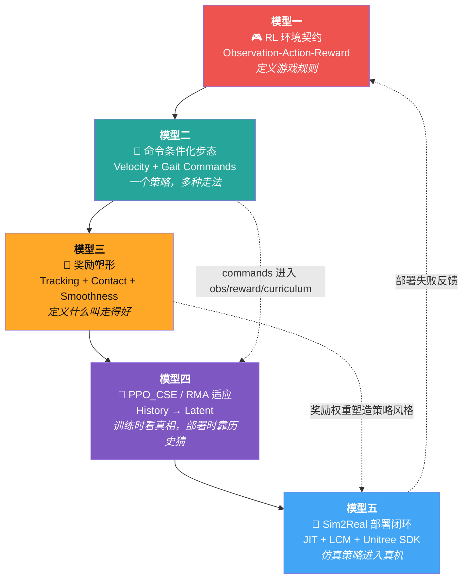
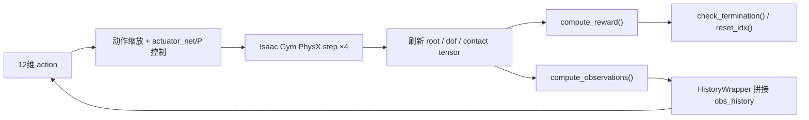
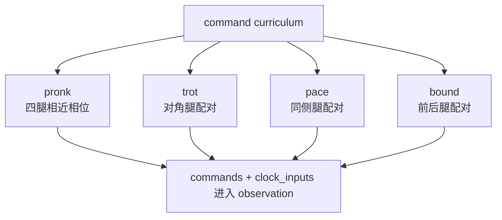
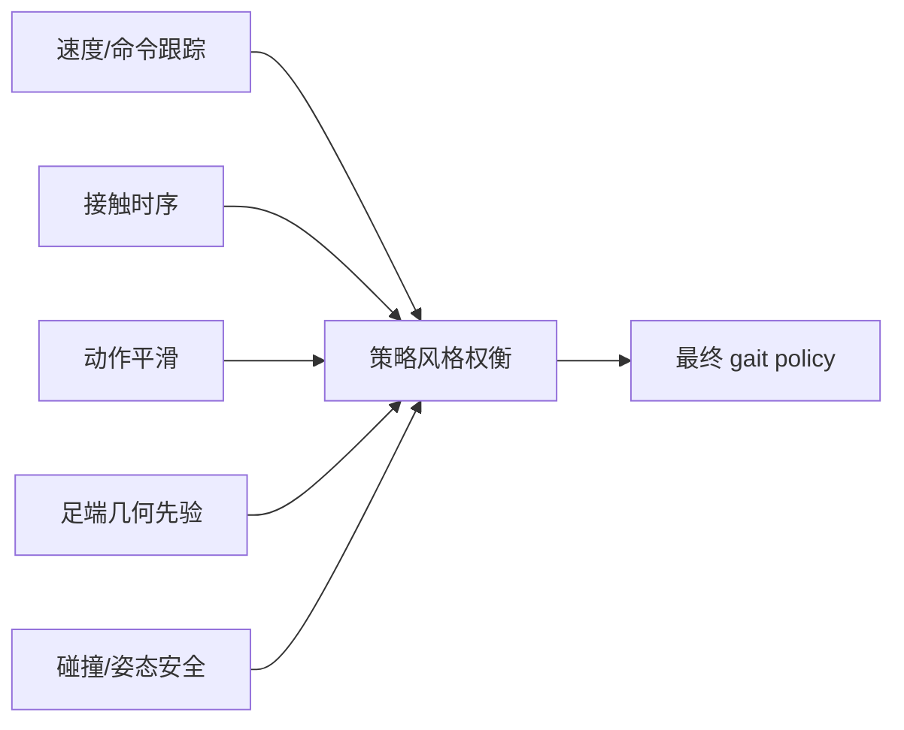
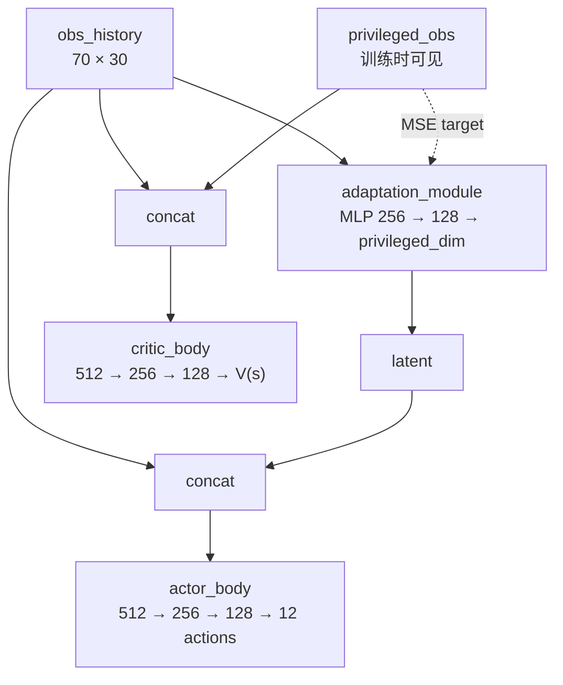
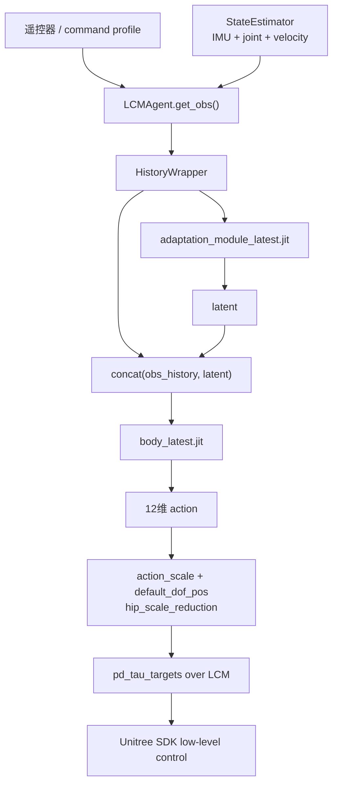

# 🏛️ Socratic Learn — Go1 多步态强化学习与 Sim2Real 部署

  
  
  
  

---

## 📌 第一步：抓骨架（Build the Skeleton）

> 🔑 **核心问题：** 在 `walk-these-ways` 这个 Go1 多步态强化学习项目里，所有专家都会先抓住的五个核心思维模型是什么？

---

## 🗺️ 五模型全景图

---

## 🔴 模型一：RL 环境契约（Observation-Action-Reward）

> 💡 **它回答的核心问题：** Go1 在每个控制周期看见什么、能做什么、什么算好、什么时候重置？

### 📊 环境规格表

| 要素 | 本项目默认训练配置 | 源码位置 | 说明 |
|:---|:---:|:---|:---|
| 并行环境数 | `4000` | `go1_config.py` / `scripts/train.py` | Isaac Gym GPU 并行采样 |
| 动作维度 | `12` | `Cfg.env.num_actions` | 12 个关节目标偏移 |
| 单帧观测 | `70` | `scripts/train.py` | gravity + commands + joint state + actions + clock |
| 历史长度 | `30` | `Cfg.env.num_observation_history` | `70 × 30 = 2100` 维历史输入 |
| 特权观测 | `2` | `Cfg.env.num_privileged_obs` | 训练时给 critic / adaptation target |
| 物理步长 | `dt=0.005s` | `legged_robot_config.py` | PhysX 200Hz |
| 控制 decimation | `4` | `Cfg.control.decimation` | 策略 50Hz，物理 200Hz |

### 🔁 一步仿真的数据流

### ⚠️ 关键设计决策

- `VelocityTrackingEasyEnv` 只是薄封装，真正的任务定义在 `LeggedRobot`。
- `reset_idx()` 不只是重置机器人，还会重采样 commands、执行随机化、清空 lag/history 相关 buffer。
- observation 不是“传感器原样输出”，而是为训练和部署对齐后人工拼接的接口。

> 🔗 **与相邻模型的关系：** 模型一规定接口；模型二把 commands 塞进接口；模型三用 reward 评价接口输出；模型五必须在真机端复刻同一接口。

---

## 🟢 模型二：命令条件化步态（Command-Conditioned Multiplicity of Behavior）

> 💡 **它回答的核心问题：** 一个策略如何同时学会 trot、pace、bound、pronk，以及不同速度、转向、身体姿态？

### 🧭 15 维 Command 谱系

| 维度 | 含义 | 训练范围示例 |
|:---:|:---|:---|
| 0 | 前向速度 `lin_vel_x` | `[-1.0, 1.0]` |
| 1 | 侧向速度 `lin_vel_y` | `[-0.6, 0.6]` |
| 2 | 偏航角速度 `ang_vel_yaw` | `[-1.0, 1.0]` |
| 3 | 身体高度 | `[-0.25, 0.15]` |
| 4 | 步态频率 | `[2.0, 4.0]` |
| 5 | gait phase | `[0.0, 1.0]` |
| 6 | gait offset | `[0.0, 1.0]` |
| 7 | gait bound | `[0.0, 1.0]` |
| 8 | gait duration | `[0.5, 0.5]` |
| 9 | 摆腿高度 | `[0.03, 0.35]` |
| 10 | body pitch | `[-0.4, 0.4]` |
| 11 | body roll | `[-0.0, 0.0]` |
| 12 | stance width | `[0.10, 0.45]` |
| 13 | stance length | `[0.35, 0.45]` |
| 14 | 保留/辅助项 | 依配置 |

### 🦿 四类步态课程

### ⚠️ 关键设计决策

- `gaitwise_curricula=True` 时，命令分布按步态类别维护。
- command 不只是遥控输入；它同时影响 observation、reward、curriculum。
- `clock_inputs` 给策略一个周期相位参考，降低从零发现步态节律的难度。

> 🔗 **与相邻模型的关系：** 模型二定义“想要什么行为”；模型三定义“做到没有”；模型四学习从历史和命令到动作的映射。

---

## 🟠 模型三：奖励塑形（Reward as Behavior Specification）

> 💡 **它回答的核心问题：** 多步态 Go1 到底怎样才算“走得好”？

### 🎁 训练脚本中的主要奖励权重

| 奖励项 | 权重 | 类型 | 作用 |
|:---|:---:|:---:|:---|
| `tracking_contacts_shaped_force` | `+4.0` | 🟢 接触时序 | 该接触时有力，不该接触时少力 |
| `tracking_contacts_shaped_vel` | `+4.0` | 🟢 足端速度 | 支撑脚慢，摆动脚可动 |
| `jump` | `+10.0` | 🟢 高度/跳跃 | 跟踪 body height command |
| `orientation_control` | `-5.0` | 🔴 姿态 | 惩罚偏离 roll/pitch command |
| `raibert_heuristic` | `-10.0` | 🔴 足端几何 | 鼓励落脚点符合速度/频率关系 |
| `action_smoothness_1` | `-0.1` | 🟡 平滑 | 惩罚一阶动作变化 |
| `action_smoothness_2` | `-0.1` | 🟡 平滑 | 惩罚二阶动作变化 |
| `feet_slip` | `-0.04` | 🔴 接触质量 | 惩罚支撑脚滑动 |
| `collision` | `-5.0` | 🔴 安全 | 惩罚非期望身体碰撞 |
| `lin_vel_z` | `-0.02` | 🔴 稳定 | 抑制竖直方向乱跳 |
| `ang_vel_xy` | `-0.001` | 🔴 稳定 | 抑制 roll/pitch 角速度 |

### 🧠 奖励不是“越多越好”

> ⚠️ **关键设计决策：**
> - 强接触奖励让步态更可控，但也可能限制策略自发发现别的接触模式。
> - 平滑奖励能减少真机抖动，但太强会牺牲快速响应。
> - Raibert heuristic 是专家先验，能帮训练，也可能把策略绑在手工步态模板上。

> 🔗 **与相邻模型的关系：** 模型三把模型二的 commands 变成优化目标；模型四通过 PPO 学会最大化这些目标；模型五用真机结果检验 reward 是否写对。

---

## 🟣 模型四：PPO_CSE / RMA 适应架构

> 💡 **它回答的核心问题：** 训练时能看见摩擦、恢复系数等特权信息；真机看不见。策略如何仍然适应？

### 🧠 网络结构

### ⚙️ PPO / CSE 关键参数

| 参数 | 值 | 含义 |
|:---|:---:|:---|
| `num_steps_per_env` | `24` | 每轮每环境采样步数 |
| `num_learning_epochs` | `5` | 每批数据重复训练轮数 |
| `num_mini_batches` | `4` | PPO mini-batch 数 |
| `clip_param` | `0.2` | PPO clipped surrogate |
| `desired_kl` | `0.01` | 自适应学习率目标 KL |
| `gamma` | `0.99` | 折扣因子 |
| `lam` | `0.95` | GAE 参数 |
| `adaptation_module_learning_rate` | `1e-3` | adaptation loss 学习率 |

### ⚠️ 关键设计决策

- actor 训练时也通过 `adaptation_module(obs_history)` 得到 latent。
- critic 训练时使用 privileged observation。
- `PPO.update()` 额外用 MSE 让 adaptation module 拟合 privileged obs。
- 部署只导出 `adaptation_module_latest.jit` 和 `body_latest.jit`，不导出 critic。

> 🔗 **与相邻模型的关系：** 模型四把模型一/二/三采集到的数据转成可部署策略；模型五只保留推理需要的 student 路径。

---

## 🔵 模型五：Sim2Real 部署闭环

> 💡 **它回答的核心问题：** 训练出的 TorchScript 策略如何变成真实 Go1 的低层控制命令？

### 🚀 部署链路

### 📦 部署关键文件

| 文件 | 角色 |
|:---|:---|
| `go1_gym_deploy/scripts/deploy_policy.py` | 加载参数和 JIT 策略 |
| `go1_gym_deploy/envs/lcm_agent.py` | 构造真机 observation，发布 action |
| `go1_gym_deploy/utils/cheetah_state_estimator.py` | 接收 IMU、关节、速度、RC |
| `go1_gym_deploy/utils/command_profile.py` | 遥控器命令映射 |
| `go1_gym_deploy/utils/deployment_runner.py` | 控制循环和日志 |

### ⚠️ 最危险的不是维度错，而是语义错

| 检查项 | 为什么危险 |
|:---|:---|
| 关节顺序 | 维度正确，但 action 发给错关节 |
| `default_dof_pos` | 中性姿态偏移会导致持续大 PD 误差 |
| `action_scale` | 动作幅度放大/缩小，直接影响稳定性 |
| `commands_scale` | 命令语义变了，策略以为目标速度不同 |
| `clock_inputs` | 步态相位错，接触节律会崩 |
| `control_dt` | 频率不一致，历史和 gait phase 都失真 |
| LCM 延迟 | 状态旧、动作新，PD 误差可能突然放大 |

---

## 🧩 Skeleton Summary

  

> 这个项目的骨架是：  
> **在 Isaac Gym 中定义 Go1 的并行 RL 环境，用命令条件化表达多步态行为，用奖励塑形规定运动风格，再用 PPO_CSE/RMA 从历史中学习适应隐变量，最后把 JIT student 策略接入 LCM 真机低层控制闭环。**

---

## ❓ 反问

这五个模型里，你最熟悉哪个？最陌生的是哪个？  
别只说名字，说一个你能在源码里定位到的证据。

