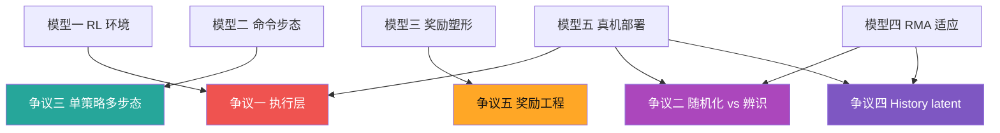

# ⚔️ Socratic Learn — Go1 Step 2 找争议

<p align="center">
  
  
  
</p>

---

## 📌 第二步：找争议（Find the Controversies）

> 🔑 **核心问题：** 在 Go1 多步态强化学习与 Sim2Real 部署里，专家真正会吵的是什么？各自站哪边？底层分歧是什么？

---

## 争议一：执行层 — Actuator Net / 位置目标 vs 直接力矩控制

<p align="center">
  
</p>

|  | 阵营 A：位置目标 + actuator_net/PD | 阵营 B：直接力矩控制 |
|:--|:--|:--|
| 🏷️ **立场** | 策略输出关节目标偏移，底层模型/PD 转成力矩 | 策略直接输出 12 维关节力矩 |
| 📍 **本项目** | 明显站 A：`Cfg.control.control_type="actuator_net"` | 不采用 |
| ✅ **核心论据** | action 语义稳定，Sim2Real 更安全；actuator_net 能拟合真实 Unitree 电机响应 | 表达能力最大，适合高动态动作，不被 PD/actuator 模型限制 |
| 🗣️ **反驳对方** | 直接力矩对质量/惯量/延迟极敏感，上真机风险大 | 位置目标像低通滤波器，会限制跳跃、快速转向等高带宽行为 |

```text
本项目路线：
策略 action
  -> action_scale + default_dof_pos
  -> joint_pos_target
  -> actuator_net(joint error history, joint velocity history)
  -> torque
  -> PhysX / 真机 PD 执行

直接力矩路线：
策略 action
  -> torque
  -> 电机
```

> 🔗 **关联骨架：** 模型一 `_compute_torques()` + 模型五 `LCMAgent.publish_action()`。  
> 本项目选择 A，是为了让训练和真机低层接口更稳。

---

## 争议二：Sim2Real — Domain Randomization vs System Identification

<p align="center">
  
</p>

|  | 阵营 A：Domain Randomization | 阵营 B：System Identification |
|:--|:--|:--|
| 🏷️ **立场** | 训练时随机摩擦、恢复系数、质量、重力、电机强度、延迟 | 精确测真机参数，建高保真数字孪生 |
| 📍 **本项目** | 站 A，并加入 history adaptation | 只作为潜在替代路线 |
| ✅ **核心论据** | 真实世界参数会变，策略见惯变化才稳 | 随机化会让策略保守，极限性能下降 |
| 🗣️ **反驳对方** | 数字孪生再准，地面/电池/老化一变就失配 | 随机范围一大，策略学平均解，训练慢且动作钝 |

### 🎲 本项目随机化谱系

| 随机化项 | 训练脚本范围 |
|:---|:---|
| 摩擦 | `[0.1, 3.0]` |
| 恢复系数 | `[0.0, 0.4]` |
| base mass | `[-1.0, 3.0]` |
| 重力扰动 | `[-1.0, 1.0]` |
| 电机强度 | `[0.9, 1.1]` |
| motor offset | `[-0.02, 0.02]` |
| lag timesteps | `6`，且随机化 |

> 🔗 **关联骨架：** 模型四 RMA 适应 + 模型五 Sim2Real。  
> 随机化本身不够，项目还让 `adaptation_module(obs_history)` 去估计隐藏动力学。

---

## 争议三：多步态 — 单一命令条件化策略 vs 多个专用策略

<p align="center">
  
</p>

|  | 阵营 A：一个策略，多种 gait | 阵营 B：多个 gait 专用策略 |
|:--|:--|:--|
| 🏷️ **立场** | 用 command + clock inputs 控制 trot/pace/bound/pronk | 每种步态训练独立策略或显式 gait scheduler |
| 📍 **本项目** | 明显站 A：Multiplicity of Behavior | 不采用 |
| ✅ **核心论据** | 一个策略统一部署，行为可连续调节，技能共享 | 每个步态更容易优化、解释、加安全边界 |
| 🗣️ **反驳对方** | 多策略切换会产生不连续动作，部署复杂 | 单策略会互相干扰，某个 gait 变好可能拖垮另一个 |

```text
单策略路线：
command = [速度, yaw, body height, gait phase, offset, bound, frequency, ...]
policy(obs_history, command, clock)
  -> 对应 gait 的 action
```

> 🔗 **关联骨架：** 模型二命令条件化 + 模型三奖励塑形。  
> 真正该看的不是平均 reward，而是分 gait 的 tracking error、fall rate、torque peak。

---

## 争议四：适应机制 — History Latent 是否足够？

<p align="center">
  
</p>

|  | 阵营 A：History → Latent 足够 | 阵营 B：需要显式估计器/更多传感 |
|:--|:--|:--|
| 🏷️ **立场** | 从最近 30 帧观测中推断摩擦、延迟、电机偏差等隐变量 | 历史不可观测时，必须增加传感器或系统辨识 |
| 📍 **本项目** | 站 A：`adaptation_module(obs_history)` | 不显式建外部估计器 |
| ✅ **核心论据** | 同样 action 在不同物理参数下产生不同响应，历史轨迹会泄露环境 | 低摩擦、电机弱、状态估计延迟可能表现相似，history latent 会混淆 |
| 🗣️ **反驳对方** | 外部估计器增加部署复杂度，也可能不稳定 | 只靠 MLP 猜隐藏参数，没有可观测性保证 |

> 🔗 **关联骨架：** 模型四 PPO_CSE / RMA。  
> 最直接的诊断是比较 `act_teacher(obs_history, privileged_obs)` 和 `act_student(obs_history)`。

---

## 争议五：奖励工程 — Dense Reward vs 更少先验

<p align="center">
  
</p>

|  | 阵营 A：Dense Reward Engineering | 阵营 B：更少奖励 + 更强课程/探索 |
|:--|:--|:--|
| 🏷️ **立场** | 显式奖励速度、接触、平滑、足端几何、安全 | 少写人工偏好，让策略自己发现运动 |
| 📍 **本项目** | 站 A：多奖励项 + 多权重 | 只作为替代思想 |
| ✅ **核心论据** | 四足接触空间太大，没有密集信号训练很慢 | 奖励项越多越容易 reward hacking，迁移任务时要重调 |
| 🗣️ **反驳对方** | 稀疏奖励可能永远学不到稳定 gait | 稠密奖励可能只是学会讨好奖励函数 |

> 🔗 **关联骨架：** 模型三奖励塑形。  
> 争议关键不是“奖励多不多”，而是每个 reward 是否对应真机上真正重要的行为。

---

## 🗺️ 争议 vs 骨架 对照



---

## ❓ 反问

这五个争议里，你最站哪边？为什么？  
别说“都重要”。选一边，然后说：**如果你错了，最先会在哪个实验现象里暴露？**

