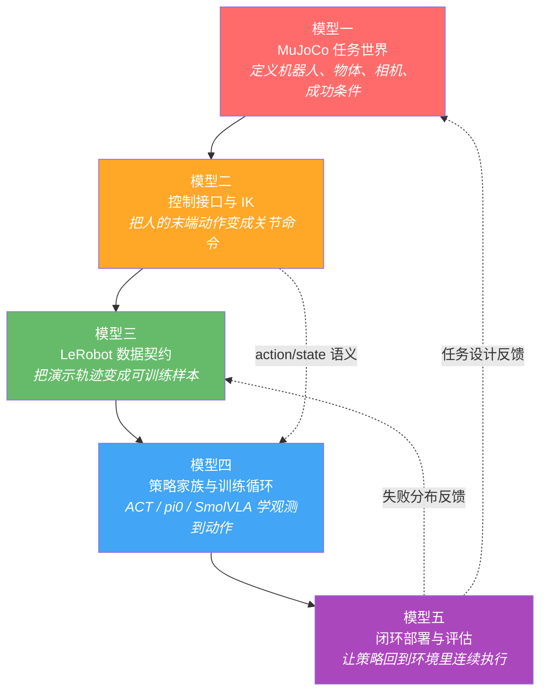
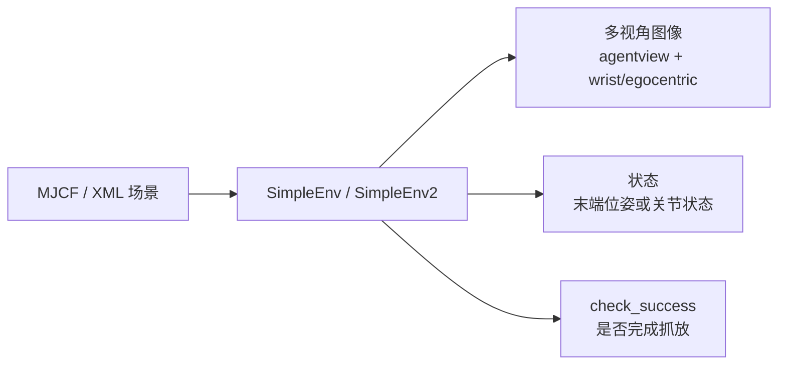
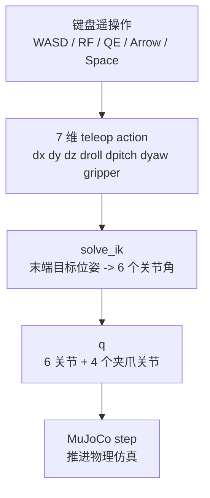
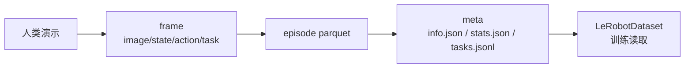
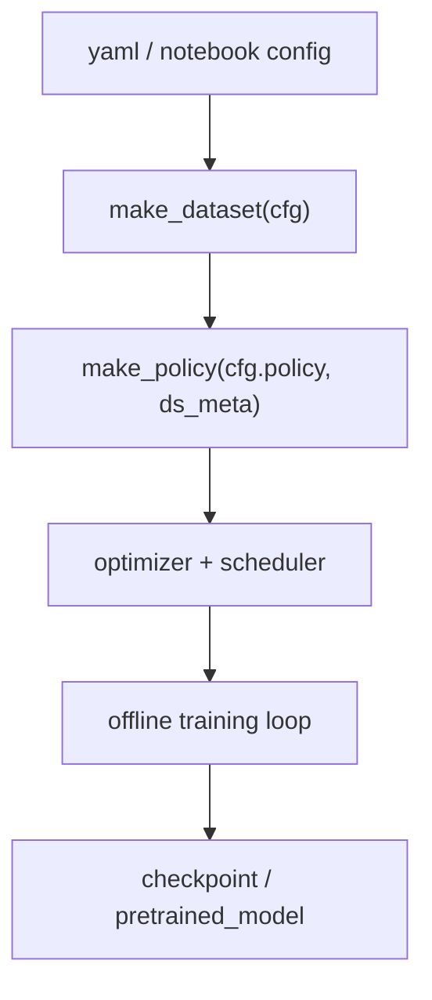
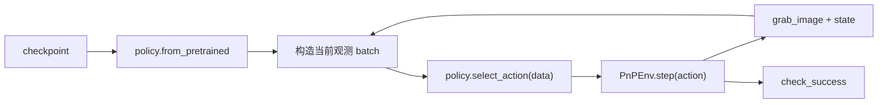
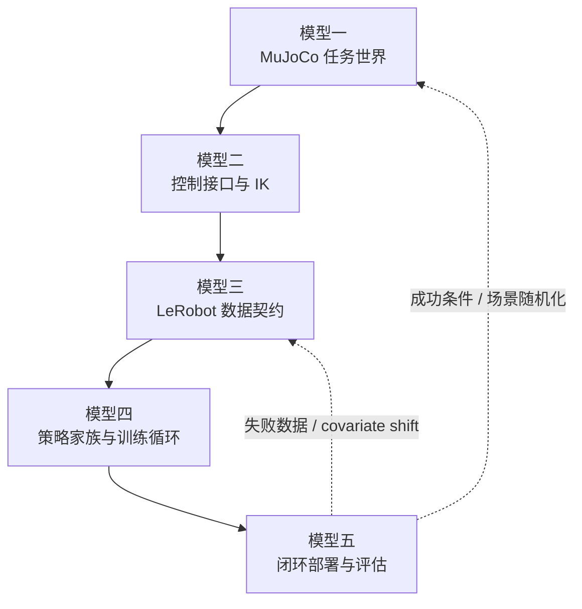

# Socratic Learn — LeRobot + MuJoCo 抓放模仿学习与 VLA 部署

<p align="center">
  
  
  
  
</p>

---

## 第一步：抓骨架（Build the Skeleton）

> **核心问题：** 如果把「LeRobot + MuJoCo 抓放模仿学习与 VLA 部署」按可验证的系统边界拆开，最核心的五个思维模型是什么？

这个仓库的主线不是单独跑一个模型，而是把下面五件事接成一个闭环：

1. MuJoCo 里有一个可控的抓放世界。
2. 人通过键盘遥操作，动作经 IK 转成机器人能执行的关节命令。
3. 数据按 LeRobot 的 schema 存成 episode。
4. ACT、pi0、SmolVLA 从离线数据里学策略。
5. 策略回到 MuJoCo 闭环 rollout，靠成功条件检验。

### 范围与证据边界

这篇不是 LeRobot/VLA 领域的完整综述，而是对本仓库的学习骨架抽象。结论主要来自 README、`mujoco_env/` 环境代码、数据采集 notebooks、训练入口和部署 notebooks。凡是涉及“模型更适合什么”的判断，属于基于代码结构和常见工程经验的推断，不等同于论文结论。

| 结论类型 | 证据来源 | 置信度 |
|:--|:--|:--|
| 环境、动作、成功条件的描述 | [`mujoco_env/y_env.py`](mujoco_env/y_env.py#L13)、[`mujoco_env/y_env2.py`](mujoco_env/y_env2.py#L13) | 高 |
| 数据字段和写帧逻辑 | [`1.collect_data.ipynb`](1.collect_data.ipynb)、[`5.language_env.ipynb`](5.language_env.ipynb) | 高 |
| 训练和部署链路 | [`train_model.py`](train_model.py#L128)、[`3.train.ipynb`](3.train.ipynb)、[`4.deploy.ipynb`](4.deploy.ipynb) | 高 |
| ACT 与 VLA 的适用性比较 | 仓库配置 + 模型机制推断 | 中 |

---

## 五模型全景图



---

## 模型一：MuJoCo 任务世界

> **它回答的核心问题：** 机器人到底在哪里，看到什么，能碰到什么，什么时候算成功？

### 任务世界的四个组成

| 组成 | 仓库位置 | 作用 |
|:--|:--|:--|
| 机器人与场景 | `asset/robotis_omy/`、`asset/example_scene_y.xml`、`asset/example_scene_y2.xml` | 定义 OMY 机械臂、桌面、相机、物体 |
| 物体资产 | `asset/objaverse/`、`asset/tabletop/` | mug、plate、YCB 风格物体与碰撞模型 |
| 环境封装 | `mujoco_env/y_env.py`、`mujoco_env/y_env2.py` | reset、step、render、grab_image、check_success |
| 成功条件 | `check_success()` | mug 与 plate 的位置接近、夹爪打开、末端抬高 |

证据锚点：`SimpleEnv` 定义在 [`y_env.py#L13`](mujoco_env/y_env.py#L13)，普通成功条件在 [`y_env.py#L289`](mujoco_env/y_env.py#L289)；`SimpleEnv2` 定义在 [`y_env2.py#L13`](mujoco_env/y_env2.py#L13)，语言目标绑定和成功条件分别在 [`y_env2.py#L110`](mujoco_env/y_env2.py#L110)、[`y_env2.py#L325`](mujoco_env/y_env2.py#L325)。

### 两个环境版本

| 环境 | 任务 | 关键差异 |
|:--|:--|:--|
| `SimpleEnv` | 单 mug 放到 plate | 随机初始化 mug 与 plate，任务固定 |
| `SimpleEnv2` | 红/蓝 mug 中按语言指令选择目标 | `instruction` 决定 `obj_target`，成功条件看目标 mug |



> **关键理解：** MuJoCo 不是背景板，它决定了所有数据的物理语义。相机位置、物体随机化、接触模型、成功条件一变，后面的数据和策略含义都会变。

> **与相邻模型的关系：** 任务世界给模型二提供可执行的物理对象；模型五的 rollout 失败又会反过来暴露任务世界哪里设计得不够真实。

---

## 模型二：控制接口与 IK

> **它回答的核心问题：** 人按键盘产生的是“末端想怎么动”，机器人执行的是“关节应该到哪里”，这两者怎么接起来？

### 控制链路



### 三种 action 语义

| `action_type` | 输入 action 的含义 | 适合场景 |
|:--|:--|:--|
| `eef_pose` | 末端位姿增量 + 夹爪 | 人类 teleop，直观 |
| `delta_joint_angle` | 关节角增量 + 夹爪 | 更接近低层控制，但保留相对动作 |
| `joint_angle` | 绝对关节角 + 夹爪 | 模型部署，稳定复现训练数据里的动作 |

### 这个仓库最容易混淆的一点

在 `1.collect_data.ipynb` 里：

```text
teleop_robot() 产生的是末端增量 action
PnPEnv.step(action) 通过 IK 得到 joint_q
dataset 保存的 action 是 joint_q
```

证据锚点：`SimpleEnv.step()` 根据 `action_type` 切换动作解释，见 [`y_env.py#L98`](mujoco_env/y_env.py#L98)；`teleop_robot()` 生成 7 维末端增量和夹爪命令，见 [`y_env.py#L204`](mujoco_env/y_env.py#L204)；采集 notebook 在写帧前调用 `joint_q = PnPEnv.step(action)`，再把 `joint_q` 写入 `"action"`，见 [`1.collect_data.ipynb`](1.collect_data.ipynb) 中对应 cell。

也就是说，训练时策略学的不是“键盘增量”，而是“在这一帧观测下，应该输出哪个关节目标”。

> **关键理解：** IK 是这个仓库里的“语义转换器”。人用任务空间教，模型最终常常学关节空间动作。

> **与相邻模型的关系：** 模型二决定模型三的 `action` 字段到底是什么意思；如果训练和部署时 action 语义不一致，模型四再强也会直接学歪。

---

## 模型三：LeRobot 数据契约

> **它回答的核心问题：** 一次演示要保存成什么格式，才能被回放、训练、部署复用？

### 核心 schema

| 字段 | 形状 | 含义 | 注意点 |
|:--|:--:|:--|:--|
| `observation.image` | `256x256x3` | 外部视角图像 | agentview |
| `observation.wrist_image` | `256x256x3` | 腕部/末端视角图像 | egocentric |
| `observation.state` | `6` | 状态向量 | 不同 notebook 里语义可能不同 |
| `action` | `7` | 6 关节 + 夹爪，或动作命令 | 训练和部署必须一致 |
| `obj_init` | `6` 或 `9` | 物体初始位置 | 普通任务两个物体，语言任务三个物体 |
| `task` | 字符串 | 任务描述 | 语言条件训练的入口 |

### 普通任务和语言任务的数据差异

| 数据来源 | `observation.state` | `action` | `obj_init` |
|:--|:--|:--|:--|
| `1.collect_data.ipynb` | `ee_pose`，末端位置 + RPY | `joint_q`，IK 后关节目标 | mug + plate = 6 |
| `5.language_env.ipynb` | `joint_q[:6]`，6 个关节角 | `PnPEnv.q[:7]`，6 关节 + 夹爪 | red mug + blue mug + plate = 9 |

证据锚点：普通采集的 schema 在 [`1.collect_data.ipynb`](1.collect_data.ipynb) 中包含 `observation.state`、`action`、`obj_init`；写帧逻辑把 `ee_pose` 写到 state，把 `joint_q` 写到 action。语言采集在 [`5.language_env.ipynb`](5.language_env.ipynb) 中把 `joint_q[:6]` 写到 state，把 `PnPEnv.q[:7]` 写到 action，并用 `task = PnPEnv.instruction` 记录语言指令。



> **关键理解：** LeRobot 数据集不是“把图片和动作扔进文件夹”。它是一个严格契约：字段名、shape、统计量、episode 边界、task 文本都会影响策略输入输出。

> **与相邻模型的关系：** 模型三把模型二产生的控制轨迹喂给模型四；模型五 rollout 失败时，第一件事通常不是改网络，而是查这个数据契约有没有语义错位。

---

## 模型四：策略家族与训练循环

> **它回答的核心问题：** 给定 LeRobot 数据，什么模型负责从观测预测动作？

### 三类策略

| 策略 | 仓库入口 | 适合问题 | 关键机制 |
|:--|:--|:--|:--|
| ACT | `3.train.ipynb`、`4.deploy.ipynb` | 小规模、固定任务模仿学习 | action chunking，Transformer，低延迟 |
| pi0 | `7.pi0.ipynb`、`pi0_omy.yaml` | 语言条件、预训练 VLA 微调 | 视觉 + 语言 + 动作专家 |
| SmolVLA | `8.smolvla.ipynb`、`smolvla_omy.yaml` | 更轻量的 VLA 微调/部署 | 小模型、更低资源需求 |

### 训练入口抽象



### 关键训练参数

| 项 | ACT | pi0 / SmolVLA |
|:--|:--|:--|
| 训练方式 | notebook 手写 loop | `train_model.py --config_path ...` |
| action chunk | `chunk_size=10` | `chunk_size=5` |
| 每次执行步数 | `n_action_steps=10` 或部署中 `1` | `n_action_steps=5` |
| 数据集 | 本地 `demo_data` | `omy_pnp_language` |
| 预训练依赖 | 通常从头训练 | 需要本地或 HF 模型路径 |

证据锚点：统一训练入口在 [`train_model.py#L128`](train_model.py#L128) 创建 dataset，在 [`train_model.py#L143`](train_model.py#L143) 创建 policy；pi0 与 SmolVLA 的本地预训练路径设置在 [`train_model.py#L140`](train_model.py#L140) 和 [`train_model.py#L142`](train_model.py#L142)。ACT notebook 使用 `ACTConfig(..., chunk_size=10, n_action_steps=10)`；部署 notebook 使用 `ACTPolicy.from_pretrained()` 后调用 `policy.select_action()`。

> **关键理解：** ACT 更像“把这条任务轨迹学稳”，pi0/SmolVLA 更像“利用视觉语言预训练来理解任务文本和目标”。这个判断的置信度是中等：它符合模型设计和本仓库配置，但没有在本文中通过系统实验比较验证。

> **与相邻模型的关系：** 模型四完全吃模型三的字段语义；它输出的动作必须能被模型五的环境以同一套 `action_type` 执行。

---

## 模型五：闭环部署与评估

> **它回答的核心问题：** 训练 loss 下降之后，策略回到 MuJoCo 里能不能连续完成抓放？

### 部署链路



### 为什么闭环比离线误差更重要

| 指标 | 能说明什么 | 不能说明什么 |
|:--|:--|:--|
| train loss | 模型是否拟合数据分布 | 部署时遇到偏离轨迹能否恢复 |
| mean action error | 单帧动作是否接近标注 | 连续控制是否稳定 |
| dataset replay | 数据与环境能否复现 | 策略是否能抗自己的误差 |
| rollout success | 任务是否完成 | 失败根因还要继续诊断 |

证据锚点：部署时的典型链路是加载 policy，构造当前观测，调用 `policy.select_action(data)`，再执行 `PnPEnv.step(action)`；ACT 部署 notebook 的相关调用可见 [`4.deploy.ipynb`](4.deploy.ipynb)，pi0/SmolVLA 推理调用可见 [`7.pi0.ipynb`](7.pi0.ipynb)、[`8.smolvla.ipynb`](8.smolvla.ipynb)。

> **关键理解：** 模仿学习有一个天然问题：训练时看的是专家状态，部署时看的是自己动作造成的新状态。一点小误差会把策略带到训练数据没覆盖的区域，这就是闭环评估的价值。

> **与相邻模型的关系：** 模型五检验前四个模型是否真的接上了；它也是下一轮数据采集、schema 修正、模型选择的反馈源。

---

## 骨架总结（Skeleton Summary）

> 用你自己的话可以这样说：
>
> **这个仓库先在 MuJoCo 里定义 OMY 机械臂抓放世界，再用键盘遥操作和 IK 生成演示轨迹，把图像、状态、动作、任务文本存成 LeRobot 数据集，最后用 ACT 或 pi0/SmolVLA 做离线模仿学习，并把策略放回 MuJoCo 闭环 rollout 检验是否真能完成任务。**

### 五模型依赖关系



---

## 反问

这五个模型里，**你最熟悉哪个？最陌生的是哪个？**
