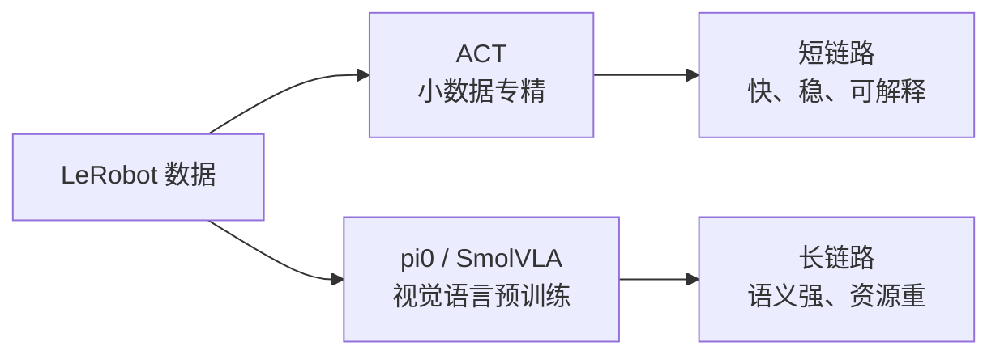
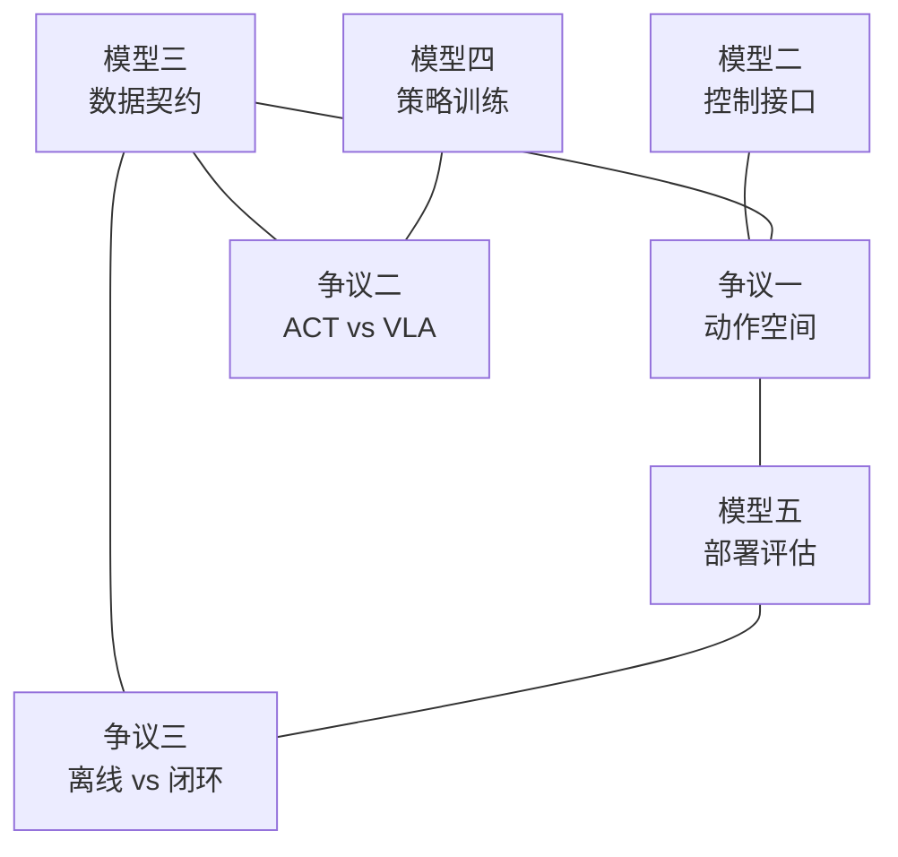

# Socratic Learn — Step 2 找争议

<p align="center">
  
  
  
  
</p>

---

## 第二步：找争议（Find the Controversies）

> **核心问题：** 在「LeRobot + MuJoCo 抓放模仿学习与 VLA 部署」这个仓库暴露出的工程空间里，最值得争论的三个问题是什么？各自站哪边？各自的核心理由是什么？

### 范围与证据边界

这里的“争议”不是断言它们就是整个机器人学习领域被引用最多、论文最多的三大争议。更严谨的说法是：**它们是阅读本仓库后，最会影响实现选择、实验解释和部署成败的三个分歧点。**

| 争议 | 直接证据 | 推断成分 | 置信度 |
|:--|:--|:--|:--|
| 任务空间动作 vs 关节空间动作 | `teleop_robot()`、`step()`、notebook 写帧逻辑、部署 `action_type='joint_angle'` | “哪种更适合泛化”属于工程判断 | 高 |
| ACT 小模型专精 vs VLA 预训练泛化 | ACT/pi0/SmolVLA 都在仓库中给出训练或部署路径 | “泛化能力”未由本仓库系统实验验证 | 中 |
| 纯离线 BC vs 闭环纠错 | 仓库有离线训练、离线误差和 rollout，但没有 DAgger 实现 | “需要纠错数据”是模仿学习常见风险推断 | 中 |

---

## 争议一：任务空间动作 vs 关节空间动作

<p align="center">
  
</p>

|  | 阵营 A：任务空间动作 | 阵营 B：关节空间动作 |
|:--|:--|:--|
| **立场** | 策略或数据直接表达末端位姿增量：`dx dy dz droll dpitch dyaw gripper` | 策略输出 6 个关节目标 + 夹爪 |
| **核心论据** | 人类示教更自然；抓放任务本质上是“末端到哪里、夹爪何时开合”；换机械臂时更容易保留任务语义 | MuJoCo 和真实机器人最终都执行关节；部署链路简单；避免策略运行时 IK 不稳定 |
| **反驳对方** | 关节角太依赖本体结构，学到的是这台 OMY 的姿态轨迹，不是“抓杯子”的任务结构 | 末端空间看起来高级，但每一步都要过 IK；接近奇异位形或夹爪接触时，微小末端误差会放大成关节抖动 |

```text
任务空间派：
人类按键 -> 末端增量 -> 数据 action -> 策略输出末端增量 -> IK -> 关节

关节空间派：
人类按键 -> 末端增量 -> IK -> 数据 action 保存关节 -> 策略直接输出关节
```

### 本项目站在哪里？

这个仓库是一个混合体：

- 遥操作时站在任务空间派：`teleop_robot()` 产生末端增量。
- 保存训练数据时转向关节空间派：`PnPEnv.step(action)` 经 IK 后，普通任务把 `joint_q` 存成 `action`。
- 部署 ACT 时明显站在关节空间派：`SimpleEnv(xml_path, action_type='joint_angle')`。

证据锚点：`step()` 对 `eef_pose`、`delta_joint_angle`、`joint_angle` 三种 action 语义分支处理，见 [`mujoco_env/y_env.py#L98`](mujoco_env/y_env.py#L98)；`teleop_robot()` 产生末端增量，见 [`mujoco_env/y_env.py#L204`](mujoco_env/y_env.py#L204)；普通采集 notebook 把 `joint_q` 写入 `"action"`；ACT 部署 notebook 初始化 `SimpleEnv(xml_path, action_type='joint_angle')`。

> **底层分歧：** 你是希望模型学“任务语义”，还是希望部署时控制链路最短、最稳？

> **关联骨架：** [模型二 控制接口与 IK](./socratic-01-抓骨架.md#模型二控制接口与-ik) + [模型三 LeRobot 数据契约](./socratic-01-抓骨架.md#模型三lerobot-数据契约) + [模型五 闭环部署与评估](./socratic-01-抓骨架.md#模型五闭环部署与评估)。

---

## 争议二：ACT 小模型专精 vs pi0/SmolVLA 预训练泛化

<p align="center">
  
</p>

|  | 阵营 A：ACT / 专用模仿学习 | 阵营 B：pi0 / SmolVLA / VLA |
|:--|:--|:--|
| **立场** | 固定任务、少量演示，用 ACT 这种 action-chunking policy 就够了 | 机器人要听语言、换目标、跨任务泛化，必须用视觉语言动作预训练模型 |
| **核心论据** | 数据少、训练快、部署简单；没有 tokenizer、HF 权重、本地模型路径等复杂依赖；对单一 mug-to-plate 任务更稳定 | 语言任务里“红杯/蓝杯”不是图像分类小技巧，而是语义绑定；预训练模型能利用外部视觉语言知识 |
| **反驳对方** | VLA 需要更多显存、更多数据、更多工程处理；两种颜色两个杯子的小任务，用大模型可能是过度设计 | ACT 学到的是固定轨迹模式，任务文本只当标签；一旦目标、语言、物体组合变多，专用模型会很快见顶 |



### 本项目的证据

| 路径 | 配置 | 含义 |
|:--|:--|:--|
| ACT | `chunk_size=10`，notebook 手动训练 | 先跑通固定抓放任务 |
| pi0 | `pi0_omy.yaml`，`steps=20_000`，`batch_size=16` | 用语言数据微调 VLA |
| SmolVLA | `smolvla_omy.yaml`，`device=cuda` | 在 VLA 能力和资源消耗之间折中 |

证据锚点：ACT 训练 notebook 使用 `ACTConfig(..., chunk_size=10, n_action_steps=10)`；ACT 部署 notebook 使用 `ACTPolicy.from_pretrained('./ckpt/act_y', ...)`。pi0 与 SmolVLA 的训练配置分别在 [`pi0_omy.yaml`](pi0_omy.yaml) 和 [`smolvla_omy.yaml`](smolvla_omy.yaml)，统一训练入口在 [`train_model.py`](train_model.py)。注意：这些证据能证明仓库提供了三条路径，不能单独证明哪条路径在统计意义上更优。

> **底层分歧：** 你认为机器人学习的核心瓶颈是“动作轨迹拟合”，还是“视觉语言语义理解”？

> **关联骨架：** [模型三 LeRobot 数据契约](./socratic-01-抓骨架.md#模型三lerobot-数据契约) + [模型四 策略家族与训练循环](./socratic-01-抓骨架.md#模型四策略家族与训练循环)。

---

## 争议三：离线模仿学习 vs 闭环纠错数据

<p align="center">
  
</p>

|  | 阵营 A：纯离线 BC | 阵营 B：闭环纠错 / DAgger / 失败数据回灌 |
|:--|:--|:--|
| **立场** | 采足够多专家演示，监督学习 `observation -> action`，再部署 | 光有专家轨迹不够，必须让模型自己 rollout，收集失败状态，再让人纠正 |
| **核心论据** | 工程简单、数据干净、训练稳定；抓放任务动作短，少量高质量 demo 可以跑通 | 部署时策略看到的是自己造成的状态，不再是专家状态；误差会逐步累积，离线 loss 低不代表闭环成功 |
| **反驳对方** | 闭环纠错采集成本高，人的纠正动作也可能不一致；项目复现阶段先做 BC 更合理 | 只看 mean action error 很危险：单帧误差 0.02，连续 100 帧后可能已经把杯子碰飞 |

```text
纯离线 BC 假设：
训练分布 P_expert(state) ≈ 部署分布 P_policy(state)

闭环纠错派反驳：
只要策略犯一次小错，下一帧 state 就可能离开 P_expert
之后模型是在未知区域里继续犯错
```

### 本项目的典型信号

| 现象 | 可能解释 |
|:--|:--|
| 数据回放正常 | 说明 episode 和 MuJoCo 初始条件能重建 |
| mean action error 低 | 说明离线单帧拟合不错 |
| rollout 失败 | 说明闭环分布发生偏移，或 action/state 契约错位 |
| 成功率随随机初始位置下降 | 说明数据覆盖不够，策略依赖某些固定轨迹 |

证据锚点：离线训练和 `DataLoader` 在 [`train_model.py#L181`](train_model.py#L181)；ACT notebook 中有基于数据集的 action error 检查；部署 notebooks 调用 `policy.select_action(data)` 再执行环境 step。仓库没有实现 DAgger 或人类纠错回灌，因此“闭环纠错”在这里是对缺口的分析，不是现有功能说明。

> **底层分歧：** 你相信“高质量专家数据足以覆盖任务”，还是认为“部署失败状态本身也是必须学习的数据”？

> **关联骨架：** [模型三 LeRobot 数据契约](./socratic-01-抓骨架.md#模型三lerobot-数据契约) + [模型五 闭环部署与评估](./socratic-01-抓骨架.md#模型五闭环部署与评估)。

---

## 争议 vs 骨架 对照

```text
争议一：任务空间 vs 关节空间
    -> 模型二 控制接口与 IK
    -> 模型三 数据契约
    -> 模型五 部署

争议二：ACT vs pi0/SmolVLA
    -> 模型三 数据契约
    -> 模型四 策略家族

争议三：纯离线 BC vs 闭环纠错
    -> 模型三 数据覆盖
    -> 模型五 rollout 评估
```



---

## 反问

这三个争议里，**你最站哪边？为什么？**
