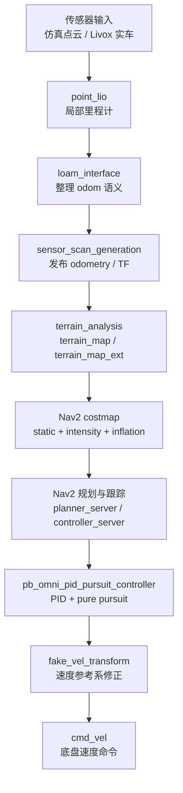
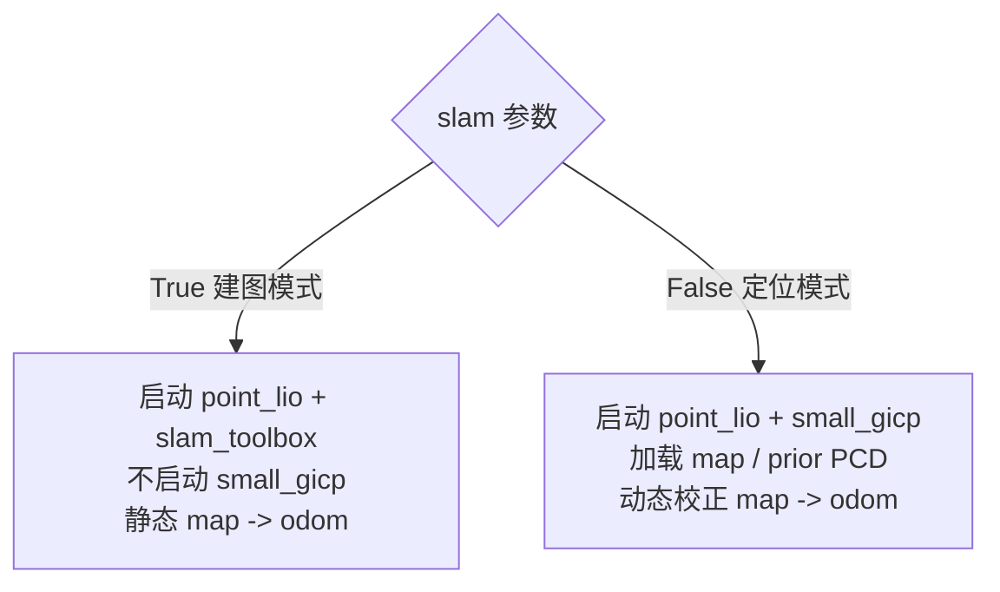

# SMBU2025 苏格拉底学习笔记 01：抓骨架

> 学习目标：先抓系统骨架，不急着背包名和参数。

## 颜色图例

| 颜色 | 含义 |
|---|---|
| <span style="color:#1565C0"><strong>蓝色</strong></span> | 系统结构 / 主链路 |
| <span style="color:#2E7D32"><strong>绿色</strong></span> | 结论 / 记忆规则 |
| <span style="color:#EF6C00"><strong>橙色</strong></span> | 优先排查 / 学习重点 |
| <span style="color:#C62828"><strong>红色</strong></span> | 风险 / 容易误解 |

## 一句话骨架

<span style="color:#2E7D32"><strong>核心判断：</strong></span> `SMBU2025` 的核心不是 <span style="color:#C62828"><strong>“跑 Nav2”</strong></span>，而是把**仿真/实车传感器数据**通过 <span style="color:#1565C0"><strong>TF、定位、地形代价图、自定义控制器</strong></span>，变成哨兵机器人可执行的稳定导航闭环。

主链路用竖版画，避免横向图被编辑器缩得太小：



`slam` 模式差异单独看：



## 五个模型总览

| 模型 | 一句话 | 核心问题 | 关键入口 |
|---|---|---|---|
| **1. 启动编排** | 先看 launch，再看节点 | 当前系统到底在跑什么？ | `pb2025_nav_bringup/launch` |
| **2. 定位与重定位** | `point_lio` 给连续运动，`small_gicp` 校正全局漂移 | 机器人相信自己在哪里？ | `localization_launch.py` / `slam_launch.py` |
| **3. TF 坐标系治理** | <span style="color:#C62828"><strong>每份数据必须放在正确 frame 里解释</strong></span> | 点云、位姿、速度属于哪个坐标系？ | `loam_interface` / `sensor_scan_generation` / `fake_vel_transform` |
| **4. 点云到可通行性** | 点云要先翻译成 costmap 证据 | 哪里能走，哪里不能走？ | `terrain_analysis` / `IntensityVoxelLayer` |
| **5. 规划与控制** | Nav2 给框架，自定义控制器让底盘稳定走 | Nav2 Goal 如何变成 `cmd_vel`？ | `planner_server` / `controller_server` / `fake_vel_transform` |

## 先记住 `slam` 参数

<span style="color:#EF6C00"><strong>重点：</strong></span> `slam` 参数不是在问要不要启动 `point_lio`。

| 参数 | 模式 | 会启动 | 不会启动 | `map -> odom` 来源 |
|---|---|---|---|---|
| `slam:=True` | 建图模式 | `point_lio`、`slam_toolbox`、`pointcloud_to_laserscan`、`map_saver_server`、Nav2 导航链路 | `small_gicp_relocalization` | 静态 TF |
| `slam:=False` | 定位/导航模式 | `point_lio`、`map_server`、`small_gicp_relocalization`、Nav2 导航链路 | `slam_toolbox` | `small_gicp` 动态校正 |

记忆规则：

> <span style="color:#2E7D32"><strong>`point_lio` 两种模式都在</strong></span>；<span style="color:#C62828"><strong>`small_gicp_relocalization` 只在导航/定位模式中启用，SLAM 建图模式中禁用。</strong></span>

---

## 1. 包边界与启动编排模型

**一句话：**  
**先看 launch，再看节点；先看运行模式，再看算法细节。**

**它回答的问题：**  
当前系统到底在跑什么？

要先分清：

| 维度 | 典型选择 | 影响 |
|---|---|---|
| 场景来源 | 仿真 / 实车 | 点云来源不同 |
| 运行目的 | 建图 / 导航定位 | 是否启用 `small_gicp` |
| 参数来源 | simulation / reality YAML | frame、topic、插件参数不同 |
| 命名空间 | 单机器人 / 多机器人 | topic、node、action、TF 前缀不同 |

关键入口：

| 文件 | 作用 |
|---|---|
| `rm_navigation_simulation_launch.py` | 仿真入口，启动仿真点云转换工具 |
| `rm_navigation_reality_launch.py` | 实车入口，启动 Livox 驱动 |
| `bringup_launch.py` | 总编排，按 `slam` 选择建图或定位 |
| `slam_launch.py` | 建图链路 |
| `localization_launch.py` | 定位/重定位链路 |
| `navigation_launch.py` | 地形分析、Nav2、控制与速度变换 |

**和其他模型的关系：**  
启动编排决定后面四个模型是否存在，以及它们如何接线。没有它，后面看到的 topic、TF、参数会是一堆散件。

---

## 2. 定位与重定位模型

**一句话：**  
**`point_lio` 负责连续局部运动，`small_gicp_relocalization` 用先验点云修正全局漂移。**

**它回答的问题：**  
机器人“相信自己在哪里”？这个相信从哪里来，又如何被纠正？

定位链路：

```text
LiDAR / IMU
  -> point_lio
  -> loam_interface
  -> odometry / registered_scan
  -> small_gicp_relocalization
  -> map -> odom correction
```

关键节点：

| 节点 | 作用 |
|---|---|
| `point_lio` | LiDAR/IMU 里程计，输出局部运动估计和注册点云 |
| `loam_interface` | 把 point_lio 的 `lidar_odom` 相关结果整理到真实 `odom` 语义 |
| `small_gicp_relocalization` | 当前点云和先验 PCD 对齐，发布 `map -> odom` 修正 |
| `map_server` | 导航模式加载栅格地图 |
| `slam_toolbox` | 建图模式生成/维护地图 |

**和其他模型的关系：**  
定位模型依赖 TF 模型。如果 `lidar_frame`、`base_frame`、`robot_base_frame` 的关系错了，定位看似正常输出，实际会把 Nav2 带到错误世界里。

---

## 3. TF 坐标系治理模型

**一句话：**  
<span style="color:#C62828"><strong>这个项目的难点不是“有 TF”</strong></span>，而是**每份数据必须在正确 frame 里解释**。

**它回答的问题：**  
同一份点云、速度、位姿到底属于哪个坐标系？

关键 frame：

| Frame | 直觉理解 |
|---|---|
| `map` | 全局地图坐标系 |
| `odom` | 局部连续里程计坐标系 |
| `base_footprint` | 底盘基准 |
| `front_mid360` | 前置 Mid360 雷达 |
| `gimbal_yaw` | 云台 yaw 相关速度参考系 |
| `gimbal_yaw_fake` | 给 Nav2 用的稳定伪速度参考系 |

关键节点：

| 节点 | 解决的问题 |
|---|---|
| `loam_interface` | point_lio 输出基于 `lidar_odom`，需要转到真实 `odom` |
| `sensor_scan_generation` | 发布 `odometry`，并处理雷达、底盘、云台之间的 TF |
| `fake_vel_transform` | 云台自旋时，避免 Nav2 把速度方向理解错 |

典型故障表现：

| 哪里错 | 可能现象 |
|---|---|
| 定位 frame 错 | 漂移、跳变、重定位不稳定 |
| 点云 frame 错 | 障碍物位置错、costmap 错 |
| 速度 frame 错 | 机器人朝奇怪方向移动 |

**优先级判断：**  
<span style="color:#EF6C00"><strong>优先攻克 TF。</strong></span> 它同时影响 <span style="color:#1565C0"><strong>定位、点云、costmap 和最终速度方向</strong></span>。

---

## 4. 点云到可通行性模型

**一句话：**  
**点云不是直接给 Nav2 用的**，必须先变成 <span style="color:#2E7D32"><strong>“哪里能走、哪里不能走”</strong></span> 的代价证据。

**它回答的问题：**  
哪些地形能通过？哪些点应该成为障碍？坡、坑、动态物体、无数据区域怎么处理？

链路：

```text
registered_scan / sensor_scan
  -> terrain_analysis / terrain_analysis_ext
       把点云分析成“地形代价点云”
  -> terrain_map / terrain_map_ext
       点云里每个点的 intensity 带有可通行性/高度代价信息
  -> IntensityVoxelLayer
       读取点云 intensity，把点放进 Nav2 voxel/costmap
  -> local_costmap / global_costmap
       Nav2 最终用来规划的障碍地图
```

`terrain + intensity voxel` 拆开看：

| 术语 | 意思 | 在项目里对应什么 |
|---|---|---|
| `terrain` | 地形分析：判断坡、坑、障碍物高度、动态物体等 | `terrain_analysis`、`terrain_analysis_ext` |
| `intensity` | 点云点的强度字段，这里被用来装“离地高度/障碍代价” | `terrain_map` / `terrain_map_ext` 里的 PointCloud2 intensity |
| `voxel` | 三维栅格小格子，用来把点云障碍离散进 costmap | `IntensityVoxelLayer` |

所以这个短语完整说法是：

> <span style="color:#2E7D32"><strong>先用 terrain_analysis 把点云变成带 intensity 代价的地形点云，再用 IntensityVoxelLayer 按 intensity 把障碍写入 Nav2 costmap。</strong></span>

会涉及 `/scan` 话题吗？

<span style="color:#EF6C00"><strong>结论：</strong></span> 正常导航 costmap 主链路不靠 `/scan`；建图模式会生成一个 LaserScan，但本项目把它叫做 `obstacle_scan`，不是 `/scan`。

| 场景 | 是否涉及 LaserScan | 话题名 | 用途 |
|---|---|---|---|
| `slam:=False` 导航/定位模式 | 一般不走 `/scan` 主链路 | 无核心 `/scan` | costmap 主要吃 `terrain_map` / `terrain_map_ext` 点云 |
| `slam:=True` 建图模式 | 会涉及 LaserScan | `obstacle_scan` | `pointcloud_to_laserscan` 把 `terrain_map_ext` 转成 LaserScan 给 `slam_toolbox` |

建图模式链路是：

```text
terrain_map_ext
  -> pointcloud_to_laserscan
  -> obstacle_scan
  -> slam_toolbox
```

源码/参数里对应关系：

| 位置 | 关系 |
|---|---|
| `slam_launch.py` | `cloud_in` remap 到 `terrain_map_ext`，`scan` remap 到 `obstacle_scan` |
| `nav2_params.yaml` | `slam_toolbox.scan_topic: obstacle_scan` |

<span style="color:#C62828"><strong>注意：</strong></span> `pointcloud_to_laserscan` 包默认输出叫 `scan`，但在这个项目的建图 launch 里被 remap 成了 `obstacle_scan`。

那 Nav2 不是 2D 导航吗？

<span style="color:#2E7D32"><strong>是的，Nav2 规划控制主体仍然是 2D 导航。</strong></span>

这里的 `terrain + intensity voxel` 不是让 Nav2 做完整 3D 规划，而是：

```text
3D 点云 / 地形高度信息
  -> 提取哪些区域不可通行
  -> 写入 2D costmap 的障碍/代价
  -> Nav2 仍然在 2D costmap 上规划路径
```

更准确地说，这是 <span style="color:#EF6C00"><strong>“用 3D 感知增强 2D 导航”</strong></span>。

| 层次 | 是 2D 还是 3D | 在项目里的作用 |
|---|---|---|
| LiDAR 点云 | 3D | 保留高度、坡、坑、障碍物形状 |
| `terrain_analysis` | 2.5D/3D 感知处理 | 从点云中判断地形可通行性 |
| `IntensityVoxelLayer` | 3D voxel 证据，但服务于 costmap | 把点云障碍写入 costmap |
| Nav2 planner | 2D | 在 2D costmap 上生成 Path |
| controller | 2D 平面速度为主 | 输出 `x/y/yaw` 速度命令 |

<span style="color:#C62828"><strong>不要误解：</strong></span> 这里不是无人机那种 3D 轨迹规划；它还是地面机器人导航，只是用点云高度信息判断“这个 2D 位置能不能走”。

怎么用高度信息判断“这个平面位置能不能走”？

核心算法不是直接看点的绝对高度，而是看：

> <span style="color:#2E7D32"><strong>某个 XY 网格里的点，相对该网格估计地面的高度差 `disZ`。</strong></span>

简化流程：

```text
输入：registered_scan 点云

1. 按 XY 平面分格
   每个格子收集附近点的 z 值

2. 估计每个格子的“地面高度”
   useSorting=True:
     取 z 值的 quantileZ 分位点作为地面
   useSorting=False:
     取最低点作为地面

3. 对每个点计算相对地面高度
   disZ = point.z - ground_z
   如果 considerDrop=True:
     disZ = abs(disZ)

4. 过滤有效点
   只保留：
     0 <= disZ < vehicleHeight
     且该格子点数足够
     且没有被动态障碍清除逻辑过滤掉

5. 把 disZ 写进点云 intensity
   point.intensity = disZ

6. IntensityVoxelLayer 读取 intensity
   intensity 在阈值范围内的点进入 costmap
```

用一句更土的话说：

```text
先问：这个 XY 格子里的地面大概在哪个 z？
再问：当前点比地面高多少？
如果高出地面一截，就可能是障碍或不可通行结构。
```

关键参数：

| 参数 | 作用 |
|---|---|
| `useSorting` | 是否用分位数估计地面；开启后更适合坡面 |
| `quantileZ` | 取 z 值排序后的哪个分位点作为地面 |
| `considerDrop` | 是否把低洼/坑也当成代价，即 `abs(disZ)` |
| `vehicleHeight` | 只处理低于车辆高度的障碍候选点 |
| `minBlockPointNum` | 一个格子里点数太少就不可信 |
| `minRelZ` / `maxRelZ` | 限制有效点云高度范围，过滤天花板/地板异常 |
| `disRatioZ` | 距离越远，高度容忍范围越大，用来适应坡度和远处噪声 |
| `min_obstacle_intensity` / `max_obstacle_intensity` | costmap 层最终按 intensity 范围接收障碍点 |

当前参数里有一个重要注释：`useSorting=True` 后，坡面更容易被当成可通行地面，而不是一堆障碍。原因是坡面上点的高度会逐渐变化，如果总取最低点当地面，坡上的其他点都可能显得“高出地面”；用分位点估计地面会更稳。

<span style="color:#C62828"><strong>注意：</strong></span> 它不是判断“这个点高就不能走”，而是判断“这个点相对局部地面高多少”。这就是为什么它能处理坡，而不只是平地障碍。

关键组件：

| 组件 | 作用 |
|---|---|
| `terrain_analysis` | 近距离地形分析，发布 `terrain_map` |
| `terrain_analysis_ext` | 大范围地形分析，发布 `terrain_map_ext` |
| 点云 `intensity` | 写入障碍物离地高度等代价信息 |
| `pb_nav2_costmap_2d::IntensityVoxelLayer` | 根据 intensity 把点云转成 costmap 障碍证据 |

Nav2 costmap 组合：

| Layer | 作用 |
|---|---|
| `static_layer` | 栅格地图静态障碍 |
| `intensity_voxel_layer` | 来自地形点云的动态/三维障碍 |
| `inflation_layer` | 给障碍物膨胀安全距离 |

**和其他模型的关系：**  
定位告诉点云在哪里，TF 保证点云解释正确；地形模型把点云翻译成 costmap；规划控制模型再根据 costmap 选路径。

---

## 5. 规划、跟踪与速度执行模型

**一句话：**  
**Nav2 负责导航框架**，<span style="color:#1565C0"><strong>自定义控制器和速度变换</strong></span> 负责让全向底盘真的能稳定走。

**它回答的问题：**  
一个 RViz 里的 Nav2 Goal 如何变成底盘最终执行的 `cmd_vel`？

执行链路，注意每一步的**产物类型**：

```text
Nav2 Goal
  -> planner_server
       产物：全局路径 nav_msgs/Path
  -> controller_server
       调用：pb_omni_pid_pursuit_controller
       产物：速度命令 Twist / TwistStamped 语义
  -> velocity_smoother
       产物：平滑后的 cmd_vel_nav2_result
       约定坐标系：gimbal_yaw_fake
  -> fake_vel_transform
       产物：转换到真实 robot_base_frame 的 cmd_vel
       约定坐标系：gimbal_yaw
```

关键组件：

| 组件 | 作用 |
|---|---|
| `planner_server` | 生成全局路径，产物是 **Path**，不是 `cmd_vel` |
| `controller_server` | 调用路径跟踪控制器，把路径跟踪问题变成速度命令问题 |
| `pb_omni_pid_pursuit_controller` | 根据路径、机器人当前位姿和 odometry 计算速度命令 |
| `velocity_smoother` | 平滑速度输出 |
| `fake_vel_transform` | 把 `gimbal_yaw_fake` 下的速度转回真实 `gimbal_yaw`，并叠加自旋，最终发布 `cmd_vel` |

<span style="color:#2E7D32"><strong>记忆规则：</strong></span> `planner_server` 规划出来的是 <span style="color:#1565C0"><strong>路径 Path</strong></span>；`controller_server` 里的控制器才把路径转换成 <span style="color:#EF6C00"><strong>速度命令</strong></span>。

速度话题的 frame 语义：

| 速度话题 | 来源 | 消息类型 | 约定坐标系 | 为什么 |
|---|---|---|---|---|
| `cmd_vel_controller` | `controller_server` 输出，经 remap 给 `velocity_smoother` | `Twist` / Nav2 控制语义 | `gimbal_yaw_fake` | Nav2 的 `robot_base_frame` 配成 `gimbal_yaw_fake` |
| `cmd_vel_nav2_result` | `velocity_smoother` 输出 | `geometry_msgs/Twist` | `gimbal_yaw_fake` | smoother 只平滑速度，不改 frame 语义 |
| `cmd_vel` | `fake_vel_transform` 输出 | `geometry_msgs/Twist` | `gimbal_yaw` | fake transform 把 fake frame 下的速度转回真实 `robot_base_frame` |

<span style="color:#C62828"><strong>注意：</strong></span> `geometry_msgs/Twist` 本身没有 `header.frame_id`。这里说的“坐标系”不是消息字段，而是由 Nav2 参数和 `fake_vel_transform` 约定出来的解释语义。

为什么需要这个变换？

<span style="color:#6A1B9A"><strong>根本原因：</strong></span> Nav2 默认希望 `robot_base_frame` 是一个**稳定的机器人本体参考系**，但这个项目里真实速度参考系 `gimbal_yaw` 会因为云台扫描而快速旋转。

如果直接让 Nav2 使用 `gimbal_yaw`：

| 发生什么 | 后果 |
|---|---|
| 云台 yaw 在转 | `gimbal_yaw` 的 x/y 轴也在转 |
| Nav2 输出 `linear.x` / `linear.y` | 这些速度会被解释在一个正在旋转的坐标系里 |
| 同一条路径上的“向前走” | 可能因为云台朝向变化而变成向左、向右或斜着走 |
| 控制器看起来在工作 | 但底盘实际运动方向会飘，甚至和路径方向不一致 |

所以项目创造了 `gimbal_yaw_fake`：

| Frame | 位置 | yaw | 用途 |
|---|---|---|---|
| `gimbal_yaw` | 真实云台/速度参考位置 | 跟着云台或机器人姿态变化 | 最终底盘命令解释 |
| `gimbal_yaw_fake` | 和 `gimbal_yaw` 同位置 | 把 yaw 抵消，保持稳定方向 | 给 Nav2 用 |

一个 90 度例子：

```text
目标：机器人应该沿世界前方走

如果云台 yaw = 90 度：
  Nav2 在 gimbal_yaw_fake 下输出：
    linear.x = 1.0
    linear.y = 0.0
  含义：沿稳定 fake frame 的 x 方向前进

fake_vel_transform 转到真实 gimbal_yaw：
    linear.x ≈ 0.0
    linear.y ≈ -1.0
  含义：虽然真实 frame 已经转了 90 度，但底盘执行后，世界方向仍然是“向前”
```

<span style="color:#2E7D32"><strong>一句话：</strong></span> `gimbal_yaw_fake` 是给 Nav2 的“稳定世界”，`fake_vel_transform` 是把这个稳定世界里的速度翻译回真实底盘能理解的 `gimbal_yaw`。

`gimbal_yaw_fake` 是怎么定义的？

它不是 URDF 里真实存在的 link，而是 `fake_vel_transform` 节点运行时发布出来的虚拟 TF。

`current_robot_base_angle` 从哪里来？

来源链路是：

```text
sensor_scan_generation
  -> 发布 odometry
       header.frame_id = odom
       child_frame_id  = gimbal_yaw
       pose.orientation = odom -> gimbal_yaw 的姿态

fake_vel_transform
  -> 订阅 odometry
  -> current_robot_base_angle = yaw(odometry.pose.pose.orientation)
```

也就是说：

```text
current_robot_base_angle
  = 当前 odometry 中 robot_base_frame 的 yaw
  = odom -> gimbal_yaw 的 yaw
```

源码对应关系：

| 位置 | 逻辑 |
|---|---|
| `sensor_scan_generation` | 发布 `odometry`，child frame 是 `robot_base_frame` |
| `fake_vel_transform::odometryCallback` | 从 `msg->pose.pose.orientation` 取 yaw |
| `fake_vel_transform::syncCallback` | 同步 `odometry` 和 `local_plan` 时再次更新 yaw |
| `fake_vel_transform::publishTransform` | 用 `-current_robot_base_angle` 发布 `gimbal_yaw -> gimbal_yaw_fake` |

源码逻辑可以概括成：

```text
parent frame : gimbal_yaw
child frame  : gimbal_yaw_fake
translation  : 0, 0, 0
rotation     : yaw = - current_robot_base_angle
```

也就是：

| 属性 | `gimbal_yaw_fake` 的定义 |
|---|---|
| 原点位置 | 和 `gimbal_yaw` 完全重合 |
| x/y/z 平移 | 全部为 0 |
| yaw | 取 `gimbal_yaw` 当前 yaw 的反方向，用来抵消真实 yaw |
| 物理含义 | 没有实体，是给 Nav2 用的稳定参考系 |
| 发布频率 | `fake_vel_transform` 以 50Hz 发布 |

如果 `gimbal_yaw` 当前相对 `odom` 转了 `theta`：

```text
gimbal_yaw       yaw = theta
gimbal_yaw_fake  yaw = theta + (-theta) = 0
```

所以从 `odom` 看，`gimbal_yaw_fake` 的 yaw 方向基本和 `odom` 对齐；从机器人结构看，它又和真实 `gimbal_yaw` 在同一个位置。

更直白地说：

```text
gimbal_yaw_fake
  = 原点位置和 gimbal_yaw 相同
  + yaw 方向和 odom 对齐
```

<span style="color:#C62828"><strong>注意：</strong></span> 这里说的是 **2D/yaw 意义上的姿态对齐**。源码里只用 `q.setRPY(0, 0, -current_robot_base_angle)` 抵消 yaw，并没有处理完整 6D 姿态。

<span style="color:#2E7D32"><strong>一句话：</strong></span> `gimbal_yaw_fake` = <span style="color:#1565C0"><strong>同原点位置的 `gimbal_yaw`</strong></span> + <span style="color:#EF6C00"><strong>yaw 与 `odom` 对齐</strong></span>。

**和其他模型的关系：**  
控制器不是孤立算法。它站在前四个模型的输出之上：

| 缺了什么 | 控制会怎样 |
|---|---|
| 启动编排 | 不知道哪些节点和参数生效 |
| 定位 | 不知道机器人在哪里 |
| TF | 不知道速度方向该怎么解释 |
| 地形代价图 | 不知道哪里不能走 |

---

## 自我检查

先回答这三个问题：

1. 这五个模型里，你最熟悉哪个？
2. 你最陌生的是哪个？
3. 为什么？请指出你能说清楚的链路，以及你说不清楚的断点。

追问自己一句：

> 如果机器人“看起来在跑，但方向不对或地图不对”，你第一反应会查哪个模型？为什么？
