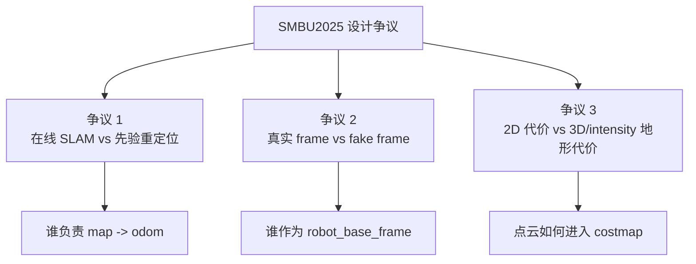

# SMBU2025 苏格拉底学习笔记 02：找争议

> 学习目标：不要只背“这个项目怎么写”，要看见设计选择背后的分歧。

## 颜色图例

| 颜色 | 含义 |
|---|---|
| <strong>紫色</strong> | 争议 / 底层分歧 |
| <strong>蓝色</strong> | 阵营 A / 系统结构 |
| <strong>绿色</strong> | 阵营 B / 稳定结论 |
| <strong>红色</strong> | 风险 |

## 一句话

<strong>争议点不是函数写法，而是系统取舍。</strong>

| 争议 | 问题本质 |
|---|---|
| **定位策略** | 建图在线闭环，还是先验地图重定位？ |
| **速度参考系** | 直接让 Nav2 看真实 frame，还是用 fake frame 隔离云台自旋？ |
| **障碍表达** | 用简单 2D costmap，还是用点云 intensity 表达地形可通行性？ |

## 争议地图

## 三个核心争议总览

| 争议 | 阵营 A | 阵营 B | 底层分歧 | 关联模型 |
|---|---|---|---|---|
| **1. 定位策略** | <strong>在线 SLAM / 建图闭环</strong> | <strong>先验 PCD + `small_gicp` 重定位</strong> | <strong>更相信实时自建地图，还是更相信先验地图？</strong> | 启动编排、定位重定位、TF |
| **2. 速度参考系** | <strong>直接使用真实 robot frame</strong> | <strong>引入 `gimbal_yaw_fake`</strong> | <strong>系统纯粹性优先，还是控制稳定性优先？</strong> | TF、规划控制 |
| **3. 障碍表达** | <strong>2D scan / static costmap 为主</strong> | <strong>地形分析点云 + intensity 体素层</strong> | <strong>简洁鲁棒优先，还是表达能力优先？</strong> | 地形代价、Nav2 costmap |

---

## 争议 1：在线 SLAM，还是先验 PCD + 重定位？

**争议问题：**  
哨兵导航应该主要依赖 **在线 SLAM**，还是依赖 **先验 PCD + `small_gicp_relocalization`**？

| 对比维度 | <strong>阵营 A：在线 SLAM / 建图闭环</strong> | <strong>阵营 B：先验 PCD + small_gicp 重定位</strong> |
|---|---|---|
| **核心主张** | 机器人边跑边维护地图，减少对先验地图的依赖 | 比赛导航更依赖先验地图，运行时用当前点云对齐先验 PCD |
| **主要节点** | `point_lio`、`slam_toolbox`、`map_saver_server` | `point_lio`、`map_server`、`small_gicp_relocalization` |
| **`map -> odom` 来源** | 静态 TF 或 SLAM 体系维护的地图关系 | `small_gicp` 动态校正 |
| **优势** | 适应变化、部署门槛低、适合建图调试 | 稳定、可调试、适合比赛固定场地 |
| **风险** | <strong>在线地图漂移、闭环不稳、调参复杂</strong> | <strong>先验 PCD 失效会拖垮定位</strong> |
| **适合场景** | 建图、探索、初期调试 | 比赛导航、已知地图场景 |

<strong>底层分歧：</strong> 你更怕 <strong>实时 SLAM 漂移</strong>，还是更怕 <strong>先验地图不准</strong>？

**和第一步模型的关系：**

- **启动编排：** `slam:=True` 和 `slam:=False` 直接切换两套策略。
- **定位重定位：** `point_lio` 两种模式都在，`small_gicp_relocalization` 只在定位/导航模式启用。
- **TF：** 两种策略最终都要给 Nav2 一个可信的 `map -> odom -> robot_base_frame` 链路。

**苏格拉底追问：**  
如果先验 PCD 和当前场地有偏差，你会优先怀疑 `small_gicp`，还是怀疑 TF，还是怀疑地形代价图？为什么？

---

## 争议 2：真实 frame，还是 `gimbal_yaw_fake`？

**争议问题：**  
Nav2 的 `robot_base_frame` 应该直接使用真实云台/底盘 frame，还是引入一个伪 frame 隔离云台自旋？

| 对比维度 | <strong>阵营 A：直接使用真实 frame</strong> | <strong>阵营 B：使用 `gimbal_yaw_fake`</strong> |
|---|---|---|
| **核心主张** | frame 应该和真实机器人结构一一对应 | frame 可以服务于控制稳定性 |
| **代表 frame** | `gimbal_yaw` | `gimbal_yaw_fake` |
| **优势** | 语义干净、TF tree 直观、少一层速度转换 | 适配 Nav2 假设、云台自旋时控制更稳 |
| **风险** | <strong>云台自旋会扰乱 Nav2 对机器人朝向的理解</strong> | <strong>引入额外转换层，时间同步和调试更复杂</strong> |
| **关键节点** | Nav2 直接使用真实 frame | `fake_vel_transform` 负责 fake frame 到真实 frame 的速度转换 |
| **适合场景** | 机器人朝向稳定、结构简单 | 云台扫描、自旋、速度参考系变化剧烈 |

<strong>底层分歧：</strong> frame 是为了 <strong>物理真实</strong>，还是为了 <strong>控制可用</strong>？

**和第一步模型的关系：**

- **TF：** `gimbal_yaw_fake` 是 TF 治理模型中的关键工程选择。
- **规划控制：** Nav2 以 `gimbal_yaw_fake` 规划和控制，再由 `fake_vel_transform` 转为真实 `cmd_vel`。
- **定位重定位：** 如果 `odometry` 的 child frame 和 Nav2 使用的 robot frame 语义不一致，控制会被放大出错。

**苏格拉底追问：**  
如果机器人在云台自旋时“目标方向正确但底盘运动方向不对”，你如何区分是控制器问题，还是 fake frame 转换问题？

---

## 争议 3：2D costmap，还是地形分析点云 + intensity 体素层？

**争议问题：**  
RoboMaster 哨兵导航应该主要依赖 2D 栅格/laser scan，还是使用“地形分析点云 + 按 intensity 建障碍体素层”？

| 对比维度 | <strong>阵营 A：2D scan / static costmap 为主</strong> | <strong>阵营 B：地形分析点云 + intensity 体素层</strong> |
|---|---|---|
| **核心主张** | 导航表达越简单越稳定 | 比赛地形不是纯平面，需要 3D 地形证据 |
| **数据表达** | 2D scan、栅格地图、静态障碍 | `terrain_map`、`terrain_map_ext`、点云 `intensity`、voxel costmap |
| **优势** | 成熟稳定、参数少、RViz 中容易理解 | 能表达坡、坑、台阶、动态障碍和高度差 |
| **风险** | <strong>对复杂地形表达不足，容易误判可通行性</strong> | <strong>参数多，点云 frame、强度阈值、时间衰减都可能出错</strong> |
| **关键组件** | `StaticLayer`、普通 obstacle/costmap 逻辑 | `terrain_analysis`、`terrain_analysis_ext`、`IntensityVoxelLayer` |
| **适合场景** | 平面、低速、障碍简单 | 高速全向移动、场地有高低差或复杂障碍 |

<strong>底层分歧：</strong> 你愿不愿意用 <strong>调参复杂度</strong> 换 <strong>地形表达能力</strong>？

**和第一步模型的关系：**

- **地形代价：** `terrain_analysis` / `terrain_analysis_ext` 是这一争议的核心。
- **TF：** 点云 frame 错，代价地图一定错。
- **规划控制：** costmap 的保守程度直接影响路径形状、速度、恢复行为。

**苏格拉底追问：**  
如果机器人总是绕很远，或者把可通行区域当障碍，你会先看 `terrain_analysis` 参数、`IntensityVoxelLayer` 阈值，还是 TF？为什么？

---

## 三个争议的共同底层问题

| 共同问题 | 在项目中的表现 |
|---|---|
| **先验 vs 在线** | `small_gicp` 依赖 prior PCD，`slam_toolbox` 依赖在线建图 |
| **物理真实 vs 控制可用** | `gimbal_yaw` 是真实 frame，`gimbal_yaw_fake` 是控制友好 frame |
| **简洁鲁棒 vs 表达能力** | 2D costmap 简洁，terrain intensity 表达力更强 |

## 你必须站队

请先不要查答案，直接回答：

1. 三个争议里，你最能理解哪一个？
2. 你最站哪边？
3. 为什么？请给出一个系统级理由，而不是“这个包就是这么写的”。

追问：

> <strong>如果你是比赛当天负责导航的人，你会为了稳定性牺牲哪一部分表达能力？为什么？</strong>
