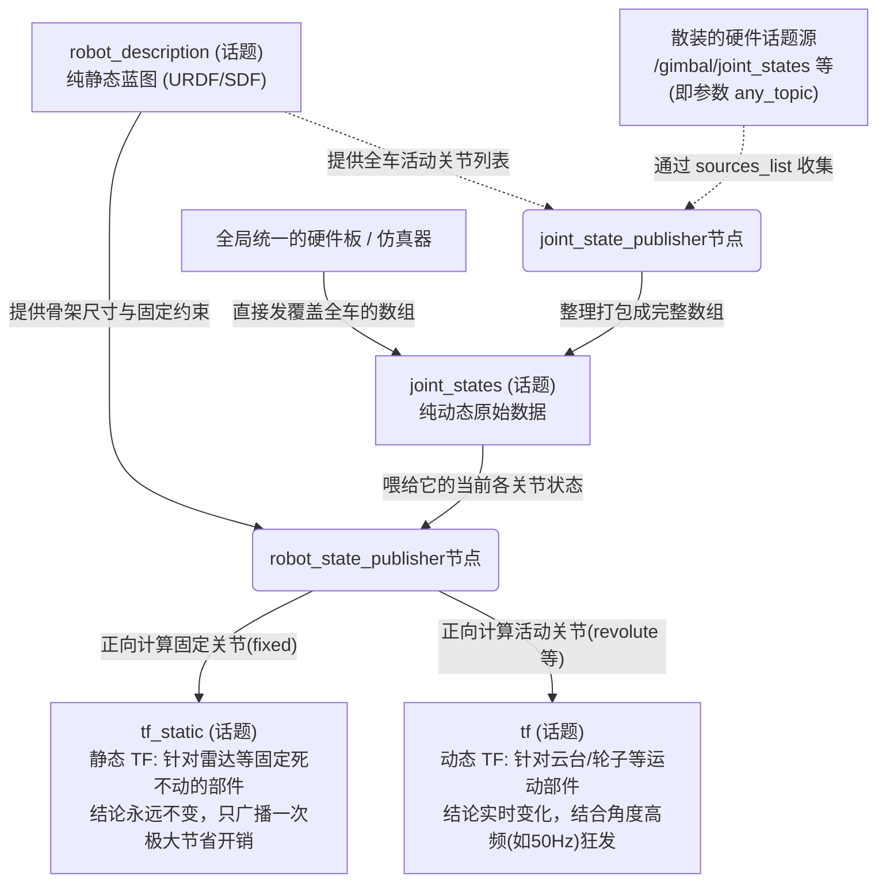
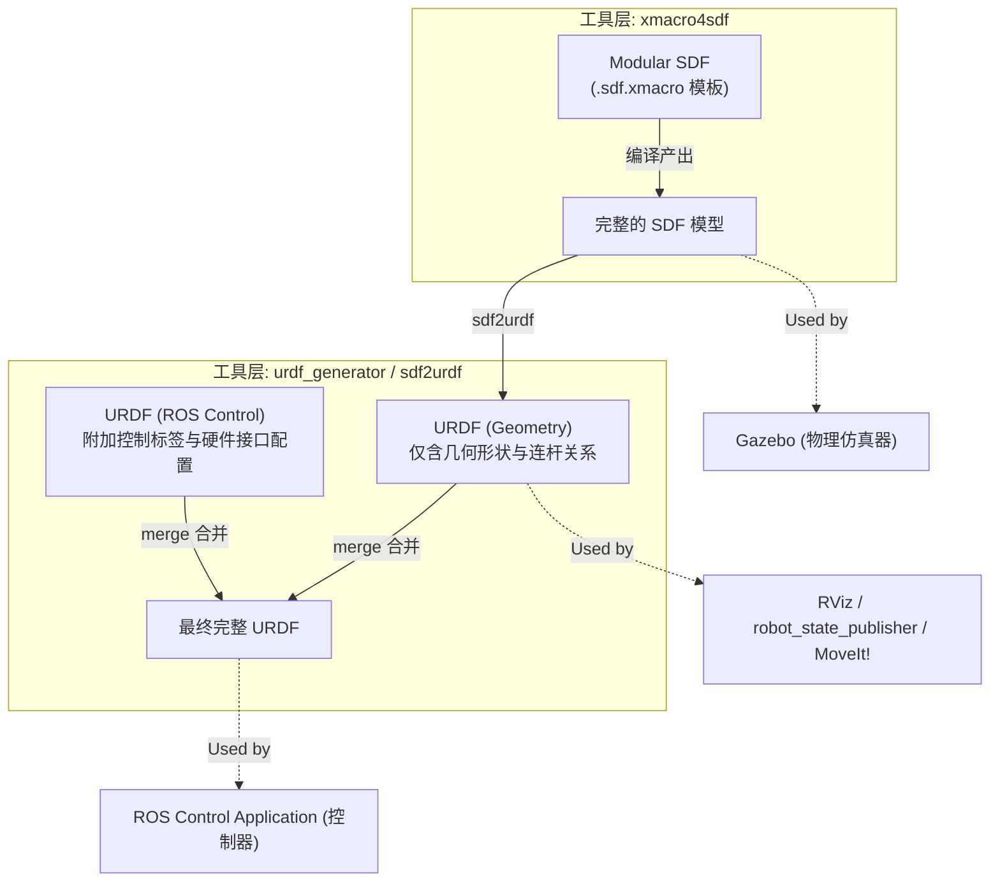

# SMBU2025 工作区组件笔记
> 更新时间：2026-06-01

## 1. pb2025_robot_description

### 1.1 文件夹作用说明

**核心目的**：提供 PB2025 机器人的模型与物理描述，用于仿真 (Gazebo)、可视化 (RViz)以至真实运行环境。它通过发布 `robot_description` 为其他 ROS 节点提供机器人统一的连杆(Link)及坐标关系蓝图。

**关键内容解析**：
- **`resource/models/`**：存放 SDF/xmacro 文件与 meshes 3D网格（包括机器人本体及工业相机、Livox 等传感器模型）。
- **`xmacro/`**：存放 `.sdf.xmacro` 模板文件，可用于按需生成、组合不同配置的机器人变体。
- **`launch/robot_description_launch.py`**：启动总入口，负责加载描述文件并把系统需要的 `robot_description` 推送至参数服务器。
- **`params/robot_description.yaml`**：维护描述相关的附加参数选项（例如配置要挂载的指定传感器等）。
- **`rviz/visualize_robot.rviz`**：准备好的 RViz 配置文件，方便一键可视化机器人模型。
- **`env-hooks/`**：注册环境路径的脚本。在编译安装后，自动将模型路径注入（如 `GAZEBO_MODEL_PATH`），确保仿真器能成功检索到对应的资源。

**典型应用场景与速查**：
- **场景 A**：在 Gazebo 中生成（Spawn）本款机器人进行物理仿真。
- **场景 B**：运行导航感知算法前，获取机器人的几何形态和运动学模型边界。
- **快速调试**：执行 `ros2 launch pb2025_robot_description robot_description_launch.py` 可直接呼出 RViz 确认 TF 连杆位置和模型是否无误。

---

### 1.2 ROS TF 与机器人状态发布数据流

以下流程图解释了在机器人系统中，基于模型描述产生的静态与动态坐标变换体系。**核心逻辑是从“静态模型蓝图”和“实时电机位置”推导出“任一时刻下各部件在空间中的准确坐标”**：



**概念简记：**
1. **`robot_description`**：告诉系统机器人长什么样（各部件在哪、有多长）。
2. **`joint_states`**：陈述事实“XXX关节现在转了30度”，但不包含具体空间坐标。
3. **`tf_static`**：雷达等与底座死死固定的部件，其相对位置绝对恒定，所以发一次就行，大幅节省 CPU 和网络。
4. **`tf`**：云台等一直在转的部件，为了让导航和感知随时知道云台朝向，必须结合角度实时高频发布。
5. **`joint_state_publisher` 与 `any_topic`**：当硬件发出的动态位置是散装的（比如云台和底盘由不同电控板读取，即 `any_topic`）时，`joint_state_publisher` 节点会充当“打包专员”。它根据 `robot_description` 知道机器人一共有哪些关节，然后通过 `sources_list` 监听各路“散装数据”，拼图组合完毕后，统一输出标准的 `joint_states`。

---

### 1.3 sdformat_tools 与模型格式转换工作流

ROS 原生生态（RViz, `robot_state_publisher`, MoveIt）极度依赖 **URDF** 格式，而强大的物理仿真引擎 Gazebo 则更契合 **SDF** 格式。为了同一套模型能同时满足仿真与真机控制双边需求，工作区引入了 `sdformat_tools` 将其管线打通。以下是模型文件的生成与提炼过程：



**流程解析：**
1. **展开模块 (SDF 阶段)**：`xmacro4sdf` 工具读取开发者编写的 `.sdf.xmacro` 模板文件，将其宏展开并合并，生成了最终的一份大号 `.sdf` 文件。这份文件包含了完整的物理仿真信息，直接喂给 **Gazebo** 使用。
2. **兼容 ROS (URDF 几何阶段)**：通过 `sdf2urdf` 脚本，将大号 `.sdf` 里的视觉、碰撞、连杆树（几何信息）翻译并降级提取为 `.urdf`。因为 **RViz**、`robot_state_publisher` 以及机器臂规划插件 **MoveIt** 只认 URDF。
3. **注入控制驱动 (URDF 终极阶段)**：为了让节点能够真实控制硬件/虚拟电机，将独立的包含电机映射和 `ros2_control` 接口定义的 URDF 插件配置合并进基础几何 URDF 中，打包出全功能的终极版 URDF ，供 **ros control** 控制层使用。

---

## 2. rmu_gazebo_simulator

### 2.1 文件夹作用说明

**核心目的**：`rmu_gazebo_simulator` 是 RoboMaster University 场景下的 Gazebo 仿真环境总包，用于把机器人模型、比赛场地、Gazebo 物理仿真、ROS 2 控制接口、裁判系统和网页控制端组合起来，形成一套可运行的机器人算法测试环境。

**关键内容解析**：
- **`dependencies.repos`**：源码依赖清单，供 `vcs import` 使用。它会拉取 `sdformat_tools`、`rmoss_interfaces`、`rmoss_core`、`rmoss_gazebo`、`rmoss_gz_resources`、`pb2025_robot_description` 等依赖包，保证该仿真环境能完整编译和运行。
- **`rmu_gazebo_simulator/package.xml`**：ROS 2 package 声明文件，记录该包依赖 `ros_gz_sim`、`ros_gz_bridge`、`rmoss_gz_base`、`rmoss_gz_cam`、`rmoss_gz_plugins`、`pb2025_robot_description` 等组件。
- **`launch/bringup_sim.launch.py`**：仿真启动总入口。它会读取当前选择的地图配置，启动 Gazebo，加载比赛世界，生成机器人，并启动裁判系统相关节点。
- **`launch/gazebo.launch.py`**：负责启动 Gazebo / Ignition 仿真器本体，并加载指定的 `.sdf` 世界文件。
- **`launch/spawn_robots.launch.py`**：负责根据配置在仿真世界中生成机器人实体。
- **`config/gz_world.yaml`**：选择当前要运行的仿真世界，可切换 `rmul_2024`、`rmuc_2024`、`rmul_2025`、`rmuc_2025` 等地图。
- **`config/ros_gz_bridge.yaml`**：配置 ROS 2 与 Gazebo 之间的话题桥接，让仿真器里的传感器、机器人状态和控制指令能进入 ROS 系统。
- **`resource/worlds/`**：存放 RoboMaster 比赛场地的 SDF 世界文件。
- **`resource/models/`**：存放场地相关模型、网格和材质资源。
- **`scripts/player_web/`**：操作手网页控制端，可通过浏览器在局域网内控制机器人。
- **`scripts/referee_web/` 与 `scripts/referee_system/`**：裁判系统网页端与裁判逻辑，用于模拟比赛规则、状态显示和对战流程。

**典型应用场景与速查**：
- **场景 A**：启动完整 Gazebo 仿真环境，验证机器人底盘、云台、射击和传感器接口是否正常。
- **场景 B**：在没有真机的情况下，调试导航、感知、决策、控制等算法。
- **场景 C**：通过网页端进行局域网联机操作，模拟 RoboMaster 对战流程。
- **拉取依赖**：
    ```bash
    vcs import src < src/rmu_gazebo_simulator/dependencies.repos
    ```
- **构建工作区**：
    ```bash
    colcon build --symlink-install --cmake-args -DCMAKE_BUILD_TYPE=release
    ```
- **启动仿真**：
    ```bash
    ros2 launch rmu_gazebo_simulator bringup_sim.launch.py
    ```

**与 `pb2025_robot_description` 的关系**：`pb2025_robot_description` 负责描述机器人“长什么样、各个 Link 和 Joint 如何连接”；`rmu_gazebo_simulator` 负责把这个机器人放进 Gazebo 比赛世界里，并提供物理仿真、ROS-Gazebo 桥接、控制接口和裁判/网页系统。因此前者偏“机器人模型描述”，后者偏“完整仿真运行环境”。

### 2.2 RMOSS 依赖总结

`dependencies.repos` 中的 `rmoss_interfaces`、`rmoss_core`、`rmoss_gazebo`、`rmoss_gz_resources` 是 RMOSS（RoboMaster OSS）生态里的基础依赖，它们分别负责通信接口、通用功能、Gazebo 仿真能力和仿真资源。

```text
rmoss_interfaces   -> 定义 ROS 2 通信格式
rmoss_core         -> 提供 RoboMaster 通用基础功能
rmoss_gazebo       -> 提供 Gazebo 仿真插件与仿真接口
rmoss_gz_resources -> 提供 Gazebo 模型与裁判系统资源
```

**`rmoss_interfaces`：通信协议定义包**
- 提供 RoboMaster 相关 `.msg` 和 `.srv` 接口。
- 常见消息包括 `ChassisCmd`、`GimbalCmd`、`ShootCmd`、`RefereeCmd`、`RobotStatus` 等。
- 在本仿真环境中，网页控制端、裁判系统和机器人控制节点都依赖它来统一通信格式。

**`rmoss_core`：通用基础功能包**
- 提供真机和算法都可能用到的基础能力。
- 主要模块包括 `rmoss_util`、`rmoss_base`、`rmoss_cam`、`rmoss_projectile_motion`。
- 典型功能包括公共工具、相机封装、SBC 与 MCU 通信基础工具、弹道解算等。

**`rmoss_gazebo`：Gazebo 仿真支持包**
- 面向 Gazebo / Ignition 仿真环境，提供 RoboMaster 机器人仿真能力。
- 主要模块包括 `rmoss_gz_plugins`、`rmoss_gz_base`、`rmoss_gz_cam`、`rmoss_gz_bridge`。
- 在本仿真环境中，它负责模拟底盘、云台、射击、传感器和 Gazebo 插件行为。

**`rmoss_gz_resources`：Gazebo 模型资源包**
- 主要存放 RoboMaster 相关 SDF / xmacro 模型资源。
- 包括装甲板模块、枪口测速模块、指示灯模块、弹丸模型、标准机器人模型等。
- 它更偏“模型素材库”，控制逻辑通常由 `rmoss_gazebo` 或自定义插件提供。

**整体关系简记**：`rmoss_interfaces` 规定“怎么通信”，`rmoss_core` 提供“基础能力”，`rmoss_gazebo` 负责“仿真控制”，`rmoss_gz_resources` 提供“仿真模型资源”。它们共同支撑 `rmu_gazebo_simulator` 这个完整仿真环境。
