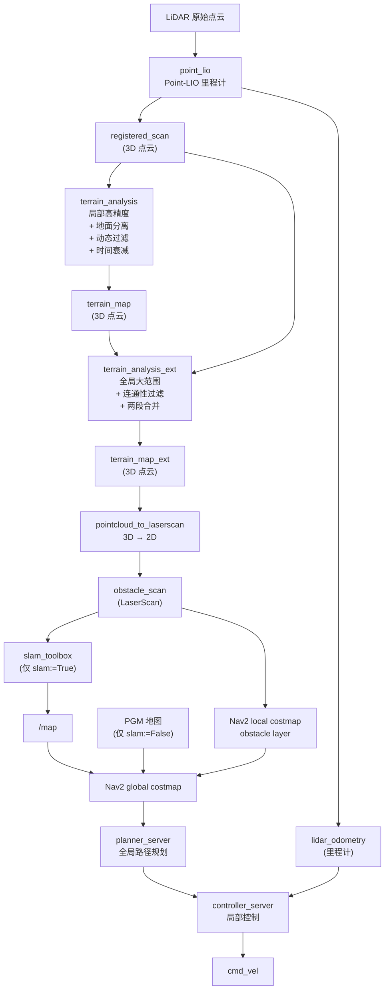
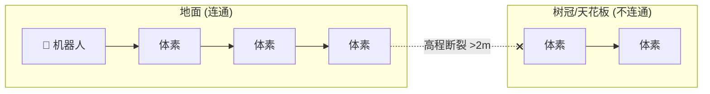
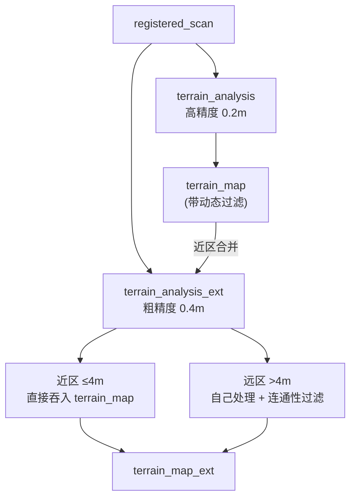
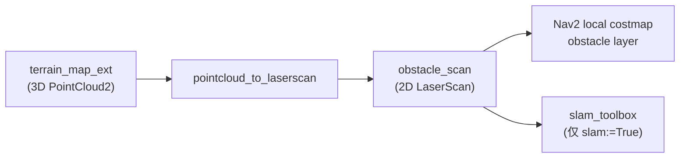
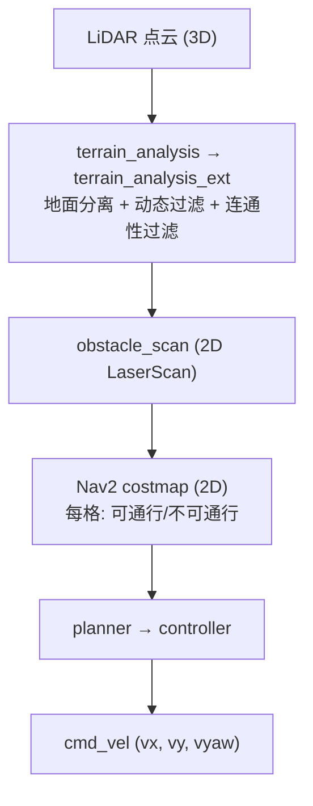
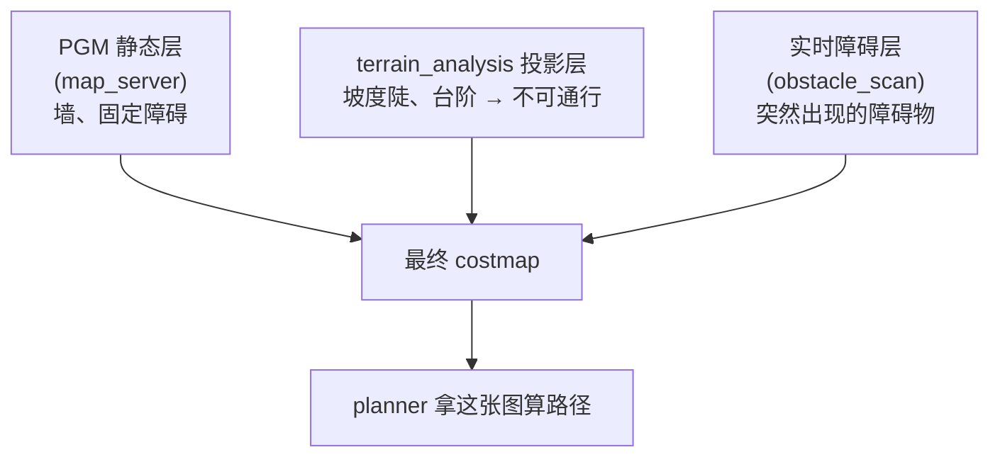

# pb2025_nav_bringup 导航系统架构总结

## 目录

1. [总览：完整数据流](#1-总览完整数据流)
2. [两种启动模式](#2-两种启动模式)
   - 2.1 [边建图边导航](#21-边建图边导航-slamtrue)
   - 2.2 [已知地图导航](#22-已知地图导航-slamfalse-默认)
3. [terrain_analysis 流水线](#3-terrain_analysis-流水线)
   - 3.1 [为什么需要这条流水线](#31-为什么需要这条流水线)
   - 3.2 [terrain_analysis（局部高精度）](#32-terrain_analysis局部高精度)
   - 3.3 [动态障碍过滤](#33-动态障碍过滤cleardyobs)
   - 3.4 [terrain_analysis_ext（全局大范围 + 连通性过滤）](#34-terrain_analysis_ext全局大范围--连通性过滤)
4. [obstacle_scan：打通 3D → 2D](#4-obstacle_scan打通-3d--2d)
5. [2.5D 导航](#5-25d-导航--3d-感知--2d-规划)
   - 5.1 [2D vs 2.5D vs 3D](#51-2d-vs-25d-vs-3d)
   - 5.2 [本项目的 2.5D 链路](#52-本项目的-25d-链路)
6. [costmap 多层叠加与冲突处理](#6-costmap-多层叠加与冲突处理)
   - 6.1 [Maximum 策略](#61-maximum-策略安全优先)
7. [slam_toolbox](#7-slam_toolbox)
   - 7.1 [本项目使用情况](#71-本项目使用情况)
   - 7.2 [sync vs async](#72-sync-vs-async)
8. [关键 launch 文件](#8-关键-launch-文件)
9. [相关源码](#9-相关源码)

---

## 1. 总览：完整数据流



---

## 2. 两种启动模式

两种模式唯一互斥的部分是**定位/建图**，`navigation_launch.py`（含 terrain_analysis 和 Nav2 导航栈）**始终启动**。

### 2.1 边建图边导航 (`slam:=True`)

```bash
ros2 launch pb2025_nav_bringup rm_navigation_simulation_launch.py slam:=True
```

| 组件 | 所属模块 | 作用 |
|---|---|---|
| `sync_slam_toolbox_node` | slam_launch | 2D 栅格地图实时 SLAM，发布 `/map` |
| `pointlio_mapping` | slam_launch | 3D 激光-惯导紧耦合里程计，发布 `registered_scan` + `lidar_odometry` |
| `pointcloud_to_laserscan` | slam_launch | 3D 点云 → 2D LaserScan，供 costmap 和 slam_toolbox 消费 |
| `map_saver_server` | slam_launch | 保存建好的地图 |
| `static_transform_publisher` | slam_launch | map→odom 静态 TF（单位变换，map 与 odom 重合） |
| `terrain_analysis` | navigation_launch | 局部高精度地形分析 + 动态障碍过滤 + 地面分离 |
| `terrain_analysis_ext` | navigation_launch | 大范围地形分析 + 天花板/树冠连通性过滤 |
| Nav2 导航栈 | navigation_launch | planner/controller/behavior/bt/smoother |

- **不需要** PGM 地图，地图由 slam_toolbox 实时构建
- **不需要** prior PCD
- map→odom 由 static_transform_publisher 发布（单位变换）

### 2.2 已知地图导航 (`slam:=False`, 默认)

```bash
ros2 launch pb2025_nav_bringup rm_navigation_simulation_launch.py world:=rmuc_2025 slam:=False
```

| 组件 | 所属模块 | 作用 |
|---|---|---|
| `pointlio_mapping` | localization_launch | 3D 实时里程计（加载 prior PCD 先验点云） |
| `map_server` | localization_launch | 加载预置 PGM，发布 `/map` |
| `small_gicp_relocalization` | localization_launch | 点云配准全局定位（替代 AMCL，不依赖 slam_toolbox localization 模式） |
| `terrain_analysis` | navigation_launch | 同上 |
| `terrain_analysis_ext` | navigation_launch | 同上 |
| Nav2 导航栈 | navigation_launch | 同上 |

- **需要** PGM (`map/simulation/<world>.yaml`)
- **需要** prior PCD (`pcd/simulation/<world>.pcd`)
- 定位靠 small_gicp + point_lio，**没有** AMCL，**没有** slam_toolbox localization 模式

---

## 3. terrain_analysis 流水线

### 3.1 为什么需要这条流水线

原始 3D 点云不能直接喂给 Nav2 的 2D costmap，因为存在以下问题：

| 问题 | 不做会怎样 |
|---|---|
| 地面点没分离 | 地面标记为障碍 → 动不了 |
| 树冠/天花板没过滤 | 头顶悬空物 → planner 绕路/堵死 |
| 动态物体没消除 | 路过的人 → costmap 永久残留 |
| 旧点不会衰减 | 之前看到的点永远不消 → 死区越来越多 |

### 3.2 terrain_analysis（局部高精度）

**输入**: `registered_scan` (3D 点云), `lidar_odometry` (里程计)
**输出**: `terrain_map` (3D 点云，带高程信息)

**职责**：
- 体素：1.0m × 21² 滑动窗口，平面分辨率 0.2m × 51²
- **地面分离**：每个 0.2m 格子取 0.25 分位数作为估计地面高程，只保留地面上方 `vehicleHeight`(1.5m) 内的点
- **动态障碍过滤**（详见下文）
- **无数据区域标记**：没有点云的格子标记为障碍物（防止冲入盲区）
- **时间衰减**：`decayTime = 2s`，旧点自动消失；`noDecayDis = 4m`，近处不衰减

### 3.3 动态障碍过滤（`clearDyObs`）

三步判断点云中的点是否来自动态物体：

**Step 1 — 统计嫌疑点**

每个 0.2m 体素，把点变换到**车身坐标系**（roll/pitch/yaw 补偿后）：

```
条件:
  距离 > 0.3m（排除自身）
  AND 车身系仰角 ∈ [-16°, 16°]（水平延伸的簇 ← 典型行人特征）
  OR  abs(车身系 Z) < 0.2m（贴地结构）
```

满足 → 该体素 `dyObsCount++`

**Step 2 — 排除误判**

同一帧里该体素存在**高仰角**的点 → 该体素 `dyObsCount = 0`（清零）

高仰角 = 来自上方 = 不可能是人 = 之前数的不算数

**Step 3 — 输出过滤**

`dyObsCount >= 1` 的体素 → **该体素所有点丢弃**，不出现在 `terrain_map` 中

### 3.4 terrain_analysis_ext（全局大范围 + 连通性过滤）

**输入**: `registered_scan` + **`terrain_map`**（级联）
**输出**: `terrain_map_ext`

**与 terrain_analysis 的关键区别**：

| | terrain_analysis | terrain_analysis_ext |
|---|---|---|
| 体素 | 1.0m × 21² | 2.0m × 41² |
| 平面分辨率 | 0.2m × 51² | 0.4m × 101² |
| 地面估计 | 分位数 (0.25) | 最小值 |
| 动态过滤 | ✅ | ❌ |
| 连通性过滤 | ❌ | ✅ |
| 覆盖范围 | ~10m | ~40m |

**地形连通性检查**（核心差异）：

从机器人脚底体素出发，BFS 洪泛搜索。规则：
- 相邻体素高程差 < 0.5m → 连通的，**是地面**
- 相邻体素高程差 > 2.0m → **天花板/树冠**，标记丢弃



**两段合并输出**：



级联后 `terrain_map_ext` 兼具两者优点：近处精细（含动态过滤），远处大范围（含天花板过滤）。

---

## 4. obstacle_scan：打通 3D → 2D



| 消费者 | 用途 | 配置位置 |
|---|---|---|
| **Nav2 local costmap** obstacle layer | 局部避障 | `nav2_params.yaml` → `scan_topic: obstacle_scan` |
| **slam_toolbox** | 2D 激光 scan matching 建图 | `nav2_params.yaml` → `slam_toolbox.scan_topic: obstacle_scan` |

两者消费**同一个 topic**，各取所需。

---

## 5. 2.5D 导航 = 3D 感知 + 2D 规划

### 5.1 2D vs 2.5D vs 3D

| | 感知 | 规划 | 适用 |
|---|---|---|---|
| **2D** | 平面 PGM | (x, y, yaw) | 平面室内 |
| **2.5D** | 3D 点云 → 2D costmap | (x, y, yaw) | 地面机器人越野 |
| **3D** | 3D 空间 | (x, y, z, roll, pitch, yaw) | 无人机 |

### 5.2 本项目的 2.5D 链路



地面机器人不需要 z 方向的运动规划，**2.5D = 3D 感知 + 2D 规划** 就是正确的抽象层级。

---

## 6. costmap 多层叠加与冲突处理



### 6.1 Maximum 策略（安全优先）

多层冲突时，默认 **Maximum**：

| 层 | 该格子的代价 |
|---|---|
| PGM 静态层 | FREE (0) ← "能走" |
| terrain_analysis | FREE (0) ← "坡小，能走" |
| 实时障碍 (obstacle_scan) | **LETHAL (254)** ← "有障碍！" |
| **Maximum(0, 0, 254)** | **LETHAL (254) → 不让走** |

**一个层说"不能走"，最终就不能走。**

| 策略 | 含义 |
|---|---|
| **Maximum**（默认） | 最保守，一个说 NO 就是 NO |
| Overwrite | 上层覆盖下层 |
| Sum | 代价相加 |

---

## 7. slam_toolbox

### 7.1 本项目使用情况

- **使用了**：`sync_slam_toolbox_node`（同步建图模式）—— 仅 `slam:=True`
- **未使用**：`localization_slam_toolbox_node`（纯定位）—— 由 `small_gicp_relocalization` 替代
- **未使用**：`async_slam_toolbox_node`（异步建图）

### 7.2 sync vs async

| | sync | async |
|---|---|---|
| 处理策略 | 每帧排队，逐帧处理 | 只取最新帧，丢弃未完成的 |
| 实时性 | 可能滞后 | 紧跟实时 |
| 地图质量 | 完整，细节好 | 可能丢帧，有遗漏 |
| 适用场景 | 仿真、离线建图 | 真实机器人在线 |

本项目仿真环境优先建图质量，选 `sync`。

---

## 8. 关键 launch 文件

| 文件 | 职责 |
|---|---|
| `rm_navigation_simulation_launch.py` | 顶层入口，声明参数，组装 bringup + rviz + joy_teleop + 点云转换 |
| `bringup_launch.py` | 核心编排：按 `slam` 互斥启动 slam_launch / localization_launch；始终启动 navigation_launch |
| `slam_launch.py` | SLAM 模式：slam_toolbox + point_lio + pointcloud_to_laserscan + map_saver + static_tf |
| `localization_launch.py` | 定位模式：map_server + small_gicp_relocalization + point_lio |
| `navigation_launch.py` | terrain_analysis + terrain_analysis_ext + Nav2 导航栈（planner/controller/bt/smoother + loam_interface） |

## 9. 相关源码

| 组件 | 路径 |
|---|---|
| terrain_analysis | `pb2025_sentry_nav/terrain_analysis/src/terrainAnalysis.cpp` |
| terrain_analysis_ext | `pb2025_sentry_nav/terrain_analysis_ext/src/terrainAnalysisExt.cpp` |
| 配置文件 | `pb2025_nav_bringup/config/simulation/nav2_params.yaml` |
